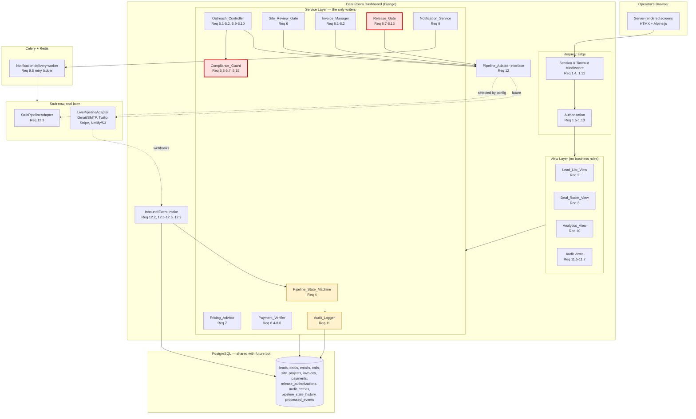
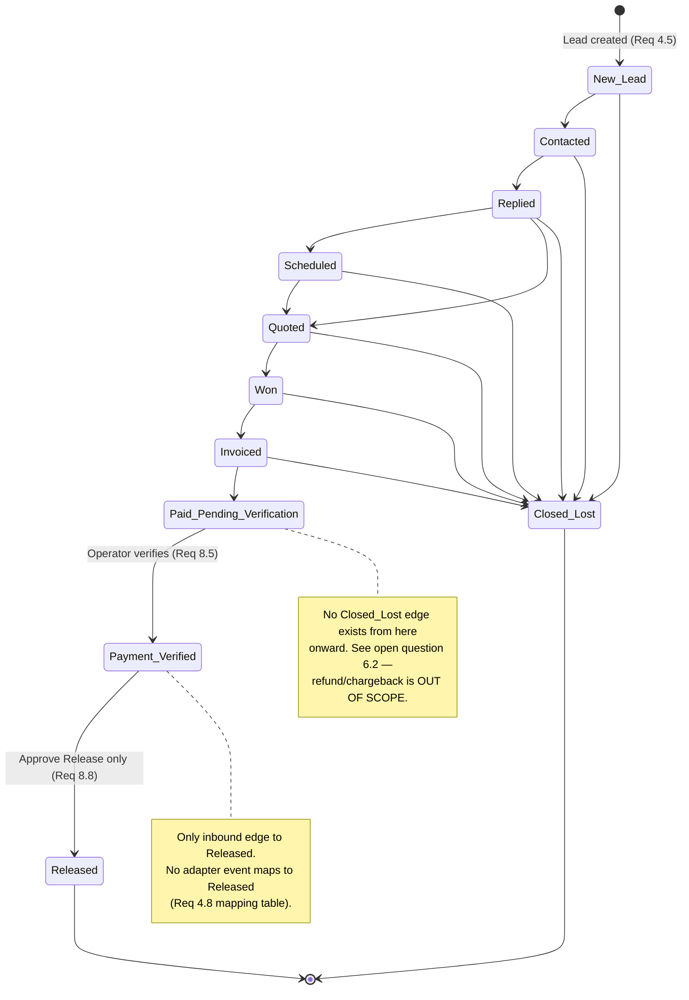
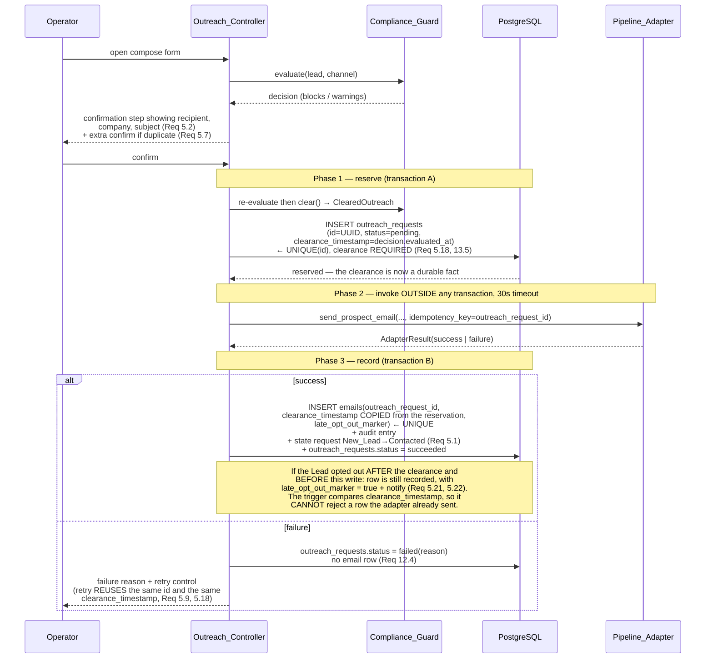

# Design Document: Deal Room Dashboard

> **Section numbering.** Top-level sections are referred to by name — Overview, Key Design Decisions, Architecture, Components and Interfaces, Data Models, Correctness Properties, Error Handling, Open Questions and Recommendations, Testing Strategy. Subsections keep their numbers, and cross-references written as §N.M point to them: §2.1–§2.7 under Key Design Decisions, §3.0 under Architecture, §3.1–§3.14 under Components and Interfaces, §4.1–§4.7 under Data Models, §5.1–§5.5 under Error Handling, §6.1–§6.2 under Open Questions and Recommendations, and §7.1–§7.7 under Testing Strategy. Correctness properties are referenced by property number.

## Overview

The Deal_Room_Dashboard is the operator console for the Kiro AI system. It is a server-rendered Python web application backed by a single PostgreSQL database, and it is the **only** component in the system authorized to move money-adjacent state forward: setting an agreed price, issuing an invoice, verifying a payment, and releasing a finished website to a customer.

This design covers the dashboard only. The lead-discovery, site-generation, email-sending, and calling automation (the "bot") is a separate future spec. The dashboard reaches that automation exclusively through the `Pipeline_Adapter` seam (Requirement 12), which ships with a stub implementation so the dashboard is independently runnable, demonstrable, and testable before any automation exists.

### Design Priorities, In Order

The requirements are not of uniform criticality, and the design reflects that ordering explicitly:

1. **Release safety** (Requirement 8, criteria 11–13). No website may be delivered without an Operator-confirmed Approve Release that follows a recorded payment verification. This is the one invariant whose violation costs real money and cannot be undone by a corrective write. It is defended in four independent layers (§3.7).
2. **State legality and totality** (Requirement 4). The pipeline is a finite state machine with 17 legal edges; every transition request produces exactly one of accepted-and-applied or rejected-and-unchanged, with no partial application.
3. **Compliance blocking** (Requirement 5). No code path may email an opted-out Lead or call a do-not-call Lead. Enforced as a single structural chokepoint plus database triggers.
4. **Audit completeness** (Requirement 11). Every applied action and every rejected attempt leaves exactly one immutable record.
5. **Everything else** — list views, analytics, notifications — is ordinary application code held to the stated performance budgets.

### Operating Principles

- **The server is the only authority.** Every control the UI renders is computed by the same function the service layer consults before applying the action. The UI cannot grant a permission the service layer would refuse, because it does not decide (Requirements 1.10, 2.10, 3.4).
- **Gates are structural, not conditional.** Where a requirement says "SHALL NOT happen without X", the design removes the code path rather than adding an `if`. A webhook cannot release a website because there is no function call from the event intake to the Release_Gate — not because a boolean is checked.
- **Nothing partially applies.** One Operator action or one inbound event equals one database transaction, and the audit write is inside it.
- **Operator-in-the-loop.** Every outbound side effect originates from an explicit Operator confirmation. The Pipeline_Adapter is never invoked by a background scheduler in this spec.

### Requirement Traceability Map

| Requirement | Primary design sections |
|---|---|
| 1 — Auth and authorization | §3.1 Auth_Service, §3.2 Authorization, §5.1 |
| 2 — Lead and Deal list view | §3.3 Lead_List_View, §4.7 Indexing |
| 3 — Deal Room detail view | §3.4 Deal_Room_View |
| 4 — Pipeline state machine | §3.5 Pipeline_State_Machine, §4.4 history table |
| 5 — Outreach and compliance | §3.6 Compliance_Guard and Outreach_Controller |
| 6 — Site preview review gate | §3.8 Site_Review_Gate |
| 7 — Price suggestion and override | §3.9 Pricing_Advisor, §2.1 pricing inputs |
| 8 — Invoicing, verification, release | §3.7 Release safety architecture |
| 9 — Operator notifications | §3.10 Notification_Service |
| 10 — Metrics, funnel, A/B | §3.11 Analytics_View, §2.4 cohort funnel |
| 11 — Audit logging | §3.12 Audit_Logger, §3.13 transactional integrity |
| 12 — Pipeline adapter boundary | §3.14 Pipeline_Adapter |
| 13 — Data persistence model | §4 Data Models |

---

## Key Design Decisions

This section records the decisions that shaped the rest of the document. Four of them — §2.1, §2.4, §2.5, and §2.6 — began as a schema gap and three latent inconsistencies found while designing against the acceptance criteria. The requirements now state each of those rules directly, so those subsections record how the design implements the stated rule and why the rule is shaped the way it is; the reasoning is kept because it is the justification for the rule, not a proposal to override it. The remaining three subsections are technology and structure choices this design makes on its own.

### 2.1 SPECIFIED — Where `page_count`, `website_condition`, and `urgency` live

**What the requirements state.** Requirement 13.1 declares `website_condition`, `urgency`, and `estimated_page_count` as columns of the `leads` table, and Requirement 13.6 constrains `website_condition` and `urgency` to the integer range 1 through 5 or unset and `estimated_page_count` to the integer range 0 through 200 or unset. Requirement 7.12 states the resolution order for the `page_count` input and states that `website_condition` and `urgency` are read from the Lead's own values with an unset value treated as absent. Requirements 3.11 and 3.12 state that an Operator holding the Agent or Admin role edits all three through the same validated, audited field-edit path used for the contact fields, with an out-of-range value rejected, the previous value retained, and the accepted range displayed. Requirement 7.13 states that `preferred_price` is excluded from every Suggested_Price computation and is never copied into a Deal `agreed_price`.

**Why the rule is shaped this way.** The Suggested_Price formula (Requirement 7.1) reads `page_count`, `website_condition`, and `urgency`, and `page_count` is a Site_Project attribute (Requirement 6.1) that does not exist until a site has been generated. Pricing matters most *before* generation, so unless each input has a Lead-side source the formula is uncomputable for exactly the Leads an Operator is about to quote. That is why the three inputs are Lead columns, and why `page_count` resolves through an ordered chain rather than reading one place.

**Implementation.**

| Attribute | Home | Populated by | Nullable |
|---|---|---|---|
| `page_count` | `site_projects.page_count` (authoritative, set at generation) with `leads.estimated_page_count` as the pre-generation source | Adapter on generation; Operator on the Deal_Room_View before generation | Yes (both) |
| `website_condition` | `leads.website_condition` `SMALLINT CHECK (BETWEEN 1 AND 5)` (Requirements 13.1, 13.6) | Operator on the Deal_Room_View; future bot research step | Yes |
| `urgency` | `leads.urgency` `SMALLINT CHECK (BETWEEN 1 AND 5)` (Requirements 13.1, 13.6) | Operator on the Deal_Room_View; future bot research step | Yes |

`Pricing_Advisor.resolve_inputs(lead)` implements the Requirement 7.12 order for `page_count`: the `page_count` of the Lead's **most recent** Site_Project if one exists, otherwise `leads.estimated_page_count`, otherwise absent. `website_condition` and `urgency` read their columns directly, an unset column resolving to absent.

"Most recent" here is not a loose word. Requirement 7.12 defers to Requirement 6.11's single definition — the Lead's Site_Project holding the greatest `site_projects.created_at`, ties broken by the greatest Site_Project id — and Requirement 6.11 names this `page_count` resolution as one of the two places the definition must be applied. The ordering key is `created_at` and never `generated_at`, because `generated_at` is unset while a Site_Project is still `Generating`, which is exactly the window in which a Suggested_Price is most likely to be requested. §3.8 gives the full reasoning; §3.3 applies the same ordering to the Requirement 6.2 list indicator.

**Population while the bot does not exist.** All three are Operator-entered fields on the Deal_Room_View, grouped in a "Pricing inputs" panel that displays the resulting Suggested_Price and recomputes it from the persisted values on change (Requirement 3.11). Each is edited through the same validated field-edit path as the contact fields (Requirements 3.6/3.8), with the ranges of Requirement 3.12 enforced at the view boundary and again by the column `CHECK`s, so each edit is audited as a Lead field edit. When the bot arrives it writes the same three columns; no dashboard code changes.

**Consistency with Requirement 7.10.** The fallback is all-or-nothing, not per-attribute: if *any* of the three resolves to absent, `Pricing_Advisor` returns `SuggestedPrice(amount=850, is_fallback=True, missing=[names...])` — the Price_Anchor — and the Deal_Room_View names each absent attribute. It does not substitute defaults for individual attributes and then evaluate the formula, because that would present a computed-looking number derived from invented inputs.

**Effect on the shared schema contract.** Requirement 13.1 enumerates all three columns as part of the `leads` table, so they are part of the shared contract rather than a dashboard-local addition. The bot spec must treat `website_condition`, `urgency`, and `estimated_page_count` accordingly, with the dashboard as the current writer and the bot's research step as the eventual co-writer. See §4.2 for the full ownership table.

**Related rule — `leads.preferred_price` is not a pricing input.** Requirement 13.1 carries `preferred_price`, which the Requirement 7.1 formula does not reference, and Requirement 7.13 states that the Pricing_Advisor excludes it from every Suggested_Price computation, that the Deal_Room_View displays it read-only as a research hint, and that no component copies it into a Deal `agreed_price`. The design implements it as a bot-owned research hint: displayed read-only on the Deal_Room_View for context, never fed to the formula, and never copied into `agreed_price` — which Requirement 7.8 independently forbids by ruling out any automatic assignment of `agreed_price`.

### 2.2 Backend framework: Django + PostgreSQL

**Decision: Django 5.x on PostgreSQL 16.** The originating plan floated Flask, Django, and FastAPI.

Rationale, weighted by what this application actually is:

- **The workload is not concurrency-bound.** This is an internal console for one to a handful of Operators. FastAPI's async-first advantage addresses a problem this system does not have; [FastAPI is positioned for async APIs, microservices, and high-concurrency backends](https://micropyramid.com/blog/python-django-top-frameworks-and-its-comparison/), none of which describe an operator dashboard. (Content was rephrased for compliance with licensing restrictions.)
- **The workload is integrity-bound**, and Django's ORM ships the exact primitives the hard requirements need: `transaction.atomic` for one-action-one-transaction (Requirement 13.10), `select_for_update` for serializing racing confirmations (Requirements 4.7, 8.13), `UniqueConstraint(condition=...)` compiling to partial unique indexes, and `CheckConstraint` for the many field-range rules in Requirement 13. Migrations matter disproportionately here because the schema is *shared with a future component*; a hand-assembled Flask stack would mean choosing and wiring Alembic, an auth system, a session store, and a permissions layer before writing any feature code.
- **Batteries matter for the auth requirement.** Requirement 1 asks for sessions, roles, lockout, absolute and idle expiry. Django provides sessions, password hashing, and a permissions scaffold out of the box; [batteries-included frameworks ship nearly all of this whereas micro-frameworks leave the assembly to you](https://micropyramid.com/blog/which-is-the-best-python-framework-for-web-development/). (Content was rephrased for compliance with licensing restrictions.)
- **Django remains the mainstream choice for full-stack applications with server-rendered screens**, which is what all eleven dashboard screens are ([2025 framework comparison](https://acquaintsoft.com/blog/django-vs-fastapi-vs-flask)). (Content was rephrased for compliance with licensing restrictions.)

**PostgreSQL specifically** (not MySQL/SQLite) because the design leans on: partial unique indexes, cross-row `CHECK` constraints via triggers, `GENERATED ALWAYS AS ... STORED` columns for duplicate-contact normalization, `JSONB` for audit `before_value`/`after_value`, `timestamptz` for the UTC storage rule (Requirement 13.11), and `INSERT ... ON CONFLICT DO NOTHING` for event idempotency.

### 2.3 Frontend: server-rendered Django templates + HTMX

**Decision: Django templates with HTMX for partial updates and Alpine.js for local widget state. No React, no separate SPA build.**

Rationale:

- **Requirement 1.10 is easier to satisfy with no client-side authority.** The requirement demands that role and session be evaluated on the server for every action request *including requests submitted without the corresponding control being displayed or enabled*. With server-rendered controls, "which controls exist" and "which actions are permitted" are the same function call (`available_actions(lead, operator)`), evaluated server-side, so UI state and enforcement cannot drift. A React client would maintain a second, advisory copy of that logic.
- **The interaction model is forms, tables, filters, and detail views.** There is no offline mode, no real-time multi-user collaboration, no complex client state. The one genuinely interactive surface — filter/search/sort updating within 1 second (Requirement 2.7) — is a partial-HTML swap, which is HTMX's core competence.
- **Cost of the alternative is concrete:** a build pipeline, an API layer that exists only for one first-party client, duplicated validation, and duplicated action-availability logic — all to serve a handful of Operators.

**Where JavaScript is still required:** the confirmation dialogs (Requirements 5.2, 5.7, 8.6), the live Suggested_Price recompute, and the notification list poll. All are small Alpine.js components over server-rendered markup. Confirmation is *never* only client-side — see §3.6.3.

### 2.4 SPECIFIED — Funnel drop-off is cohort-based

**What the requirements state.** Requirement 10.2 is explicitly the **Cohort funnel** block: it is computed over the Cohort of the selected date range, reports the Cohort_Stage_Count of each ordered stage, derives drop-off counts and percentages from those counts, and computes no figure from the Reached_Count of Requirement 10.1. Requirement 10.1 is explicitly the **Activity in range** block, carrying Reached_Count and Current_State_Count per state without restriction to a Cohort, and required to be labelled distinctly from the Cohort funnel block. Requirement 10.8 carves the cohort-derived metrics out of the ordinary range filter: cohort members are selected by the Cohort membership rule alone and their reached stages are counted without further restriction to the date range. Requirement 10.15 states the monotonicity invariant — each Cohort_Stage_Count is less than or equal to the one before it, drop-off counts are non-negative, drop-off percentages fall in `[0, 1]`, and the bounds hold without clamping. The Glossary defines both **Cohort** (the Leads whose New_Lead history entry falls inside the range) and **Cohort_Stage_Count** (Cohort members whose history contains that stage, counted regardless of when it was reached).

**Why the rule is shaped this way.** A funnel computed from the literal Reached_Count definition cannot satisfy Requirement 10.11's `[0, 1]` rate bound. Reached_Count admits any Lead whose history contains a value with an occurrence timestamp inside the range, so a Lead that reached New_Lead *before* the range and Contacted *inside* it counts toward Contacted but not New_Lead. With enough such Leads, `Reached_Count(Contacted) > Reached_Count(New_Lead)`, the drop-off count goes negative, and the percentage leaves the required range. Fixing that by clamping would hide the arithmetic rather than correct it. Restricting the funnel to a Cohort removes the cause: because every Lead's history begins at New_Lead (Requirement 4.5) and the ordered stages are traversed forward only, Cohort stage counts are monotonically non-increasing *by construction*, which is exactly the reasoning Requirement 10.15 records for holding its bounds without clamping.

**Implementation.** The Cohort funnel's population is the set of Leads whose `New_Lead` history entry falls inside the selected range, and stage counts count only members of that Cohort. The Activity-in-range block keeps the literal Reached_Count and Current_State_Count definitions, because that is the operationally useful "what happened this month" number, and the Analytics_View labels the two blocks distinctly — **Activity in range** (10.1) and **Cohort funnel** (10.2) — so the two sets of stage figures are never read as the same measure. See §3.11.

### 2.5 SPECIFIED — Notification subscription vs channel enablement

**What the requirements state.** Requirements 9.1 through 9.4 condition notification *generation* on the recipient's Notification_Subscription for the event type, explicitly "irrespective of that Operator's Channel_Delivery_Setting values". Requirements 9.5 and 9.6 are the channel *attempt* rules: each is conditioned on that channel's own Channel_Delivery_Setting, and a disabled setting suppresses the attempt while the generated notification record is retained. Requirement 9.7 declares both preference levels — one Notification_Subscription per Operator per event type, and one Channel_Delivery_Setting per Operator per event type per channel over Slack and email — states that each is set independently, states that generation depends on the subscription alone and each channel attempt on that channel's setting alone, and defines the no-preference default as subscribed to all four event types with both channels enabled. Requirement 9.10 states the counting rule: at most one notification per event identifier per Operator, and at most one delivery outcome per generated notification per enabled channel. Requirement 9.11 is consequently reachable — every generated notification appears in the in-dashboard list even when both Channel_Delivery_Setting values are disabled, because the in-dashboard list is not a channel. The Glossary defines **Notification_Subscription** and **Channel_Delivery_Setting** as those two distinct settings.

**Why the rule is shaped this way.** With one level of preference, Requirement 9.11 would be unreachable: if channel state gated generation, an Operator with both channels off would have no notification record to show in the in-dashboard list, and the criterion could never be satisfied. Two levels separate the two questions the criteria ask independently — *should this Operator be told about this event at all* (subscription) and *should this particular transport be attempted* (channel) — so a channel outage or an Operator muting Slack never destroys the record of the event.

**Implementation.** A per-`(operator, event_type)` **subscription** flag controls whether a `notifications` record is generated; a per-`(operator, event_type, channel)` **delivery** flag controls whether each channel is attempted. An Operator subscribed to an event type with both channels off still receives the in-dashboard entry (Requirement 9.11). Absent any recorded preference the Operator is treated as subscribed to all four event types with both channels enabled (Requirement 9.7). One notification row per `(event_id, operator_id)` and one delivery row per `(notification_id, channel)` implement Requirement 9.10 as uniqueness constraints rather than as pre-insert checks. See §3.10 and §4.5.

### 2.6 SPECIFIED — Validation ordering in the state machine

**What the requirements state.** Requirement 4.12 states the five-step pipeline directly and requires evaluation to stop at the first step that rejects: step 0, resolution (parse the target Pipeline_State value, resolve the `lead_id`, per Requirement 4.10); step 1, the Terminal_State pre-check of Requirement 4.4; step 2, the Legal_Transition membership check of Requirement 4.3; step 3, the action precondition checks drawn from Requirements 5 through 8 under Requirement 4.11; step 4, the concurrency guard of Requirement 4.7. Requirement 4.4 scopes its precedence claim to "before every other validation check applied to the resolved Lead", and Requirement 4.10 states that parsing the target value and resolving the `lead_id` are resolution steps that establish the subject of validation rather than validation checks.

**Why the rule is shaped this way.** Without the resolution/validation distinction the two criteria would contradict each other. Requirement 4.4 wants the Terminal_State rejection first; Requirement 4.10 wants an unknown target value or a nonexistent `lead_id` rejected before the Legal_Transition set is consulted. A nonexistent Lead has no Pipeline_State to compare against the Terminal_State set, so the terminal check *cannot* precede Lead resolution — there is nothing to check. Classifying parse-and-resolve as step 0 rather than as a validation check makes both criteria satisfiable simultaneously and keeps the terminal rejection first among the checks that actually inspect the Lead.

**Implementation.** The ordered pipeline is (0) resolve, (1) terminal pre-check, (2) legal-transition membership, (3) action preconditions, (4) concurrency guard, stopping at the first rejection. See §3.5.2 for the step-by-step table and the messages each step produces.

### 2.7 Adapter operations are synchronous; only notifications are backgrounded

**Decision.** Outbound Pipeline_Adapter operations are invoked synchronously within the Operator's request, under a 30-second timeout. Celery + Redis is used for exactly two things: notification delivery with its 60-second retry ladder (Requirement 9.8), and the optional analytics rollup escape hatch (§3.11.4).

Rationale: Requirements 5.1, 12.3, and 12.4 describe a synchronous contract — the email row is recorded *once the adapter returns success*, the Operator is *shown the failure reason*, and a retry control is offered. Backgrounding the send would mean the Operator confirms and then learns the outcome later, which contradicts the confirmation-and-result flow and complicates the retry semantics. A 30-second worst case on an explicit Operator action is acceptable; the stub returns in under a second (Requirement 12.3).

Because a synchronous external call must not happen inside a database transaction, outreach uses a three-phase protocol (§3.6.4).

---

## Architecture

### 3.0 System Context and Component Structure



The red components are the two structural chokepoints; the yellow are the integrity components. Note the edges that **do not exist**: `EVT` has no edge to `RG`, and `Views` has no edge to `ADP` or `DB`. Those absences are the enforcement mechanism, not an accident of drawing.

### 3.0.1 Layering Rules

Four rules govern where code may live. They are enforced by an import-linter contract in CI, so a violating pull request fails the build rather than relying on review.

1. **Views never write.** View functions parse the request, call exactly one service-layer function, and render the result. They contain no gate evaluation, no state transitions, and no direct ORM writes.
2. **Services own transactions.** Each service entry point opens its own `transaction.atomic()` block. Services never call each other's entry points inside an already-open transaction except through documented internal helpers that do not open a nested atomic block.
3. **Only the service layer touches the adapter.** The view layer has no reference to `Pipeline_Adapter`.
4. **Only `Release_Gate` inserts into `release_authorizations`**, and only `Release_Gate` may call `send_delivery_email`. Enforced by the import-linter contract plus a database privilege grant (§3.7.3).

### 3.0.2 Request Lifecycle for a Money-Adjacent Action

```
HTTP POST /deals/<id>/release/confirm
  │
  ├─ SessionMiddleware            → session present?            else 302 sign-in   (Req 1.1)
  ├─ AbsoluteExpiryMiddleware     → age < 12h?                  else end session   (Req 1.4)
  ├─ IdleExpiryMiddleware         → idle < 30m?                 else end session   (Req 1.12)
  ├─ View: parse + CSRF
  │
  └─ ReleaseGate.authorize_release(deal_id, operator, confirmation_token)
       │
       ├─ Authz.check(operator, "release.authorize")             (Req 1.7, 1.10)
       ├─ with transaction.atomic():
       │    ├─ deal = Deal.objects.select_for_update().get(...)  (Req 8.13 serialization)
       │    ├─ assert deal.payment_verified_at is not None       (Req 8.9)
       │    ├─ assert lead.status == PAYMENT_VERIFIED            (Req 8.8)
       │    ├─ assert confirmation_token is valid & unconsumed   (Req 8.8)
       │    ├─ INSERT release_authorizations  ← UNIQUE(deal_id)  (Req 8.13)
       │    └─ INSERT audit_entries                              (Req 11.1)
       │  commit
       │
       ├─ adapter.send_delivery_email(...)   [outside txn, 30s timeout]  (Req 12.8)
       │
       └─ with transaction.atomic():   on success                 (Req 8.15)
            ├─ UPDATE deals SET delivery_sent, delivered_date  ← guarded by trigger
            ├─ PipelineStateMachine.request(lead, RELEASED, ...)
            └─ INSERT audit_entries
```

Every rejection path in that listing rolls back the transaction and then writes a rejected-attempt audit entry in a **separate** committed transaction (§3.13.3).

### 3.0.3 Deployment Shape

A single Django process behind Gunicorn, one Celery worker, one Celery beat scheduler, Redis as broker, and PostgreSQL. The dashboard and the future bot are separate deployables sharing one database; they do not call each other directly. Configuration selects the adapter implementation:

| Setting | Values | Effect |
|---|---|---|
| `PIPELINE_ADAPTER_MODE` | `stub` \| `live` | Selects `StubPipelineAdapter` or `LivePipelineAdapter`; `stub` also turns on the UI stub badge (Requirement 12.3) |
| `REPORTING_TIMEZONE` | IANA name, default `America/New_York` | Analytics date-range boundary interpretation (Requirement 10.13) |
| `ADAPTER_OPERATION_TIMEOUT_SECONDS` | default `30` | Requirement 12.8 |
| `SESSION_ABSOLUTE_LIFETIME_SECONDS` | default `43200` | Requirement 1.4 |
| `SESSION_IDLE_TIMEOUT_SECONDS` | default `1800` | Requirement 1.12 |


---

## Components and Interfaces

Subsections are numbered §3.1–§3.14, continuing the architecture numbering of §3.0.

### 3.1 Auth_Service — sessions, lockout, expiry (Requirement 1)

Built on Django's session framework with two custom middlewares, because Django natively provides only a *sliding* expiry and Requirement 1 needs both sliding and absolute.

```python
# Requirement 1.4 + 1.12: two independent expiry rules
class SessionExpiryMiddleware:
    """Absolute 12h cap AND 30m idle cap. Either one ends the session."""
    def __call__(self, request):
        s = request.session
        now = timezone.now()
        started = s.get("session_started_at")
        last_seen = s.get("last_seen_at")

        if started and now - parse(started) >= ABSOLUTE_LIFETIME:      # Req 1.4
            return self._end(request, reason="absolute_expiry")
        if last_seen and now - parse(last_seen) >= IDLE_TIMEOUT:       # Req 1.12
            return self._end(request, reason="idle_expiry")

        s["last_seen_at"] = now.isoformat()   # touched on every request
        return self.get_response(request)
```

`session_started_at` is written once at sign-in and never refreshed, giving the absolute 12-hour cap. `last_seen_at` is refreshed on every request, giving the 30-minute idle cap. Django's own `SESSION_COOKIE_AGE` is set to the idle timeout with `SESSION_SAVE_EVERY_REQUEST = True` as a cookie-level backstop, but the authoritative check is server-side so that a forged cookie expiry cannot extend a session.

**Sign-in interface.**

```python
@dataclass(frozen=True)
class SignInOutcome:
    established: bool
    redirect_to: str | None          # retained screen or Lead_List_View  (Req 1.2)
    message: str | None              # uniform failure text              (Req 1.3)
    refusal_remaining: timedelta | None   # lockout countdown            (Req 1.11)

class AuthService:
    def sign_in(self, identifier: str, password: str,
                retained_screen: str | None) -> SignInOutcome: ...
    def sign_out(self, request) -> None: ...   # Req 1.13, ≤2s
```

**Lockout (Requirement 1.11).** A `login_attempts` table records `(identifier_hash, occurred_at, outcome)` and is **append-only**: no row in it is ever updated or deleted. Before evaluating credentials, the service counts that identifier's **failures since its last success** — the rows with `outcome = 'failure'` whose `occurred_at` falls in the trailing 15 minutes *and* is later than that identifier's most recent successful attempt, or simply the failures in the trailing 15 minutes when the identifier has no successful attempt on record:

```sql
SELECT count(*) FROM login_attempts
 WHERE identifier_hash = %(id_hash)s
   AND outcome = 'failure'
   AND occurred_at >= now() - interval '15 minutes'
   AND occurred_at > coalesce((SELECT max(occurred_at) FROM login_attempts
                                WHERE identifier_hash = %(id_hash)s
                                  AND outcome = 'success'),
                              '-infinity'::timestamptz);
```

At 5 or more it refuses without evaluating the password, displays the remaining refusal duration measured from the fifth such failure, and writes a rejected-attempt audit entry.

**A successful sign-in resets the count by *appending a success row*, not by marking anything.** The appended row's `occurred_at` becomes the new lower bound of the window, so every earlier failure drops out of the count from that instant onward without any row being touched. Requirement 1.2's "reset that account's consecutive-failure count to zero" is satisfied by exactly this reading, and it is worth saying so explicitly: immediately after a success the failures-since-last-success count is zero by construction, because no failure can have an `occurred_at` later than the success row just appended. The count is therefore a derived windowed query over immutable rows — never a mutable counter, and never an `UPDATE` on a table this design declares append-only.

The identifier is stored hashed so the attempts table is not an account-enumeration oracle. The failure message is a single constant string that never distinguishes unknown identifier from wrong password (Requirement 1.3).

**Unauthenticated access (Requirement 1.1).** The redirect happens in middleware *before* any view executes, so no query for Lead or Deal data is ever issued. The requested path is stored in the pre-auth session under a single key with a short TTL and is only honored after sign-in if the Operator's role permits that screen (Requirement 1.2).

### 3.2 Authorization — one decision function, two call sites (Requirements 1.5–1.10)

Roles are `Viewer < Agent < Admin`, stored as a single field on the Operator, defaulting to `Viewer` at creation (Requirement 1.5). Role changes are themselves an Admin-only action.

The critical design element is that **action availability and action authorization are the same table**:

```python
class Action(StrEnum):
    OUTREACH_SEND        = "outreach.send"
    INVOICE_CREATE       = "invoice.create"
    PAYMENT_VERIFY       = "payment.verify"
    RELEASE_AUTHORIZE    = "release.authorize"
    LEAD_FIELD_EDIT      = "lead.edit"
    SITE_APPROVE         = "site.approve"
    SITE_REJECT          = "site.reject"
    PRICE_SET            = "price.set"
    OPERATOR_MANAGE      = "operator.manage"
    VARIANT_CONFIGURE    = "variant.configure"
    AUDIT_SEARCH         = "audit.search"

# Req 1.6 (Viewer read-only), 1.7 (Agent), 1.8 (Agent excluded), 1.9 (Admin)
MIN_ROLE: dict[Action, Role] = {
    Action.OUTREACH_SEND:     Role.AGENT,
    Action.INVOICE_CREATE:    Role.AGENT,
    Action.PAYMENT_VERIFY:    Role.AGENT,
    Action.RELEASE_AUTHORIZE: Role.AGENT,
    Action.LEAD_FIELD_EDIT:   Role.AGENT,
    Action.SITE_APPROVE:      Role.AGENT,
    Action.SITE_REJECT:       Role.AGENT,
    Action.PRICE_SET:         Role.AGENT,
    Action.OPERATOR_MANAGE:   Role.ADMIN,
    Action.VARIANT_CONFIGURE: Role.ADMIN,
    Action.AUDIT_SEARCH:      Role.ADMIN,   # Req 11.6, 11.7
}
```

```python
def available_actions(lead: Lead, operator: Operator) -> dict[Action, Availability]:
    """SINGLE source of truth. The template calls it to decide what to render
    and why a control is disabled; the service layer calls it to decide whether
    to apply. Neither owns the rule."""
```

`Availability` carries `permitted: bool`, `enabled: bool`, and `unmet: list[UnmetPrecondition]`, where the unmet reasons are drawn from exactly the closed set Requirement 3.4 enumerates: current Pipeline_State, missing `agreed_price`, unset Payment_Verified_Flag, Site_Project review_state other than Approved, a Compliance_Guard blocking condition, and insufficient Operator role.

- The Lead_List_View omits a row action whose `permitted` or precondition check fails (Requirement 2.10).
- The Deal_Room_View renders the control disabled with its `unmet` reasons displayed (Requirement 3.4).
- Every service entry point calls `Authz.check(operator, action)` as its first statement, *inside* the service function rather than only as a view decorator. This is what satisfies Requirement 1.10 for a hand-crafted POST to an endpoint whose control was never rendered: the enforcement lives at the point of application, not at the point of display. The view decorator remains as defense in depth.

A rejected authorization writes a rejected-attempt audit entry naming the required role (Requirements 1.6, 1.8) and leaves every record untouched.

### 3.3 Lead_List_View (Requirement 2)

A single query builder produces the list. Filters, search, and sort are combined conjunctively (Requirement 2.11) and the ordering is made total so repeated identical queries return identical ordered results (Requirement 2.12):

```python
ORDER BY <selected_column> <dir> NULLS LAST,   -- Req 2.4 nulls after values
         leads.id ASC                          -- Req 2.4 deterministic tiebreak
```

`NULLS LAST` is applied for both directions, since Requirement 2.4 places valueless records after valued ones irrespective of direction — which is *not* PostgreSQL's default for `DESC`, so the clause is explicit.

**Most-recent-activity timestamp (Requirement 2.1)** is the greatest of the Lead's email `sent_at`/`opened_at`/`clicked_at`/`reply_at`, call timestamps, `pipeline_state_history.occurred_at`, and **applied** Operator action `occurred_at` — where Requirements 2.1 and 13.14 both restrict that last source to Operator actions the dashboard actually applied and explicitly exclude the timestamps of rejected action attempts. Computing this per row with correlated subqueries would be six subqueries per row. Instead it is a maintained denormalized column `leads.last_activity_at`, which Requirement 13.1 declares and requires to be written in the same transaction as any record write that advances it and read by the sort of Requirement 2.4. The advancing writes are a small set of well-known code paths: email row insert, adapter event applying an email timestamp, call insert, state transition, audited Lead edit. Denormalizing makes the value sortable and indexable, which the 1-second filter/sort budget (Requirement 2.7) requires.

Requirement 13.14 goes further and states the equality as an invariant of the stored data — for all Leads, `last_activity_at` equals the latest of the Requirement 2.1 source timestamps — rather than as a property of one write path. Two clauses of that invariant shape the implementation.

**The source set contains only applied Operator actions.** Requirements 2.1 and 13.14 exclude the timestamps of rejected action attempts from the source set. That is why the autonomous rejection transaction of §3.13.3 correctly does **not** advance the column: it commits a rejected-attempt Audit_Entry and nothing else, and a rejected-attempt entry is not a member of the source set. So the activity column and the audit table deliberately disagree about the latest thing that happened to a Lead whenever the most recent event was a refusal — the audit trail records the attempt, the activity timestamp does not, and both are correct. Any writer that advanced the column from an `audit_entries` row without filtering out rejected attempts would violate the invariant.

**The column is never null.** Requirement 13.14 states that `last_activity_at` is set at Lead creation from the `occurred_at` of that Lead's genesis `pipeline_state_history` record (Requirement 13.13) and remains set thereafter, and Requirements 13.1 and 13.6 make it a required, not-null timestamp. Every Lead therefore carries at least one source timestamp from the instant it exists — its own `New_Lead` history row, written in the same transaction as the Lead — so the "no activity yet" case is *unreachable* rather than merely unusual. The `NULLS LAST` clause above still applies to the other sortable columns, but it can never engage for this one.

The invariant is what the nightly consistency job verifies: the job recomputes the value from the source tables for every Lead, applying the same applied-actions-only filter, logs any drift, and is the detection mechanism for a future writer that advances a source timestamp without advancing the column. Property 43 asserts the same invariant over arbitrary interleavings of the advancing writes, including interleavings that contain rejected attempts.

**Search (Requirement 2.3)** trims the term, requires length 1–100 after trimming, and matches case-insensitively as a substring against `company_name`, `contact_name`, `contact_email`, `contact_phone`. Substring (not prefix) matching means B-tree indexes do not apply; a PostgreSQL `pg_trgm` GIN index over the four columns keeps this within budget at 5,000 rows and well beyond.

**Compliance badges (Requirement 2.8)** are four distinct badges — unsubscribed, do-not-call, bounced, duplicate-contact — each naming its condition. The first three read Lead columns. Duplicate-contact is computed for the whole page in one aggregate CTE over the normalized generated columns (§4.3) rather than per row:

```sql
WITH dup_email AS (
  SELECT email_normalized FROM leads
  WHERE email_normalized IS NOT NULL
  GROUP BY email_normalized HAVING count(*) > 1
), dup_phone AS (
  SELECT phone_digits FROM leads
  WHERE phone_digits <> '' GROUP BY phone_digits HAVING count(*) > 1
)
```

**Site Ready for Review indicator (Requirements 6.2, 6.11).** The list query joins each Lead's **most recent** Site_Project and renders the indicator only when that row's `review_state` is `Ready_For_Review`. "Most recent" is Requirement 6.11's single definition — the greatest `site_projects.created_at`, ties broken by the greatest `site_projects.id` — and the join uses exactly that ordering, never `generated_at`:

```sql
LEFT JOIN LATERAL (
  SELECT sp.review_state
    FROM site_projects sp
   WHERE sp.lead_id = leads.id
   ORDER BY sp.created_at DESC, sp.id DESC     -- Req 6.11, NOT generated_at
   LIMIT 1
) latest_site ON true
```

§3.8 explains why the ordering key has to be `created_at`. The reason it is restated here is that this join and the `page_count` resolution of §3.9 are the two consumers Requirement 6.11 names by name, and the requirement exists to stop them drifting apart.

**Pagination** is 50 per page with total match count, page number, and page count (Requirement 2.5). A requested page beyond the last clamps to the last page while retaining filters, search, and sort (Requirement 2.14). A zero-match result renders a count of 0, an explanatory message, and a clear-all control (Requirement 2.13). A retrieval failure renders an error with a retry control and the filter state preserved in the query string (Requirement 2.15) — filter state lives in the URL, not in server session state, which is what makes retry and clamping trivially state-preserving.

### 3.4 Deal_Room_View (Requirement 3)

Read path: one query per related collection (Lead, Deal, latest Site_Project, invoice, payment, Release_Authorization), plus a paginated activity feed. The 2-second budget (Requirement 3.1) is met with `select_related`/`prefetch_related`; no N+1 remains in the view.

**Activity history (Requirement 3.3)** is a union of four heterogeneous sources — email rows, call rows, state changes, and Operator actions — ordered by timestamp descending and paginated at 50. It is assembled by a database-level `UNION ALL` over four projections into a common shape `(occurred_at, kind, summary, detail_json)` so that ordering and pagination happen in the database rather than in Python across four separately paginated lists:

```sql
SELECT sent_at AS occurred_at, 'email' AS kind, ... FROM emails WHERE lead_id = %s
UNION ALL SELECT timestamp, 'call', ...      FROM calls WHERE lead_id = %s
UNION ALL SELECT occurred_at, 'state', ...   FROM pipeline_state_history WHERE lead_id = %s
UNION ALL SELECT occurred_at, 'action', ...  FROM audit_entries WHERE <resolves to lead>
ORDER BY occurred_at DESC, kind ASC LIMIT 50 OFFSET %s
```

**Release status display.** `Locked` while no Release_Authorization exists for the Deal (Requirement 3.2); `Released` with the `delivered_date` once one exists (Requirement 3.10). The status is derived from the existence of the authorization row, never from a separately stored status string, so it cannot disagree with the authorization table.

**Call record entry (Requirement 3.5).** `attempt_number` is assigned server-side as `1` for the first call row or `max(attempt_number) + 1` otherwise, computed under a row lock on the Lead so two concurrent submissions cannot both take the same number. `outcome ∈ {answered, busy, no-answer}`; notes ≤ 2,000 characters at the view boundary. Requirements 3.5 and 13.4 state the difference from the `calls` column bounds and the reason for it: the 5,000-character `notes` ceiling and the `attempt_number` range of 1 through 20 are the storage ceilings shared with every writer of the table, deliberately wider than the Deal_Room_View input rules, and the `attempt_number` is assigned by the view rather than submitted by the Operator. So a future bot writing longer notes is not blocked by a dashboard-side input limit.

**Field edits (Requirements 3.6, 3.8).** `contact_name` ≤ 100 chars, `contact_email` a syntactically valid address ≤ 254 chars, `contact_phone` 7–20 chars. Rejection retains the stored value and names the field and its accepted range. Acceptance writes the new value and an audit entry carrying before and after. The same path serves the three pricing-input fields from §2.1.

**Invalid input retains Operator-entered text.** Requirements 3.9 and 6.9 require rejected submissions to keep what the Operator typed. Because the app is server-rendered, rejection re-renders the form bound to the submitted (invalid) data rather than redirecting — a redirect-on-error would discard it.

**Not-found (Requirement 3.7)** renders a not-found page with a link back to the Lead_List_View and creates nothing.

### 3.5 Pipeline_State_Machine (Requirement 4)

#### 3.5.1 The transition table is data

```python
class PipelineState(StrEnum):
    NEW_LEAD = "New_Lead"; CONTACTED = "Contacted"; REPLIED = "Replied"
    SCHEDULED = "Scheduled"; QUOTED = "Quoted"; WON = "Won"
    INVOICED = "Invoiced"; PAID_PENDING_VERIFICATION = "Paid_Pending_Verification"
    PAYMENT_VERIFIED = "Payment_Verified"; RELEASED = "Released"
    CLOSED_LOST = "Closed_Lost"

S = PipelineState

TERMINAL_STATES: frozenset[S] = frozenset({S.RELEASED, S.CLOSED_LOST})   # Req 4.1

# Requirement 4.1 — the complete and exhaustive set of 17 Legal_Transitions.
# Membership in this frozenset is the ONLY definition of legality in the codebase.
LEGAL_TRANSITIONS: frozenset[tuple[S, S]] = frozenset({
    (S.NEW_LEAD,  S.CONTACTED),  (S.NEW_LEAD,  S.CLOSED_LOST),
    (S.CONTACTED, S.REPLIED),    (S.CONTACTED, S.CLOSED_LOST),
    (S.REPLIED,   S.SCHEDULED),  (S.REPLIED,   S.QUOTED),
    (S.REPLIED,   S.CLOSED_LOST),
    (S.SCHEDULED, S.QUOTED),     (S.SCHEDULED, S.CLOSED_LOST),
    (S.QUOTED,    S.WON),        (S.QUOTED,    S.CLOSED_LOST),
    (S.WON,       S.INVOICED),   (S.WON,       S.CLOSED_LOST),
    (S.INVOICED,  S.PAID_PENDING_VERIFICATION),
    (S.INVOICED,  S.CLOSED_LOST),
    (S.PAID_PENDING_VERIFICATION, S.PAYMENT_VERIFIED),
    (S.PAYMENT_VERIFIED,          S.RELEASED),
})
assert len(LEGAL_TRANSITIONS) == 17          # asserted at import time
assert not any(a == b for a, b in LEGAL_TRANSITIONS)              # no self-loops
assert not any(a in TERMINAL_STATES for a, _ in LEGAL_TRANSITIONS)  # terminals are sinks
```

The three import-time assertions encode Requirement 4.1's exhaustiveness claims directly: exactly 17 pairs, no pair with identical values, no pair whose source is terminal. A future edit that adds an edge out of a terminal state fails at import, not in production. This is also the seam through which a `Refunded` state would eventually be added (§6.2).

Preconditions that are *not* about state legality live in a separate table so the two concerns do not tangle:

```python
# Req 4.11 — action preconditions from Requirements 5-8, keyed by target state
TRANSITION_PRECONDITIONS: dict[S, list[Precondition]] = {
    S.INVOICED:          [HasAgreedPrice(), HasInvoiceRecord()],           # Req 8.1
    S.PAYMENT_VERIFIED:  [PaymentVerifiedFlagSet()],                       # Req 8.5
    S.RELEASED:          [PaymentVerifiedFlagSet(), HasReleaseAuthorization()],  # Req 8.8, 8.15
}
```



#### 3.5.2 The ordered validation pipeline

```python
@dataclass(frozen=True)
class TransitionOutcome:
    applied: bool
    from_state: S | None
    to_state: S | None
    rejection: Rejection | None      # kind + message + audit payload

class PipelineStateMachine:
    def request(self, *, lead_id: int, to_state: str, actor: Actor,
                expected_from_state: S | None,
                expected_version: int | None,
                source_event_id: str | None = None) -> TransitionOutcome:
```

Evaluation order is the five-step pipeline stated by Requirement 4.12, whose steps this table implements one-for-one, stopping at the first step that rejects (see §2.6 for why the pipeline is shaped this way):

| Step | Check | Requirement | On failure |
|---|---|---|---|
| 0a | `to_state` is a member of the PipelineState value set | 4.10, 4.12 step 0 | Reject, message names the target value as invalid, no state change |
| 0b | `lead_id` resolves to an existing Lead (`SELECT … FOR UPDATE`) | 4.10, 4.12 step 0 | Reject, message names the `lead_id` as invalid |
| 1 | `lead.status ∉ TERMINAL_STATES` | 4.4, 4.12 step 1 | Reject: final state, no further change available |
| 2 | `(lead.status, to_state) ∈ LEGAL_TRANSITIONS` | 4.3, 4.12 step 2 | Reject, message lists the legal successors of `lead.status` |
| 3 | every `TRANSITION_PRECONDITIONS[to_state]` is satisfied | 4.11, 4.12 step 3 | Reject, message lists each unsatisfied precondition |
| 4 | conditional `UPDATE` matches expected state and version | 4.7, 4.13, 4.12 step 4 | Reject: state changed since the request was formed |

Step 1 precedes steps 2 and 3 exactly as Requirement 4.4 demands, and it makes the requirement's other clause automatic: since no legal transition originates from a terminal state (asserted at import), step 1 is strictly a *better message* for a case step 2 would also reject — a belt-and-braces arrangement that is worth keeping because the message quality difference is real.

#### 3.5.3 Concurrency: two racing requests cannot both succeed (Requirement 4.7)

Two mechanisms, both required, for different reasons.

**Row lock for serialization.** The read of `lead.status` happens under `SELECT … FOR UPDATE`, so a second concurrent request blocks until the first commits and then re-reads the *new* state. This alone prevents lost updates, and [`select_for_update` requires an enclosing transaction to hold the lock at all](https://stackoverflow.com/questions/52454982/django-transaction-and-select-for-update) — in autocommit mode the rows are simply not locked, so the lock and the atomic block are inseparable in this design. (Content was rephrased for compliance with licensing restrictions.)

**Version guard for correct rejection semantics.** The lock makes the second request *see* the new state, but Requirement 4.7 wants a specific outcome: reject with a message stating the state changed *since the request was formed*. That requires knowing what the requester believed. Requirement 4.13 now states the mechanism: every accepted transition increments the Lead's `state_version` by one within the same transaction that persists the new Pipeline_State, and a request carrying a submitted `state_version` that differs from the current one is rejected at step 4 of the Requirement 4.12 pipeline with the state-changed message of Requirement 4.7, leaving the Pipeline_State and every associated Deal field unchanged and applying no second transition. Requirement 13.1 declares the column and states that it holds the count of accepted Pipeline_State changes applied to the Lead; Requirement 13.6 constrains it to a required non-negative integer defaulting to 0. So `leads` carries `state_version INTEGER NOT NULL DEFAULT 0`, rendered into every transition form as a hidden field, and the write is conditional:

```sql
UPDATE leads
   SET status = %(to_state)s,
       state_version = state_version + 1,
       last_activity_at = %(now)s
 WHERE id = %(lead_id)s
   AND status = %(expected_from)s
   AND state_version = %(expected_version)s;
-- rowcount 0  ⇒  someone else transitioned first  ⇒  reject (Req 4.7)
```

Why the guard is worth its cost, which is the rationale behind Requirement 4.13: without it, the second of two identical racing requests would be indistinguishable from a fresh valid request and could produce a second, legal-but-unintended transition. With it, a stale request is always rejected with the correct message, and because the increment shares the transaction with the status write, `state_version` is exactly the count of accepted transitions in the Lead's history — the invariant Property 45 asserts. Requests originating from adapter events pass `expected_from_state` from the state read inside the same transaction and skip the version check, since an event has no user-facing form and no prior read; the row lock alone serializes them.

#### 3.5.4 Totality and history (Requirements 4.2, 4.5, 4.6)

Every accepted transition writes, in one transaction: the `leads.status` update, one `pipeline_state_history` row, and exactly one audit entry. Because they share a transaction, a rejected outcome leaves no partial state and no history row — the accept-or-unchanged totality of Requirement 4.7 is a property of the transaction boundary, not of careful cleanup code.

Lead creation writes `status = New_Lead` plus the first history row with `from_state = NULL` (Requirement 4.5); any creation request specifying another initial state is rejected. Consequently the history of any Lead, read in order, always begins at New_Lead and every consecutive pair is a member of `LEGAL_TRANSITIONS` (Requirement 4.6) — this is the invariant asserted by the stateful property test in §7.2.

#### 3.5.5 Adapter event mapping (Requirements 4.8, 4.9)

```python
# Requirement 4.8 — exhaustive over the 7 event types of Requirement 12.2.
# Note what is ABSENT: nothing maps to Released or to Payment_Verified.
EVENT_STATE_MAP: dict[EventType, S | None] = {
    EventType.PROSPECT_REPLIED:        S.REPLIED,
    EventType.PAYMENT_RECEIVED:        S.PAID_PENDING_VERIFICATION,
    EventType.EMAIL_OPENED:            None,
    EventType.EMAIL_CLICKED:           None,
    EventType.EMAIL_BOUNCED:           None,
    EventType.UNSUBSCRIBED:            None,
    EventType.SITE_GENERATION_FINISHED: None,
}
assert set(EVENT_STATE_MAP) == set(EventType)          # exhaustive
assert S.RELEASED not in EVENT_STATE_MAP.values()      # Req 8.10, 8.12
assert S.PAYMENT_VERIFIED not in EVENT_STATE_MAP.values()  # Req 8.5 operator-only
```

Mapped events are evaluated through the same pipeline as Operator requests, so an event whose mapped state is not a legal successor is rejected with the current state and reported event type recorded, and every field *the rejected transition would itself have written* is left unchanged (Requirement 4.9). That scoping is deliberate and is what Requirement 4.9 now states: the clause covers the transition's own fields and does **not** require discarding a fact the event records under a different criterion. The one case where this bites is the payment event, whose amount, `paid_date`, and `payment_received` are recorded unconditionally by Requirement 8.3 and therefore survive a rejected `Paid_Pending_Verification` request; §3.14.3 gives the transaction shape that makes the transition rejectable without taking the payment down with it. The two `assert` lines are the machine-checked form of the claim in §3.7.2 that no webhook can release a website or verify a payment.


### 3.6 Compliance_Guard and Outreach_Controller (Requirement 5)

#### 3.6.1 The chokepoint is enforced by types, not discipline

Requirement 5's real demand is negative: *no code path may contact an opted-out Lead*. A boolean check inside `send_email()` satisfies today's code and fails the first time someone adds a second send path. The design makes the guard unbypassable by making a cleared decision the only thing the adapter-invoking method will accept.

```python
@final
class ClearedOutreach:
    """Proof that Compliance_Guard evaluated THIS request and found no block.
    Constructible only by ComplianceGuard — the sentinel argument makes any
    other construction site a visible, lint-detectable lie."""
    def __init__(self, *, _guard_token: object, lead: Lead, channel: Channel,
                 outreach_request_id: UUID, decision: ComplianceDecision):
        if _guard_token is not _GUARD_SENTINEL:
            raise TypeError("ClearedOutreach may only be minted by ComplianceGuard")
        if decision.blocks:
            raise TypeError("ClearedOutreach cannot carry blocking conditions")
        ...

    @property
    def clearance_timestamp(self) -> datetime:      # Req 5.18
        """The instant the guard evaluated THIS action and found no block.
        Carried unchanged onto the outreach_requests row and from there onto
        the emails or calls row (Req 5.18)."""
        return self.decision.evaluated_at

class OutreachController:
    # The ONLY method that reaches adapter.send_prospect_email / log_outbound_call.
    # It cannot be called without a ClearedOutreach, so it cannot be called
    # without a Compliance_Guard evaluation.
    def submit(self, cleared: ClearedOutreach, message: OutreachMessage) -> OutreachResult: ...
```

**The token *is* the clearance record (Requirement 5.18).** `ClearedOutreach` does not merely prove that a clearance happened; it carries *when* it happened. Requirement 5.18 states that the Compliance_Guard records the instant of a clean evaluation as the **Clearance_Timestamp** on that action's outreach request record, that the Outreach_Controller submits no request carrying no Clearance_Timestamp, and that the same value is copied unchanged onto the email row or call row recorded for the action. The `ComplianceDecision.evaluated_at` field (§3.6.2) *is* that instant, `ClearedOutreach` exposes it as `clearance_timestamp`, and because a `ClearedOutreach` is the only thing `submit()` accepts, "no submission without a Clearance_Timestamp" is a consequence of the type rather than a check anyone has to remember to write.

Three reinforcing layers make this structural rather than aspirational:

1. **Type-level**: `submit()` requires a `ClearedOutreach`, which only `ComplianceGuard.evaluate()` can mint, which refuses construction when blocks are present, and which carries the Clearance_Timestamp of the evaluation that minted it.
2. **Import-linter contract**: only `outreach_controller` may import the adapter's `send_prospect_email` and `log_outbound_call` symbols. A new module attempting a direct send fails CI.
3. **Database triggers** (§4.6): `emails` and `calls` carry `BEFORE INSERT` triggers that raise when the row's `clearance_timestamp` is at or after the Lead's `unsubscribed_at` / `do_not_call_at`. Even a raw SQL insert from a management command cannot violate Requirements 5.19 and 5.20.

**Which invariant each layer holds is now stated precisely, because it used to be conflated.** The requirements draw a line the earlier design did not:

- Requirements 5.11 and 5.16 are **submission** invariants: for all opted-out Leads, the count of requests *submitted to the Pipeline_Adapter* carrying a Clearance_Timestamp at or after the opt-out is zero. These are upheld by layers 1 and 2 — the guard evaluates, mints the token with its `evaluated_at`, and the only path to the adapter demands that token. Nothing about submission can be enforced by a database constraint, because submission is a network call.
- Requirements 5.19 and 5.20 are **stored** invariants: for all recorded email rows (and for all call rows that carry a Clearance_Timestamp), the row's `clearance_timestamp` is earlier than the Lead's `unsubscribed_at` / `do_not_call_at`. These are upheld by layer 3, because they are claims about rows and claims about rows belong in the store.

The distinction matters, and getting it wrong was a real defect. A trigger comparing `sent_at` against `unsubscribed_at` is not enforcing either invariant — it is enforcing a third, stricter claim that the requirements do not make and that the three-phase protocol (§3.6.4) cannot satisfy, because `sent_at` is written in Phase 3 *after* the adapter has already sent the message in Phase 2. An unsubscribe landing in that window would make the Phase 3 insert raise, roll the recording transaction back, and delete the only record of a physically-sent email — turning the compliance log into a document that omits exactly the sends a compliance auditor most needs to see. Requirements 5.21 and 5.22 rule the opposite way: on adapter success the row is recorded regardless, marked with the Late_Opt_Out_Marker, with Operators notified. Comparing the *clearance* timestamp rather than the *send* timestamp is what makes the trigger and that ruling agree, because the clearance instant is fixed before submission and cannot be invalidated by anything that happens afterward.

#### 3.6.2 The decision object

```python
@dataclass(frozen=True)
class ComplianceDecision:
    blocks: tuple[Block, ...]                 # any non-empty ⇒ no submission
    warnings: tuple[Warning, ...]             # duplicate contact  (Req 5.7)
    requires_extra_confirmation: bool         # Req 5.7
    evaluated_at: datetime
    lead_local_time: datetime | None          # Req 5.5 display
    timezone_source: TimezoneSource | None    # explicit | area_code | region | unknown

class ComplianceGuard:
    def evaluate(self, lead: Lead, channel: Channel) -> ComplianceDecision: ...
    def clear(self, decision: ComplianceDecision, lead: Lead, channel: Channel,
              outreach_request_id: UUID) -> ClearedOutreach: ...
```

**`evaluated_at` is the Clearance_Timestamp (Requirement 5.18).** The field was already on the decision object; what the requirements now settle is its role. When `evaluate()` finds no blocking condition among Requirements 5.3–5.7 and 5.15, `evaluated_at` is the instant of that evaluation, and Requirement 5.18 makes that instant the action's **Clearance_Timestamp**: it is written to `outreach_requests.clearance_timestamp` when `clear()` reserves the request in Phase 1 (§3.6.4), and copied unchanged to `emails.clearance_timestamp` or `calls.clearance_timestamp` in Phase 3. It is never recomputed — a retry of the same confirmed action reuses the same reservation row and therefore the same Clearance_Timestamp, exactly as it reuses the same `outreach_request_id`. Requirements 13.3, 13.4, and 13.5 declare the column on all three tables and make it required everywhere except on a call row an Operator logged directly with no reservation behind it (Requirement 3.5).

So the value that Requirements 5.11, 5.16, 5.19, and 5.20 all quantify over originates in exactly one place, is written once, and is never derived a second time from a clock. That is what makes the submission invariant and the stored invariant statements *about the same number*, rather than two nearby numbers that can disagree.

**Field naming.** This design uses the declared column names `unsubscribed_at` and `do_not_call_at` throughout; where the requirements say a Lead has "unsubscribed set" (Requirements 5.3, 5.11) or refer to "the Lead's unsubscribed field" (Requirement 5.8), that denotes `unsubscribed_at` being non-null, which is the bridge Requirement 13.1 states — the unsubscribed-set condition holds exactly when `unsubscribed_at` is set, and likewise for `do_not_call_at` (Requirements 5.4, 5.16).

Blocking conditions by channel:

| Condition | Channel | Requirement | Additional effect |
|---|---|---|---|
| `unsubscribed_at` set | email | 5.3 | Message names the condition and the unsubscribe timestamp |
| bounce recorded against **current** `contact_email` | email | 5.6 | Sets `manual_review_flag`; displays bounce reason and timestamp |
| `do_not_call_at` set | call | 5.4 | — |
| Lead local time outside 08:00–20:00 | call | 5.5 | Displays the Lead's local time and the window bounds |
| Lead timezone unresolvable | call | 5.15 | Displays that local time is unknown |
| Site preview URL in body while site not Approved | email | 6.6 | Evaluated by Site_Review_Gate, surfaced as a block |
| Duplicate contact | both | 5.7 | *Warning*, not a block; requires one extra confirmation |

Requirement 5.6 says bounces block "every subsequent email action". The bounce is scoped to the `contact_email` value it was recorded against, so correcting a typo'd address clears the block — which is the operationally correct behavior and the reason `email_bounces` stores the address rather than only the `lead_id`. The `manual_review_flag` persists regardless, so the correction still gets human attention.

#### 3.6.3 Timezone resolution for the calling window (Requirements 5.5, 5.15, 5.17)

Requirement 5.17 states the resolution order and stops at the first source that yields a timezone: the Lead's `timezone` value when set, otherwise a timezone derived from the digits of the Lead's `contact_phone`, otherwise a timezone derived from the Lead's `region` value, otherwise absent — with no server default substituted, and the Requirement 5.15 block applied when the result is absent. Requirement 13.1 declares `timezone` and `region` as `leads` columns so that this chain has declared inputs, and Requirement 13.6 constrains `timezone` to an IANA name of at most 64 characters and `region` to text of at most 200 characters. The implementation is that chain in that order, all local — no network lookup, so the guard cannot be blocked by an outage:

```python
def resolve_timezone(lead) -> tuple[ZoneInfo | None, TimezoneSource]:
    if lead.timezone:                                   # operator/bot-set IANA name
        return ZoneInfo(lead.timezone), EXPLICIT
    if lead.phone_digits and (zone := nanp_area_code_zone(lead.phone_digits)):
        return zone, AREA_CODE                          # bundled static table
    if lead.region and (zone := region_zone(lead.region)):
        return zone, REGION
    return None, UNKNOWN                                # ⇒ block calls (Req 5.15)
```

The four branches of `resolve_timezone` are the four sources of Requirement 5.17 in the stated order. Returning `None` **blocks** rather than falling back to a server default. A default would silently authorize a 06:00 cold call, which is precisely the harm Requirement 5.5 exists to prevent; Requirement 5.15 makes the blocking behavior explicit and Requirement 5.17 states the no-default rule and the same reason for it.

**Ambiguous area codes.** Some NANP area codes span two zones. The design resolves these to the dominant zone and records `timezone_source = AREA_CODE`, and the Deal_Room_View displays the resolved local time together with a note that it was inferred from the phone number. The alternative — treating ambiguity as unknown and blocking — was rejected because Requirement 5.15 triggers only when the timezone *cannot be determined*, and it would block a large fraction of legitimately callable Leads. The mitigation is that the inferred value is always visible and always overridable via the explicit `leads.timezone` field.

The window comparison uses the Lead's local wall-clock time: callable when `08:00 ≤ local_time < 20:00`, matching Requirement 5.5's exclusive upper bound ("at or later than 20:00" blocks).

#### 3.6.4 Idempotency: `outreach_request_id` and the three-phase submit

Requirement 5.9 requires one id per confirmed action, generated *before the first attempt*, unique, and *reused unchanged on every retry*. Requirements 5.10 and 5.12 require at most one recorded row per id. Combined with the synchronous-adapter decision (§2.7), the sequence is:



Why three phases rather than one transaction: a 30-second network call inside a transaction holds locks for 30 seconds and risks connection-pool exhaustion. Splitting it means the external call is never inside a transaction, while the *recording* of its effect still is.

**The Clearance_Timestamp is recorded in Phase 1, not Phase 3 (Requirement 5.18).** This is the ordering that makes the compliance guarantee survive the phase split. Phase 1's insert carries `clearance_timestamp = decision.evaluated_at`, so the moment the reservation commits, the fact "this action was cleared at instant T" is durable and immutable. Phase 3 does not re-derive it and does not consult the clock; it copies the reserved value onto the `emails` or `calls` row. Requirement 13.5 makes the column required on `outreach_requests`, and Requirements 13.3 and 13.4 make it required on `emails` and on any call row that carries an `outreach_request_id`, so there is no path that records an outreach row without a clearance behind it.

**A late opt-out marks the row; it does not lose it (Requirements 5.21, 5.22).** If the Lead's `unsubscribed_at` (or `do_not_call_at`) is recorded after the Phase 1 clearance but before the Phase 3 write, Phase 3 still records the row, because the adapter already reported success and the message has already left. It additionally sets `late_opt_out_marker = true` on that row and generates a notification so Operators learn of the late opt-out within 60 seconds of the row being recorded. Phase 3 detects the case by comparing the reserved `clearance_timestamp` against the Lead's current opt-out timestamp under the same row read it already takes:

```python
# Phase 3, inside transaction B (Req 5.21, 5.22)
late = (opt_out_at is not None and opt_out_at > reservation.clearance_timestamp)
row = Email.objects.create(
    lead=lead, outreach_request_id=reservation.id,
    clearance_timestamp=reservation.clearance_timestamp,   # copied, never recomputed
    late_opt_out_marker=late, sent_at=timezone.now(), ...)
if late:
    NotificationService.generate(event_type=COMPLIANCE_EVENT, lead=lead, ...)
```

The trigger of §4.6 cannot object to this insert, because it compares `NEW.clearance_timestamp` — which is strictly earlier than `opt_out_at` in precisely this case — rather than `sent_at`, which is not. The marker is what preserves the distinction the requirements care about: a row with the marker set was sent *before* the opt-out was processed and is compliant; a row without it was sent while the Lead was cleared, full stop. Neither is a row that quietly disappeared.

The uniqueness rules that make this safe:

- `outreach_requests.id` is the primary key. Phase 1's insert is the reservation; a duplicate submission of the same confirmed action conflicts and is discarded (Requirement 5.10), displaying the existing record and its timestamp.
- `emails.outreach_request_id` and `calls.outreach_request_id` each carry a `UNIQUE` constraint, and Requirement 5.12's "at most one row across emails *plus* calls per id" is enforced by the fact that `outreach_requests` records the channel at reservation time and a `BEFORE INSERT` trigger rejects a row whose channel disagrees with the reservation. Cross-table uniqueness cannot be a single index, so it is a trigger plus two single-table unique indexes.

**Honest limitation.** A crash between Phase 2 and Phase 3 leaves a `pending` reservation whose real-world outcome is unknown. The design biases to **at-most-once**: a reconciliation job marks reservations pending for more than 5 minutes as `indeterminate` and surfaces them to the Operator on the Deal_Room_View rather than auto-retrying, because a duplicate cold email is a compliance-visible harm and a missed one is not. This is also why the adapter contract passes `outreach_request_id` to the provider as an idempotency key (§3.14.1): the future live implementation can then make retry genuinely safe, at which point the reconciliation job can be upgraded to auto-retry.

#### 3.6.5 Duplicate-contact detection (Requirement 5.7)

Normalization is defined once, in the database, as stored generated columns so that application code cannot normalize differently than the index does:

```sql
email_normalized TEXT GENERATED ALWAYS AS (lower(btrim(contact_email))) STORED,
phone_digits     TEXT GENERATED ALWAYS AS (regexp_replace(coalesce(contact_phone,''),
                                                          '\D', '', 'g')) STORED
```

This matches Requirement 5.7 exactly: case-insensitive comparison after trimming for email, digits-only comparison for phone. Both columns are indexed, so detection is an index lookup at confirm time and one aggregate CTE for list badges (§3.3).

A duplicate produces a warning naming the other Lead's `company_name` and sets `requires_extra_confirmation`. That second confirmation is a **distinct** server-side step from Requirement 5.2's confirmation: the `ClearedOutreach` mint refuses when `requires_extra_confirmation` is true and the request does not carry the second confirmation token, so it cannot be satisfied by a client-side dialog alone.

#### 3.6.6 Bulk outreach (Requirements 5.13, 5.14)

Selection size > 100 is rejected outright with the maximum displayed, before any evaluation. For a valid selection, `ComplianceGuard.evaluate()` runs independently per Lead and the controller submits only for cleared Leads, then renders a per-Lead result table listing each blocked Lead with the condition that blocked it. Each cleared Lead gets its **own** `outreach_request_id`, so partial failure within a batch is retriable per Lead. A bulk action never creates a Release_Authorization or verifies a payment — Requirement 8.10 excludes bulk actions from release, and no bulk verb exists for those actions.

---

### 3.7 Release Safety Architecture (Requirement 8) — the safety-critical path

This is the invariant whose violation cannot be corrected by a later write: once a website archive reaches a customer, it is delivered. Requirements 8.11–8.13 state the guarantee three ways, and the design defends it in four independent layers so that a defect in any one layer does not produce a delivery.

#### 3.7.1 The full money path

```mermaid
sequenceDiagram
    autonumber
    participant OP as Operator (Agent/Admin)
    participant IM as Invoice_Manager
    participant EVT as Event Intake
    participant PV as Payment_Verifier
    participant RG as Release_Gate
    participant PSM as State Machine
    participant DB as PostgreSQL
    participant AD as Pipeline_Adapter

    Note over OP,DB: 1. Invoice — requires Won + operator-set agreed_price
    OP->>IM: confirm create-invoice
    IM->>DB: state == Won? agreed_price ∈ [550,1000]? no invoice yet?
    IM->>DB: INSERT invoices (UNIQUE deal_id, UNIQUE invoice_number)
    IM->>AD: create_invoice(...)
    IM->>PSM: request Won → Invoiced (Req 8.1)

    Note over EVT,DB: 2. Payment arrives — from a webhook, NOT from an operator
    AD->>EVT: payment_received(event_id, lead_id, deal_id, amount)
    EVT->>DB: ON CONFLICT DO NOTHING on processed_events (Req 12.5)
    EVT->>DB: INSERT payments; deals.paid_date; deals.payment_received = true<br/>UNCONDITIONAL — any state, invoice or not (Req 8.3)
    EVT->>PSM: request → Paid_Pending_Verification, in a NESTED SAVEPOINT<br/>(separate outcome, Req 8.3)
    alt transition legal and an invoice exists
        PSM-->>EVT: applied
    else illegal transition, or no invoice record
        PSM-->>EVT: rejected — savepoint rolls back, payment SURVIVES
        EVT->>DB: deals.payment_anomaly_flag = true<br/>+ payment_anomaly_reason (Req 8.21, 13.2)
        EVT->>DB: notify Operators of the anomaly (Req 8.21)
        Note over EVT,DB: State unchanged. Payment retained.<br/>Exactly one payment record (Req 8.23).<br/>Cleared only by an audited Agent/Admin<br/>action (Req 8.22, 11.3).
    end
    Note over EVT: This path has NO reference to RG.<br/>It cannot release. (Req 8.12)

    Note over OP,DB: 3. Human verification — the first gate
    OP->>PV: confirm Verify Payment
    PV->>DB: state == Paid_Pending_Verification? flag unset?
    alt amount ≠ invoice amount
        PV-->>OP: shortfall/overpayment + absolute difference<br/>SECOND confirmation required (Req 8.6)
        OP->>PV: confirm difference
    end
    PV->>DB: deals.payment_verified_at = now(); verified_by = operator
    PV->>PSM: request Paid_Pending_Verification → Payment_Verified (Req 8.5)

    Note over OP,AD: 4. Human release — the second gate
    OP->>RG: confirm Approve Release
    RG->>DB: SELECT deal FOR UPDATE  (serializes racers)
    RG->>DB: payment_verified_at NOT NULL? state == Payment_Verified? role ok?
    RG->>DB: INSERT release_authorizations ← UNIQUE(deal_id) (Req 8.13)
    RG->>AD: send_delivery_email(archive_link)  [30s timeout]
    alt success
        RG->>DB: deals.delivery_sent, delivered_date ← trigger-guarded
        RG->>PSM: request Payment_Verified → Released (Req 8.15)
    else failure
        RG->>DB: authorization RETAINED, delivery_sent stays unset (Req 8.16)
        RG-->>OP: failure reason + retry (one request per activation)
    end
```

#### 3.7.2 Layer 1 — structural: there is no path from an event to a release

The strongest guarantee is the absence of a call graph edge. Three facts, each independently machine-checked:

1. **`EVENT_STATE_MAP` contains no mapping to `Released` or `Payment_Verified`** (§3.5.5), asserted at import. A webhook cannot request either state, so a payment event cannot even *ask* for release.
2. **`Payment_Verified → Released` is the only inbound edge to `Released`** in `LEGAL_TRANSITIONS`, and `TRANSITION_PRECONDITIONS[RELEASED]` requires both `PaymentVerifiedFlagSet` and `HasReleaseAuthorization`. So even a hypothetical rogue transition request for `Released` fails the precondition check unless an authorization row already exists.
3. **`release_authorizations` has exactly one writer.** `ReleaseGate.authorize_release()` is the sole insert site, and `adapter.send_delivery_email` is called from nowhere else. Both are enforced by an import-linter contract in CI:

```ini
[importlinter:contract:release-gate-isolation]
name = Only release_gate may authorize or deliver
type = forbidden
source_modules =
    dashboard.views, dashboard.adapter.events, dashboard.services.payment_verifier,
    dashboard.services.outreach_controller, dashboard.services.notification_service
forbidden_modules =
    dashboard.models.release_authorization
```

Requirement 8.10 enumerates what must *not* create an authorization: a Pipeline_Adapter event, a payment event, a Pipeline_State change, or a bulk action. Each of those lives in a module listed as a `source_module` above. The requirement is therefore checked by a build step rather than by reading code.

#### 3.7.3 Layer 2 — application: preconditions on an explicit confirmation

```python
class ReleaseGate:
    def authorize_release(self, *, deal_id: int, operator: Operator,
                          confirmation_token: str) -> ReleaseOutcome:
        Authz.check(operator, Action.RELEASE_AUTHORIZE)      # Agent|Admin (Req 8.8)
        with transaction.atomic():
            deal = Deal.objects.select_for_update().select_related("lead").get(pk=deal_id)

            if deal.payment_verified_at is None:              # Req 8.9 — first check
                raise ActionRejected(RELEASE_PAYMENT_UNVERIFIED, deal_id=deal_id)
            if deal.lead.status is not S.PAYMENT_VERIFIED:    # Req 8.8
                raise ActionRejected(RELEASE_WRONG_STATE, state=deal.lead.status)
            ConfirmationTokens.consume(confirmation_token, scope=("release", deal_id))

            try:
                auth = ReleaseAuthorization.objects.create(
                    deal=deal, operator=operator, authorized_at=timezone.now())
            except IntegrityError:                            # Req 8.13 — racer lost
                return ReleaseOutcome.already_authorized(
                    ReleaseAuthorization.objects.get(deal=deal))
            AuditLogger.record(operator, RELEASE_AUTHORIZED, auth)
        # transaction committed; authorization now durable
        return self._deliver(auth)                            # Req 8.8, 8.15, 8.16
```

Note the ordering of the two rejection checks: `payment_verified_at is None` is evaluated **before** the state check, so a Deal in any state whatsoever with an unset flag is rejected with the payment-verification reason — which is exactly Requirement 8.9's "regardless of the Deal's Pipeline_State". Requirement 8.7 makes the same point for display: the control renders disabled with "payment verification outstanding" whenever the flag is unset, without consulting state.

**Reading the flag, not the state, is specified.** Requirement 8.20 states that the Release_Gate evaluates the payment-verification precondition of Requirements 8.7, 8.8, and 8.9 by reading the Payment_Verified_Flag rather than the Deal's Pipeline_State — which is why the code above tests `deal.payment_verified_at`, the field the flag reads, and treats `lead.status` only as the separate state precondition of Requirement 8.8. The surrounding rules make that safe rather than merely conventional: Requirement 8.17 makes the verification timestamp the authoritative record and requires the flag to read as set for exactly those Deals whose timestamp is set; Requirement 8.18 requires the timestamp and the `Payment_Verified` Pipeline_State to be written in one transaction so neither is persisted without the other; Requirement 8.19 states that every Deal whose Lead is at `Payment_Verified` or `Released` has the timestamp set. Together they make "read the flag" and "read the state" agree for every committed Deal, so reading the authoritative field costs nothing and removes the divergence risk discussed in §6.1. `trg_deal_state_consistency` (§4.6) enforces Requirement 8.19 for every writer, and Property 44 asserts the whole set over arbitrary interleavings.

The confirmation token is minted server-side when the confirmation screen renders, scoped to `(action, deal_id)`, single-use, and consumed inside the transaction. This is what makes the confirmation requirement server-enforced: a POST without a valid unconsumed token is rejected even if a client bypassed the dialog.

#### 3.7.4 Layer 3 — database: at most one authorization, ever

```sql
CREATE TABLE release_authorizations (
    id           BIGSERIAL PRIMARY KEY,
    deal_id      BIGINT NOT NULL REFERENCES deals(deal_id),
    operator_id  BIGINT NOT NULL REFERENCES operators(id),
    authorized_at TIMESTAMPTZ(3) NOT NULL,
    CONSTRAINT one_authorization_per_deal UNIQUE (deal_id)   -- Req 8.13
);
```

A plain `UNIQUE (deal_id)` is the right constraint here — not a partial index — because the rule is unconditional: at most one authorization per Deal for all time. (PostgreSQL's partial unique indexes, [available as `CREATE UNIQUE INDEX … WHERE` since a conditional `UNIQUE` constraint is not itself supported](https://stackoverflow.com/questions/16236365/postgresql-conditionally-unique-constraint), are used elsewhere in the schema — see §4.6 — but not for this one.) (Content was rephrased for compliance with licensing restrictions.)

**How concurrent confirmations collapse to one delivery.** Two Operators (or one Operator double-clicking) confirming simultaneously:

1. Both requests enter `authorize_release`. The first acquires the row lock on `deals`; the second blocks.
2. The first inserts the authorization, writes the audit entry, and commits, releasing the lock.
3. The second proceeds, and its `INSERT` violates `one_authorization_per_deal`, raising `IntegrityError`.
4. The handler returns `already_authorized` with the *existing* authorization. It does **not** call `_deliver()`. So `authorized_at`, `delivery_sent`, and `delivered_date` are unchanged and no second delivery request is submitted — Requirement 8.13 in full.

The unique constraint, not the lock, is the guarantee. The lock is an optimization that turns a constraint violation into an orderly rejection in the common case; the constraint is what holds even if the lock is somehow not held (a different connection, a future code path that forgets `select_for_update`, a replica promotion mid-request).

**The delivery trigger — the last line of defense.** `delivery_sent` must be unsettable without a valid authorization, and the ordering `verification ≤ authorization ≤ delivery` must hold. A `CHECK` constraint cannot reference another table, so this is a trigger:

```sql
CREATE FUNCTION assert_delivery_authorized() RETURNS trigger AS $$
DECLARE auth_at TIMESTAMPTZ;
BEGIN
    IF NEW.delivery_sent IS NOT TRUE THEN RETURN NEW; END IF;

    -- Req 8.11: payment must be verified
    IF NEW.payment_verified_at IS NULL THEN
        RAISE EXCEPTION 'delivery_sent requires payment_verified_at (Req 8.11)';
    END IF;

    -- Req 8.11: exactly one authorization must exist
    SELECT authorized_at INTO auth_at
      FROM release_authorizations WHERE deal_id = NEW.deal_id;
    IF NOT FOUND THEN
        RAISE EXCEPTION 'delivery_sent requires a release_authorization (Req 8.11/8.12)';
    END IF;

    -- Req 8.11: verification ≤ authorization ≤ delivery
    IF auth_at < NEW.payment_verified_at THEN
        RAISE EXCEPTION 'authorized_at must be ≥ payment_verified_at (Req 8.11)';
    END IF;
    IF NEW.delivered_date IS NULL OR NEW.delivered_date < auth_at THEN
        RAISE EXCEPTION 'delivered_date must be ≥ authorized_at (Req 8.11)';
    END IF;

    RETURN NEW;
END $$ LANGUAGE plpgsql;

CREATE TRIGGER trg_delivery_guard BEFORE UPDATE ON deals
    FOR EACH ROW EXECUTE FUNCTION assert_delivery_authorized();
```

This trigger fires for *every* writer of the `deals` table, including the future bot, a migration, a management command, and a psql session. It is the reason the claim "no website is delivered without operator-confirmed authorization" is a property of the system rather than of the dashboard's Python code.

#### 3.7.5 The ordering guarantee `verification_timestamp ≤ authorized_at ≤ delivered_date`

Requirement 8.11 asks for this chain. It holds for a structural reason, not by comparing clocks after the fact:

- `payment_verified_at` is written by `Payment_Verifier` in transaction V and committed before the Approve Release control becomes enabled at all (the control's precondition reads the committed flag).
- `authorized_at` is assigned by `Release_Gate` in transaction A, which begins *after* V committed — the gate reads `payment_verified_at` as a non-null committed value and rejects otherwise. So `authorized_at` is drawn from a clock reading taken strictly after V's commit.
- `delivered_date` is assigned in transaction D, which begins only after A committed and after the adapter returned success. So it is drawn after A's commit.

All three timestamps come from a single logical clock source (`timezone.now()`, i.e. the application server's clock, stored as `TIMESTAMPTZ(3)`), so the happens-before ordering of the transactions yields the timestamp ordering. The trigger in §3.7.4 then *verifies* the ordering rather than assuming it, which catches the one thing the argument does not cover: clock skew if the application is later scaled to multiple app servers. If that skew ever occurs, the trigger rejects the delivery write and the Operator sees a failure — the safe direction. A follow-up hardening option, recorded here and not implemented, is to source all three timestamps from `clock_timestamp()` in the database so there is exactly one clock.

#### 3.7.6 Invoicing and payment verification details

**Invoice creation (Requirements 8.1, 8.2).** Preconditions: state `Won`, `agreed_price` set and in `[550, 1000]`, and no existing invoice. `invoices` carries `UNIQUE (deal_id)` and `UNIQUE (invoice_number)`, so a duplicate create raises `IntegrityError` and is reported as "invoice already exists" with the existing identifier, amount, and `issued_at` unchanged. The `amount` is copied from `agreed_price` at issue time, and from then on `agreed_price` is immutable (Requirement 7.11) — enforced by a service-layer check plus a trigger rejecting `agreed_price` updates on a Deal that has an invoice, so the displayed invoice amount can never disagree with the agreed price.

**Payment recording (Requirements 8.3, 8.21, 8.22, 8.23).** Driven by the `payment_received` event. Amount is validated as a whole dollar value in `[1, 1000]` — note the deliberately wider lower bound than `agreed_price`'s 550, because a partial payment is a real event that must be recordable in order to be shown as a shortfall.

**Recording the payment is unconditional.** Requirement 8.3 records the amount, the `paid_date`, and `payment_received` for *any* payment event whose `deal_id` resolves to an existing Deal — irrespective of the Lead's current Pipeline_State and irrespective of whether an invoice record exists — and requests the `Paid_Pending_Verification` state as a separate outcome that does not condition the recording. The earlier framing of this step as applying "for a Deal holding an invoice record" was the wrong precondition: money that has arrived is a fact about the world, and a dashboard that refuses to store it because the pipeline is in an unexpected shape has lost the one datum an Operator most needs. Requirement 8.23 states the resulting invariant directly — an accepted payment event always leaves exactly one payment record — and Property 46 asserts it across every Pipeline_State, with and without an invoice, and under repeat delivery.

**The anomaly path (Requirement 8.21).** When the payment cannot be accompanied by the state change — either the Lead's current state forms no Legal_Transition to `Paid_Pending_Verification`, or the Deal has no invoice record — the payment is retained, the Pipeline_State is left unchanged, `payment_anomaly_flag` is set with `payment_anomaly_reason` naming which of the two conditions applied, and Operators are notified within 60 seconds of the event being accepted. §3.14.3 gives the transaction shape: the transition request runs in a nested savepoint whose rejection rolls back the transition alone, while the payment insert, the flag, the reason, and the `processed_events` claim all commit in the enclosing event transaction.

**Surfacing and clearing the anomaly (Requirements 8.22, 11.3).** While the flag is set, the Deal_Room_View displays a payment anomaly indicator together with the recorded reason and the Lead_List_View displays a payment anomaly badge on that Deal's Lead row. The flag is cleared **only** by an explicit clear-payment-anomaly action confirmed by an Operator holding the Agent or Admin role, which writes one Audit_Entry under the `payment anomaly clearing` action type of Requirement 11.3 with the recorded reason as `before_value`. No Pipeline_Adapter event and no Pipeline_State change clears it — the same structural argument as §3.7.2, one writer and no call edge from the event intake — so a later, legal transition does not silently erase the record that a human still needs to look at this Deal.

**Verification (Requirements 8.4–8.6, 8.14).** The view displays the recorded amount, the invoice amount, and the difference. Verification requires state `Paid_Pending_Verification` and an unset flag; otherwise it is rejected with a message distinguishing wrong-state from already-recorded (Requirement 8.14). When the amounts differ, the absolute difference is displayed labelled as shortfall or overpayment and a **second** confirmation token is required; absent that token the flag stays unset (Requirement 8.6). Setting the flag writes `payment_verified_at` at millisecond precision plus `verified_by_operator_id` — both declared as `deals` columns by Requirement 13.2 — then requests the state transition, all in one transaction as Requirement 8.18 requires.

**Delivery failure (Requirement 8.16).** The authorization is retained, `delivery_sent`/`delivered_date` stay unset, state stays `Payment_Verified`, the failure reason is displayed, and a retry control submits at most one delivery request per activation (the retry consumes a fresh single-use token, so a double-click cannot double-send). Retaining the authorization is deliberate: the human decision was made and recorded, and re-asking for it would both annoy the Operator and create a second authorization row, which the unique constraint forbids anyway.


### 3.8 Site_Review_Gate (Requirement 6)

`review_state` is constrained to `{Generating, Ready_For_Review, Approved, Rejected}` by a database `CHECK` and a Python `StrEnum`, defaulting to `Generating` at creation (Requirement 6.8). Approve and reject are legal only from `Ready_For_Review`; from any other value the action is rejected, the state retained, and a rejected-attempt audit entry written (Requirement 6.10).

```python
class SiteReviewGate:
    def on_generation_finished(self, site: SiteProject, preview_url, page_count) -> None:
        """Req 6.1 — same path for initial generation and regeneration."""
    def approve(self, site_id, operator, confirmation_token) -> ...   # Req 6.4
    def reject(self, site_id, operator, reason: str, confirmation_token) -> ...  # Req 6.5
    def assert_preview_link_permitted(self, message: OutreachMessage,
                                      lead: Lead) -> None:            # Req 6.6
```

**The preview-link gate (Requirements 6.6, 6.7).** Requirement 6.7 is an invariant: every email row containing a preview URL must reference a Site_Project that was `Approved` at that email's `sent_at`. Two mechanisms:

1. `Compliance_Guard` calls `assert_preview_link_permitted` as part of `evaluate()`, so a blocked preview link surfaces as an ordinary block in the same decision object every send path already respects. Detection scans the composed body for any `preview_url` belonging to any Site_Project of that Lead, and for the configured preview-host domain pattern, so a hand-typed or shortened-looking variant of the URL is still caught. On block, the composed message is retained and the current `review_state` is displayed alongside the required `Approved`.
2. `emails` carries a nullable `site_project_id` set whenever the body contains that Site_Project's URL, plus a `BEFORE INSERT` trigger asserting that the referenced Site_Project's `approved_at` is non-null and no later than the row's `clearance_timestamp`. This makes Requirement 6.7 a database invariant, closing the window where an email composed earlier is submitted against a site that was not approved when the action was cleared. The choice of `clearance_timestamp` over `sent_at` as the comparison operand is explained at the end of this section.

Because approve/reject are one-way from `Ready_For_Review` and a regeneration produces a *new* generation cycle, a rejected site returns to `Generating` only via the adapter's regeneration path (Requirement 6.5 submits the regeneration request; Requirement 6.1 explicitly covers the regeneration completion, setting `Ready_For_Review` again). The design models this as a new `site_projects` row per generation cycle, with a Lead's **most recent** Site_Project resolved by Requirement 6.11's single definition — the greatest `site_projects.created_at`, ties broken by the greatest Site_Project id — so the review history of every generation is preserved rather than overwritten. That also makes the Requirement 6.7 trigger correct: an old rejected generation keeps its own row and can never be retroactively approved.

**Why the ordering key is `created_at` and not `generated_at` (Requirement 6.11).** `generated_at` is unset until generation *finishes*: Requirement 6.1 records it at reported completion, and Requirement 13.5 declares it as unset until then. So a Site_Project whose `review_state` is `Generating` has no `generated_at` at all — and that is precisely the window in which both consumers of "most recent Site_Project" are consulted. The Requirement 6.2 indicator is evaluated on every Lead_List_View render, including while a regeneration is in flight. The Requirement 7.12 `page_count` resolution is read whenever a Suggested_Price is displayed, which is exactly when an Operator is about to quote. Ordering by `generated_at` would therefore sort the row that matters by a null: with `NULLS LAST` the in-flight generation is ranked behind the previous, already-rejected cycle, so the indicator would report the old row's state and the price would resolve against the old row's `page_count`; without an explicit null placement the ordering is simply not total. Requirement 13.5 makes `site_projects.created_at` required, set when the record is created under Requirement 6.8, and never changed thereafter, which gives the ordering a key that exists for every row from the instant the row exists. The id tiebreak makes the ordering total even for two rows created in the same instant. §3.3 and §3.9 apply this same ordering, and Requirement 6.11 names both of them so the three cannot diverge.

**Residual issue in Requirement 6.7, assessed and fixed rather than deferred.** Requirement 6.7 states the invariant in terms of the referenced Site_Project's `review_state` **at that email's `sent_at`**, while the trigger tests `approved_at IS NOT NULL AND approved_at ≤ sent_at`. Two objections are worth separating, because they have different answers.

*The first objection does not hold.* It supposes a Site_Project that is approved, later rejected, and retains its `approved_at` — so the trigger passes for a row whose `review_state` at `sent_at` was `Rejected`. That sequence is unreachable in this model. Requirements 6.4 and 6.5 permit approve and reject **only** from `Ready_For_Review`, and Requirement 6.10 rejects both actions from any other value; there is no rule anywhere that moves a Site_Project out of `Approved`. `Approved` is therefore an absorbing value on a given `site_projects` row, and a regeneration produces a *new* row rather than reusing the approved one. So `approved_at` being set at time T implies `review_state = Approved` for all times at or after T on that row, which makes `approved_at ≤ sent_at` equivalent to Requirement 6.7's condition rather than merely necessary for it. The paragraph above already relied on this; it is now stated as the reason the trigger is faithful.

*The second objection does hold, and is fixed here.* The trigger has the same shape as the bug the clearance model removed from §4.6: it is a `BEFORE INSERT` on `emails` whose predicate references `sent_at`, a value assigned in Phase 3 *after* the adapter has already sent the message. Any predicate over `sent_at` is therefore a predicate that could, in principle, newly fail after the send, and its failure would roll back Phase 3 and destroy the record of a delivered email. The fix is the same one Requirements 5.19 and 5.20 forced: **compare against `NEW.clearance_timestamp` instead.**

```sql
-- Req 6.7, via the clearance instant rather than the send instant
IF NEW.site_project_id IS NOT NULL THEN
    SELECT approved_at INTO appr FROM site_projects WHERE id = NEW.site_project_id;
    IF appr IS NULL OR appr > NEW.clearance_timestamp THEN
        RAISE EXCEPTION 'preview link requires an approved site at clearance (Req 6.7)';
    END IF;
END IF;
```

This is strictly stronger than the original, not weaker, and it still enforces Requirement 6.7. `clearance_timestamp ≤ sent_at` always, since the clearance is recorded in Phase 1 and `sent_at` in Phase 3, so `approved_at ≤ clearance_timestamp` implies `approved_at ≤ sent_at`; combined with `Approved` being absorbing, the site's `review_state` at `sent_at` is `Approved`. And it can never newly fail between the adapter returning and the row being written, because both of its operands — the site's `approved_at` and the reservation's `clearance_timestamp` — are fixed before submission. Nor can it reject a legitimate send: mechanism 1 above evaluates the preview-link gate inside `evaluate()`, so a cleared action always has `approved_at < clearance_timestamp`. The only insert this predicate can now refuse is one that was never cleared at all, which is a defect to surface loudly rather than a sent email to erase.

**Review surface (Requirement 6.3).** While `Ready_For_Review`, the Deal_Room_View shows `preview_url`, `page_count`, `generated_at`, and the generated text content of up to 20 pages, rendered within 3 seconds. Page text is stored in a `site_pages` child table at generation time rather than fetched from the preview host on each view, so the render is a local query and does not depend on the preview host's availability.

**Rejection reason (Requirements 6.5, 6.9)** is 10–1000 characters. Out-of-range input rejects the action, retains `Ready_For_Review` and the Operator's typed text, and displays the accepted range.

**Indicator (Requirements 6.2, 6.11).** The list view shows a "Site Ready for Review" indicator for `Ready_For_Review` only, and omits it for `Generating`, `Approved`, and `Rejected`. It is derived from the `review_state` of the Lead's most recent Site_Project under the Requirement 6.11 ordering — greatest `created_at`, ties broken by greatest id — joined in the list query exactly as shown in §3.3.

### 3.9 Pricing_Advisor (Requirement 7)

A pure function over a resolved input tuple — which is what makes it the cleanest property-test target in the system.

```python
PRICE_FLOOR, PRICE_ANCHOR, PRICE_CAP = 550, 850, 1000

def suggested_price(page_count: int, website_condition: int, urgency: int) -> int:
    """Requirement 7.1, verbatim:
    min(1000, 550 + 150*max(0, page_count-3) + 150*[condition<=2] + 100*[urgency>=4])"""
    return min(PRICE_CAP,
               PRICE_FLOOR
               + 150 * max(0, page_count - 3)
               + 150 * (1 if website_condition <= 2 else 0)
               + 100 * (1 if urgency >= 4 else 0))

@dataclass(frozen=True)
class SuggestedPrice:
    amount: int
    is_fallback: bool                    # Req 7.10
    missing: tuple[str, ...]             # names of absent attributes
```

`resolve_inputs()` follows §2.1, and its `page_count` branch resolves the Lead's most recent Site_Project by Requirement 6.11's ordering — greatest `site_projects.created_at`, ties broken by greatest id — which Requirement 7.12 names explicitly so that this resolution and the Requirement 6.2 indicator join in §3.3 cannot drift apart. Because the key is `created_at` rather than `generated_at`, a Lead whose newest Site_Project is still `Generating` and therefore has a null `generated_at` still resolves to that row, and its stored `page_count` is used if present or falls through to `leads.estimated_page_count` if not. If any of the three inputs is absent, the advisor returns `SuggestedPrice(PRICE_ANCHOR, is_fallback=True, missing=(...))` (Requirement 7.10) without evaluating the formula.

Bounds (Requirement 7.7): the floor is 550 since every additive term is non-negative, and the cap is 1000 by the `min`. Over the stated input domains the result is always an integer in `[550, 1000]`, which Property 20 tests exhaustively-by-sampling.

**The advisor never writes.** Requirement 7.8 forbids any automatic assignment of `agreed_price`. `Pricing_Advisor` has no reference to a Deal writer, and `agreed_price` is set only by `PriceService.set_agreed_price(deal, operator, submitted_value)`. The audit entry for a price change records the Suggested_Price at submission time alongside the previous and submitted values (Requirement 7.5), which is what makes "did the Operator override the recommendation, and by how much" answerable after the fact.

**Validation (Requirements 7.4, 7.9).** Blank, non-numeric, or non-whole values and values outside `[550, 1000]` are rejected with the accepted range displayed, retaining any previously persisted value or leaving it unset, and leaving Pipeline_State untouched. Stored as `INTEGER` with `CHECK (agreed_price BETWEEN 550 AND 1000)` (Requirements 7.6, 13.2), so out-of-range values cannot exist regardless of the write path.

**Immutability after invoicing (Requirement 7.11).** With an invoice present the input renders disabled with the reason, and any change request is rejected while the persisted value is retained — enforced additionally by trigger (§3.7.6).

### 3.10 Notification_Service (Requirement 9)

Generation is synchronous with the triggering event's transaction; delivery is asynchronous.

```python
class NotificationService:
    def generate(self, *, event_id: str, event_type: NotificationEventType,
                 lead: Lead, payload: dict) -> list[Notification]:
        """Called INSIDE the event/action transaction. Enqueues delivery via
        transaction.on_commit so a rolled-back event delivers nothing."""
```

Recipients are Operators with role `Agent` or `Admin` (Requirement 9.11) who are subscribed to that event type per §2.5. One `notifications` row per `(event_id, operator_id)` enforced by `UNIQUE (event_id, operator_id)`, which gives Requirement 9.10's at-most-one guarantee structurally rather than by checking first. Delivery rows are one per enabled channel with `UNIQUE (notification_id, channel)`.

Payload contents per event type: reply excerpt truncated at 500 characters (Requirement 9.1), payment amount and invoice amount (9.2), site-ready (9.3), bounce/unsubscribe as the single `compliance_event` type (9.4, 9.7). Every notification carries a deep link to the Deal_Room_View for the Lead.

**Retries (Requirement 9.8).** A Celery task per `(notification, channel)`. On failure it retries with `countdown=60`, `max_retries=3`, giving the initial attempt plus up to 3 further attempts at 60-second intervals, then records the outcome as `failed` with the attempt count. Success records `delivered`. Retries never create a new notification row (Requirement 9.10) because the row already exists before the first delivery attempt — delivery is an update to `notification_deliveries`, not an insert into `notifications`.

**60-second SLA (Requirements 9.1–9.4, 9.13, 6.1).** Requirement 9.13 states the scope of the bound: the 60 seconds cover generating the notification and the *first* delivery attempt on each enabled channel, and each further attempt scheduled under Requirement 9.8 is permitted to complete after the bound has elapsed. The design meets that scope structurally — generation happens in the triggering transaction and enqueueing happens in `transaction.on_commit`, so the worker picks the task up within its poll interval and the first attempt on each enabled channel lands well inside the bound. The retry ladder for a failing channel extends past 60 seconds, which is exactly what Requirement 9.13 permits, so a persistently failing Slack webhook is a delivery failure recorded under Requirement 9.8 and never an SLA violation.

**Slack without a webhook (Requirement 9.12)** rejects the enable request, leaves the setting disabled, and displays that a webhook target is required.

**In-dashboard list (Requirement 9.9).** Notifications from the trailing 30 days for the signed-in Operator, most recent first, each showing per-channel delivery outcome. Present even when both channels are disabled (Requirement 9.11, §2.5).

### 3.11 Analytics_View (Requirement 10)

#### 3.11.1 Reached_Count needs history, so history is a first-class table

`Reached_Count` (Requirement 10.1) asks whether a Lead's state history *contains* a value with an occurrence timestamp in range. A `leads.status` column cannot answer that — it holds only the present. `pipeline_state_history` (§4.4) is therefore written by the state machine on every accepted transition and read by analytics:

```sql
-- Reached_Count for state S in range (Req 10.1)
SELECT count(DISTINCT lead_id) FROM pipeline_state_history
 WHERE to_state = %(state)s AND occurred_at >= %(start)s AND occurred_at < %(end)s;

-- Current_State_Count for state S in range (Req 10.1)
SELECT count(*) FROM leads
 WHERE status = %(state)s AND created_at >= %(start)s AND created_at < %(end)s;
```

`count(DISTINCT lead_id)` matters: a Lead could in principle appear twice for a state across a long history, and the requirement counts *Leads*, not occurrences.

**Requirement 10.10 holds by construction.** The eleven `Current_State_Count` buckets partition the Leads created in range, because `status` is a single column constrained to exactly those eleven values and the range filter is identical across buckets. The sum therefore equals the total count of Leads created in range with no reconciliation logic — the invariant is a consequence of the schema, and Property 30 tests it.

#### 3.11.2 Rates, and the not-applicable rule

One value object handles every rate in Requirements 10.2–10.6, so the `[0,1]` bound and the zero-denominator rule (Requirement 10.11) are implemented once:

```python
@dataclass(frozen=True)
class Rate:
    numerator: int
    denominator: int

    @property
    def value(self) -> Decimal | None:
        if self.denominator == 0:
            return None                       # Req 10.11 → renders "n/a", never 0
        return Decimal(self.numerator) / Decimal(self.denominator)

    def as_percent(self) -> str:              # one decimal place, 0.0–100.0
        v = self.value
        return "n/a" if v is None else f"{v * 100:.1f}%"
```

Every rate is constructed with a numerator that is a filtered subset of its own denominator population — open rate counts emails with `opened_at` set out of emails sent in range, connect rate counts answered calls out of calls in range, and so on — so `0 ≤ value ≤ 1` follows from subset cardinality rather than from clamping. The one exception was the funnel drop-off, resolved by the cohort decision in §2.4.

#### 3.11.3 The two funnel blocks

**Activity in range** (Requirement 10.1): `Reached_Count` and `Current_State_Count` per state, literal definitions.

**Cohort funnel** (Requirement 10.2, per §2.4): for the ordered stages New_Lead → Contacted → Replied → Scheduled → Quoted → Won → Released, counts are restricted to the cohort of Leads whose `New_Lead` history entry falls in range, making stage counts monotonically non-increasing and drop-off percentages well-defined.

**The unsubscribe rate now has a writer (Requirements 10.3, 5.8, 5.23, 12.2).** Requirement 10.3's unsubscribe-rate numerator counts email rows with `unsubscribed` set, and until the attribution rule was stated nothing in the system ever set that column — the metric was structurally pinned at zero. Requirement 12.2 now accepts an optional email identifier on an `unsubscribed` event, and Requirement 5.8 makes the attribution explicit: set `emails.unsubscribed` on the row the event names when it carries an identifier, otherwise on that Lead's email row with the greatest `sent_at`, and per Requirement 5.23 on no row at all when the Lead has no email rows. §3.14.3's event table implements exactly that, which gives the numerator a writer for the first time.

**Boundary caveat, recorded rather than papered over.** The attribution rule can place the marked row outside the selected date range while the unsubscribe event itself falls inside it. A Lead emailed in March who unsubscribes in April has the `unsubscribed` flag set on a March row, so an April-only range counts that unsubscribe in neither its numerator nor its denominator, while a March-only range counts it in both. This is a direct consequence of Requirement 10.3 defining the denominator as email rows whose `sent_at` falls in the range and the numerator as a subset of that same population: the rate is "of the emails sent in this window, how many eventually drew an unsubscribe", not "how many unsubscribes arrived in this window". That reading keeps the rate inside `[0, 1]` by subset cardinality (§3.11.2) and keeps it comparable across ranges, which the alternative — an in-range event count over an in-range send count — would not, since the two can be drawn from disjoint populations and produce a rate above 1. The Analytics_View therefore labels the figure as a rate over emails sent in the range, and no clamping or cross-range correction is applied.

Other metrics: email open/click/reply/unsubscribe rates over emails sent in range (10.3); call connect rate (10.4); close rate and mean `agreed_price` over Deals in the post-Won states (10.5); per-Variant-dimension send count, reply rate, meeting rate, and close rate (10.6) with an insufficient-sample indicator plus the send count below 30 sends (10.7); revenue, invoice counts, and median days-to-payment with even-size median as the mean of the two central values and no-paid-invoices rendered not-applicable (10.12).

Date handling (Requirement 10.13): default trailing 30 days; boundaries interpreted in `REPORTING_TIMEZONE` with the start inclusive from 00:00:00 and the end inclusive through 23:59:59, converted to UTC instants for querying since storage is UTC (Requirement 13.11); ranges over 24 months rejected with the maximum span displayed.

Drill-down (Requirement 10.9): clicking a stage count lists the counted Leads with `company_name`, Pipeline_State, and `last_activity_at`, paginated at 50 with the total shown — reusing the Lead_List_View query builder with a stage filter rather than a parallel implementation.

#### 3.11.4 Performance: no pre-aggregation in v1

The budgets are 3 seconds for analytics at 5,000 Leads and 50,000 email rows, 1–2 seconds for the list view at 5,000 Leads, and 3 seconds for audit search at 100,000 entries. Every analytics metric is a single-pass aggregate over a table of at most 50,000 rows with a covering index on the range column. That is well inside budget for PostgreSQL, and pre-aggregation would add staleness plus a second source of truth for numbers the business will act on.

**Decision: compute on read, with a documented escape hatch.** A CI performance test seeds 5,000 Leads / 50,000 emails / 100,000 audit entries and asserts each budget, so a regression is caught rather than discovered. If a budget is missed, the escape hatch is a nightly `analytics_daily_rollup(day, metric_key, numerator, denominator)` table populated by a Celery beat job, with the view reading rollups for complete days and computing only the partial current day. This is designed but not built.

Indexes supporting the budgets are listed in §4.7.

### 3.12 Audit_Logger (Requirement 11)

```python
class AuditLogger:
    @staticmethod
    def record(actor: Actor, action_type: AuditActionType, target,
               before: dict | None, after: dict | None) -> AuditEntry:
        """Called INSIDE the acting transaction. See §3.13."""
```

`audit_entries` holds `actor_id`, `action_type`, `target_type`, `target_id`, `before_value JSONB`, `after_value JSONB`, `occurred_at TIMESTAMPTZ(3)`, and a monotonically increasing `id` that provides the append-sequence tiebreak Requirement 11.5 needs for entries sharing an `occurred_at`.

`before_value` is `NULL` for a creation and `after_value` is `NULL` for a rejected attempt, both rendered as "not applicable" (Requirement 11.2). The eleven `action_type` values of Requirement 11.3 are a closed enum with a database `CHECK`: outreach send, Pipeline_State change, `agreed_price` change, site approval, site rejection, invoice creation, payment verification, **payment anomaly clearing**, release authorization, Lead field edit, and rejected action attempt. The payment-anomaly-clearing type is the audited half of Requirement 8.22 — clearing the Payment_Anomaly_Flag is an Agent/Admin-only action that records the anomaly reason as its `before_value` (§3.7.6), so the fact that a human looked at an anomalous payment and dismissed it is itself in the trail rather than inferable only from the flag going quiet.

**Immutability (Requirement 11.4).** Three layers, because "append-only" claimed only in application code is not append-only:

1. A `BEFORE UPDATE OR DELETE` trigger on `audit_entries` that raises. This is the load-bearing layer: [a trigger applies to every user regardless of role or privilege, unlike a privilege grant](https://stackoverflow.com/questions/74684032/creating-an-append-only-table-in-postgres-using-revoke-on-all-roles-and-granting). (Content was rephrased for compliance with licensing restrictions.)
2. The application's database role is granted only `INSERT` and `SELECT` on the table.
3. The Django model overrides `save()` to reject any call with a primary key already set, and `delete()` to raise, so an accidental ORM write fails fast with a clear message instead of a database error.

A request that reaches the application asking to modify an entry is rejected with an "audit records are immutable" message and every field left unchanged.

**Retention (Requirement 11.8).** Entries are retained at least 24 months from `occurred_at` and are never deleted inside that window. No purge job is scheduled in v1 — entries simply accumulate, which at this system's volume is trivial and removes any risk of a misconfigured purge deleting inside the window. If purging is ever introduced it must use a cutoff strictly greater than 24 months.

**Views.** Per-Lead audit history (Requirement 11.5) ordered by `occurred_at DESC, id DESC`, paginated at 50, with a no-activity message when empty, resolving both entries targeting the Lead and entries targeting its Deal. Admin-only searchable log (Requirement 11.6) filterable conjunctively by `actor_id`, `action_type`, and date range, ordered `occurred_at DESC`, paginated at 50 with total match count, first page within 3 seconds at 100,000 entries. Non-Admin access is rejected with an authorization-failure message (Requirement 11.7).

### 3.13 Transactional Integrity and the Audit-Inside-Transaction Question

This section answers hard point 5 directly: how "the audit write is inside the action's transaction" coexists with "audit storage is append-only and immutable".

#### 3.13.1 One action, one transaction

Every Operator action and every inbound event executes inside a single `transaction.atomic()` block containing all of its record writes *and* its audit entry. Requirement 13.10 (no partially applied write) and Requirement 11.9 (a failed audit write rejects the action) are then the same mechanism viewed from two sides:

```python
with transaction.atomic():
    site.review_state = APPROVED                       # domain write
    site.save(update_fields=["review_state", "approved_at", "approved_by_id"])
    AuditLogger.record(operator, SITE_APPROVED, site,  # audit write, SAME txn
                       before={"review_state": "Ready_For_Review"},
                       after={"review_state": "Approved"})
# Either both rows are committed, or neither is.
```

If the audit `INSERT` fails for any reason — constraint violation, disk error, serialization failure — the exception propagates, the transaction rolls back, and the domain write is undone. The Operator sees "the action was not recorded and was not applied" (Requirement 11.9). No code is needed to *implement* Requirement 11.9; it is the transaction's behavior.

#### 3.13.2 Why this does not conflict with append-only

The apparent conflict dissolves once "modification" is defined precisely. Requirement 11.4 forbids modifying or deleting an **existing** Audit_Entry. An entry inserted in a transaction that later rolls back never became an existing entry: it was never committed, never visible to any other transaction, and never readable by either audit view. A rollback is not a deletion of a record — it is the non-occurrence of a record.

The three immutability layers of §3.12 all operate on committed rows and are entirely compatible with insert-then-rollback:

- The `BEFORE UPDATE OR DELETE` trigger never fires on rollback; rollback is not a DML statement.
- The `INSERT`-only privilege grant permits the insert; the rollback needs no privilege.
- The model's `save()` guard only blocks saves with a pre-existing primary key.

What *is* forbidden, and is structurally impossible here, is the reverse arrangement: writing the audit entry in its own committed transaction *before* the domain write, which would leave a committed record of an action that never happened if the domain write then failed. The design writes them together precisely to avoid that.

#### 3.13.3 The exception: rejected-attempt entries need their own transaction

Requirements 1.6, 1.8, 4.3, 4.4, 6.10, 8.9, 11.2, and 11.3 all require an audit entry for a **rejected** attempt. This is the one case where the entry must survive while the action does not — and if the entry were written inside the rolled-back transaction it would vanish with it.

Resolution: rejection uses an autonomous transaction, opened after the action's transaction has rolled back.

```python
def apply_action(handler, *, operator, **kwargs):
    try:
        with transaction.atomic():
            return handler(operator=operator, **kwargs)        # commits on success
    except ActionRejected as rejection:
        # The action's transaction has now rolled back completely.
        # A NEW transaction records the rejected attempt (Req 11.2, 11.3, 11.10).
        with transaction.atomic():
            AuditLogger.record(operator, rejection.action_type, rejection.target,
                               before=rejection.before_snapshot, after=None)
        raise
```

Two consequences worth stating:

- **Ordering is correct.** The rejection entry's `occurred_at` is captured when the rejection is raised, not when the second transaction opens, so the recorded time reflects the attempt.
- **Exactly-one still holds (Requirement 11.10).** An action either commits with exactly one applied-action entry, or rolls back and commits exactly one rejected-attempt entry. It cannot produce both, because the rejection path is only reached by an exception that guarantees the first transaction rolled back. A submission discarded as a duplicate (Requirement 5.10) takes neither path — it returns the existing record and adds nothing, so the original submission's single entry remains the only one.

The one residual risk is that the rejection-entry transaction itself fails, losing the record of a rejected attempt. Since the action was already correctly rejected and no state changed, this degrades observability rather than integrity; it is logged at ERROR level to the application log and surfaced on a health dashboard.

#### 3.13.4 External side effects are never inside a transaction

The three-phase outreach protocol (§3.6.4) and the release-then-deliver split (§3.7.3) both exist for this reason. The rule: a transaction may contain only database work. Anything that talks to the network happens between transactions, with its intent reserved beforehand and its outcome recorded afterward. `transaction.on_commit` is used for every enqueue so that no background work is ever scheduled for a rolled-back action.

### 3.14 Pipeline_Adapter (Requirement 12)

#### 3.14.1 Outbound: exactly five operations

```python
class OperationName(StrEnum):
    GENERATE_SITE_PREVIEW = "generate_site_preview"
    SEND_PROSPECT_EMAIL   = "send_prospect_email"
    SEND_DELIVERY_EMAIL   = "send_delivery_email"
    CREATE_INVOICE        = "create_invoice"
    LOG_OUTBOUND_CALL     = "log_outbound_call"

@dataclass(frozen=True)
class AdapterResult:
    status: Literal["success", "failure"]          # exactly one  (Req 12.1)
    failure_reason: str | None = None              # 1–500 chars when failure
    payload: Mapping[str, Any] = field(default_factory=dict)

class PipelineAdapter(ABC):
    """Five operations, no more. Each returns a result; none raises to callers."""
    @abstractmethod
    def generate_site_preview(self, *, lead_id: int,
                              idempotency_key: UUID) -> AdapterResult: ...
    @abstractmethod
    def send_prospect_email(self, *, lead_id: int, to_email: str, subject: str,
                            body: str, idempotency_key: UUID) -> AdapterResult: ...
    @abstractmethod
    def send_delivery_email(self, *, deal_id: int, to_email: str,
                            archive_link: str, idempotency_key: UUID) -> AdapterResult: ...
    @abstractmethod
    def create_invoice(self, *, deal_id: int, amount_usd: int,
                       idempotency_key: UUID) -> AdapterResult: ...
    @abstractmethod
    def log_outbound_call(self, *, lead_id: int, outcome: str, notes: str,
                          idempotency_key: UUID) -> AdapterResult: ...
```

**The `idempotency_key` on all five signatures is required, not a design preference.** Requirement 12.1 states that every invocation of each of the five outbound operations carries an **Idempotency_Key** generated once per Operator-confirmed action and stable across every retry of that same confirmed action, and it identifies the `outreach_request_id` of Requirement 5.9 as the Idempotency_Key for `send_prospect_email` and `log_outbound_call`. Requirement 12.4 completes the contract on the failure side: the retry control resubmits the same operation *with the same Idempotency_Key*. So the parameter appears on all five signatures because the requirements put it there, and the two operations that already had a stable per-action identifier simply reuse it rather than minting a second one; `generate_site_preview`, `send_delivery_email`, and `create_invoice` each generate their key once at the Operator confirmation that triggers them and carry it through every retry of that confirmation. Requirement 13.5 stores the key alongside the clearance on the `outreach_requests` row for the two outreach operations.

The stub ignores the key; the future live implementation forwards it to the provider's idempotency mechanism — Stripe's `Idempotency-Key` header, Gmail/SMTP's message-id, Twilio's request-level dedupe. Having it in the interface from the start is what makes a retry genuinely safe once a real provider is behind the seam, without changing any caller.

**Never raising is part of the contract.** A facade wraps every implementation and converts exceptions, connection errors, and timeouts into `AdapterResult(status="failure")`. Callers therefore have exactly two branches, which is what Requirement 12.1's "exactly one result of success or failure" demands.

**The 30-second timeout (Requirement 12.8)** lives in the facade, not in each implementation, so stub and live behave identically:

```python
class TimeoutEnforcingAdapter(PipelineAdapter):
    def _invoke(self, name: OperationName, fn, **kwargs) -> AdapterResult:
        started = time.monotonic()
        try:
            with concurrent.futures.ThreadPoolExecutor(max_workers=1) as pool:
                return pool.submit(fn, **kwargs).result(
                    timeout=settings.ADAPTER_OPERATION_TIMEOUT_SECONDS)
        except concurrent.futures.TimeoutError:
            return AdapterResult("failure",
                failure_reason=f"{name} did not return within "
                               f"{settings.ADAPTER_OPERATION_TIMEOUT_SECONDS}s")
        except Exception as exc:
            return AdapterResult("failure", failure_reason=redact(str(exc))[:500])
        finally:
            record_invocation(name, kwargs, elapsed=time.monotonic() - started)
```

A timeout returns failure and records no email, call, invoice, or Release_Authorization row for that invocation (Requirement 12.8) — which is automatic under the three-phase protocol, since recording happens only in Phase 3 on success.

**Failure handling (Requirement 12.4).** State retained, all records unchanged, the returned reason displayed, and a retry control that resubmits the same operation with the same Idempotency_Key — which for the two outreach operations is the same `outreach_request_id`, and therefore also the same reserved Clearance_Timestamp (§3.6.4).

#### 3.14.2 Stub mode (Requirement 12.3)

```python
class StubPipelineAdapter(PipelineAdapter):
    """Records every invocation with all arguments. Returns success in <1s.
    Transmits nothing outside the dashboard — it holds no network client at all."""
```

The stub cannot transmit externally because it has no client, no SMTP config, and no HTTP session — the absence is the guarantee. Invocations are written to `adapter_invocations(id, operation_name, arguments JSONB, result, elapsed_ms, invoked_at)`, which doubles as a demo surface: an Operator can see exactly what *would* have been sent.

`create_invoice` and `generate_site_preview` in stub mode also synthesize the corresponding inbound event (a `site_generation_finished` event after a short delay) so the full pipeline is exercisable end to end without the bot. This synthesis goes through the **real** inbound intake endpoint with a real event identifier, so it is subject to the same validation and de-duplication as a live webhook — the stub gets no privileged path.

**The UI indicator.** A single template context flag `adapter_stub_mode`, rendered by one shared `action_button` partial that every action control uses. Because there is one partial, a new action control cannot be added without the badge. A CI test asserts that every template containing a form posting to an action endpoint includes that partial.

#### 3.14.3 Inbound event intake

```python
class EventType(StrEnum):
    EMAIL_OPENED = "email_opened"; EMAIL_CLICKED = "email_clicked"
    PROSPECT_REPLIED = "prospect_replied"; EMAIL_BOUNCED = "email_bounced"
    UNSUBSCRIBED = "unsubscribed"; PAYMENT_RECEIVED = "payment_received"
    SITE_GENERATION_FINISHED = "site_generation_finished"
```

Required on every event (Requirement 12.2): `event_id` (1–128 chars), `event_type`, `lead_id`, `event_timestamp`. `payment_received` additionally requires `deal_id` and `amount`. Validation is a per-type schema; an unknown event type (Requirement 12.9) or a missing/invalid field or unresolvable `lead_id` (Requirement 12.6) rejects the event, records the payload with the rejection reason in `rejected_events`, and changes nothing.

**De-duplication (Requirements 12.5, 12.7).** The first statement of the handling transaction is the claim:

```sql
INSERT INTO processed_events (event_id, event_type, lead_id, received_at)
VALUES (%(event_id)s, %(event_type)s, %(lead_id)s, now())
ON CONFLICT (event_id) DO NOTHING;
-- rowcount 0 ⇒ already processed ⇒ discard, change nothing (Req 12.5)
```

`ON CONFLICT DO NOTHING` makes the claim atomic, so two simultaneous deliveries of the same event cannot both proceed — one inserts, the other sees rowcount 0. Since the claim and all downstream effects share one transaction, a rollback releases the claim too, so a transient failure does not permanently swallow the event.

Requirement 12.5 requires retaining identifiers for at least 90 days. The purge job uses a **180-day** cutoff, comfortably above the floor, so a clock or scheduling error cannot cause a purge inside the required window.

**Event handling table.**

| Event type | Effects | State request (Req 4.8) |
|---|---|---|
| `email_opened` | set `emails.opened_at` | — |
| `email_clicked` | set `emails.clicked_at` | — |
| `prospect_replied` | set `emails.reply_at`; notify (Req 9.1) | `Replied` |
| `email_bounced` | insert `email_bounces` with address+reason; set `manual_review_flag` (Req 5.6); notify (9.4) | — |
| `unsubscribed` | set `leads.unsubscribed_at`; **set `emails.unsubscribed` on the row named by the event's optional email identifier, else on that Lead's greatest-`sent_at` row, else on no row at all when the Lead has none** (Req 5.8, 5.23, 12.2); block future email; notify (9.4) | — |
| `payment_received` | **unconditionally** insert `payments` and set `deals.paid_date` + `deals.payment_received`, irrespective of Pipeline_State and irrespective of whether an invoice exists (Req 8.3); notify (9.2); set `payment_anomaly_flag` + reason when the state request is rejected or no invoice exists (Req 8.21) | `Paid_Pending_Verification`, requested as a **separate outcome** — its rejection does **not** roll back the payment (Req 8.3, 8.21, 4.9) |
| `site_generation_finished` | set `review_state = Ready_For_Review`, `preview_url`, `page_count`, `generated_at`; notify (Req 6.1, 9.3) | — |

**The payment event forces a two-level transaction shape.** Every other row of that table is satisfiable inside one flat transaction, because every effect in the row either all applies or all does not. The `payment_received` row is not, and the requirements now make the reason explicit. Requirement 8.3 records the payment amount, `paid_date`, and `payment_received` **unconditionally** for any payment event whose `deal_id` resolves, irrespective of Pipeline_State and irrespective of invoice existence, and requests the `Paid_Pending_Verification` state as a *separate* outcome that does not condition the recording. Requirement 8.21 covers the two anomaly cases — the current state forms no Legal_Transition to `Paid_Pending_Verification`, or the Deal has no invoice — by retaining the payment, leaving the state unchanged, setting the Payment_Anomaly_Flag with a recorded reason, and notifying Operators. Requirement 8.23 states the resulting invariant: an accepted payment event always leaves exactly one payment record.

A flat transaction cannot deliver that. §3.5.5 sends mapped events through the same validation pipeline as Operator requests, and that pipeline signals a rejection by raising — which in a flat transaction aborts everything the handler has done, including the payment insert. The event would then be recorded as processed with no payment stored anywhere, which is exactly the zero-payment-record outcome Requirement 8.23 forbids.

**Resolution: the transition request is evaluated inside a nested savepoint whose rollback does not abort the enclosing event transaction.**

```python
def handle_payment_received(event) -> None:
    with transaction.atomic():                       # enclosing event transaction
        if not claim_processed_event(event):         # Req 12.5 — first statement
            return                                  # duplicate, change nothing

        deal = Deal.objects.select_for_update().select_related("lead").get(
            pk=event.deal_id)                        # Req 8.3 — deal_id resolves

        # Req 8.3 — UNCONDITIONAL. No state check, no invoice check.
        Payment.objects.create(deal=deal, amount_usd=event.amount,
                               paid_date=event.paid_date, event_id=event.event_id)
        deal.payment_received = True
        deal.paid_date = event.paid_date
        deal.save(update_fields=["payment_received", "paid_date"])

        anomaly_reason: str | None = None
        if deal.invoice_id is None:
            anomaly_reason = NO_INVOICE_ON_PAYMENT          # Req 8.21
        else:
            try:
                with transaction.atomic():                  # NESTED SAVEPOINT
                    PipelineStateMachine.request(
                        lead_id=deal.lead_id,
                        to_state=S.PAID_PENDING_VERIFICATION,
                        actor=AdapterActor(event.event_id),
                        expected_from_state=deal.lead.status,
                        expected_version=None)
            except ActionRejected as rejection:
                # Savepoint rolled back: no state change, no history row.
                # The ENCLOSING transaction — payment insert included — survives.
                anomaly_reason = illegal_transition_reason(deal.lead.status)
                record_rejected_event(event, rejection)      # Req 4.9

        if anomaly_reason is not None:                       # Req 8.21, 13.2, 13.6
            deal.payment_anomaly_flag = True
            deal.payment_anomaly_reason = anomaly_reason
            deal.save(update_fields=["payment_anomaly_flag", "payment_anomaly_reason"])
            NotificationService.generate(event_type=PAYMENT_ANOMALY, lead=deal.lead, ...)

        NotificationService.generate(event_type=PAYMENT_RECEIVED, lead=deal.lead, ...)
    # One commit. Payment recorded exactly once (Req 8.23); state advanced only if legal.
```

Four things about this shape are load-bearing:

1. **The `processed_events` claim still commits.** It is written in the enclosing transaction, not in the savepoint, so a rejected transition never releases the claim. The event is not reprocessed on redelivery, and Requirement 12.7's N-deliveries-equals-one-delivery guarantee holds for the anomaly path exactly as it does for the ordinary path — a second delivery of the same payment event finds the claim, discards, and leaves the single payment record and the anomaly flag as they stand.
2. **The anomaly flag is written in the same enclosing transaction as the payment.** The two facts a Deal in this situation carries — "money arrived" and "this Deal needs a human" — commit together or not at all. There is no window in which a payment is stored with no anomaly marker on a Deal whose state never moved.
3. **The rejection record goes in the enclosing transaction, not an autonomous one.** §3.13.3 opens a fresh transaction for rejected-attempt records because the action's transaction has already rolled back and would take the record with it. Here only the *savepoint* rolled back, so the enclosing transaction is alive and the Requirement 4.9 rejected-event record is written directly into it. That is strictly better: the record cannot be lost to a second transaction failing on its own.
4. **Nothing is partially applied, so Requirement 13.10 still holds.** The savepoint rollback is not a partial application — it is the complete non-occurrence of the transition, leaving no `leads.status` change, no `pipeline_state_history` row, and no `state_version` increment. What survives is a different fact recorded by a different criterion, which is the carve-out Requirement 4.9 now states in as many words: its preservation clause is scoped to the fields the rejected transition would itself have written and explicitly does not require discarding the payment values Requirement 8.3 records unconditionally.

Every row of that table is idempotent in effect: timestamp fields are set to the event's value rather than incremented, flags are set rather than toggled, and inserts are guarded by the `processed_events` claim. That is what makes Requirement 12.7 (N deliveries ≡ 1 delivery, for N from 1 to 10) true, and Property 37 tests it directly.


---

## Data Models

### 4.1 Entity relationships

```mermaid
erDiagram
    OPERATORS ||--o{ AUDIT_ENTRIES : "acts"
    OPERATORS ||--o{ RELEASE_AUTHORIZATIONS : "authorizes"
    OPERATORS ||--o{ NOTIFICATIONS : "receives"
    OPERATORS ||--o{ NOTIFICATION_PREFERENCES : "configures"

    LEADS ||--o| DEALS : "has at most one (Req 13.12)"
    LEADS ||--o{ EMAILS : "has"
    LEADS ||--o{ CALLS : "has"
    LEADS ||--o{ SITE_PROJECTS : "has one per generation cycle"
    LEADS ||--o{ PIPELINE_STATE_HISTORY : "has"
    LEADS ||--o{ EMAIL_BOUNCES : "has"
    LEADS ||--o{ CONTACTS : "has"
    LEADS ||--o{ OUTREACH_REQUESTS : "reserves"

    DEALS ||--o| INVOICES : "has at most one"
    DEALS ||--o{ PAYMENTS : "receives"
    DEALS ||--o| RELEASE_AUTHORIZATIONS : "has AT MOST ONE (Req 8.13)"

    SITE_PROJECTS ||--o{ SITE_PAGES : "contains"
    SITE_PROJECTS ||--o{ EMAILS : "referenced by (Req 6.7)"

    EMAILS ||--o{ EMAIL_VARIANT_ASSIGNMENTS : "tagged with"
    VARIANTS ||--o{ EMAIL_VARIANT_ASSIGNMENTS : "applied to"

    NOTIFICATIONS ||--o{ NOTIFICATION_DELIVERIES : "delivered via"

    LEADS {
        bigint id PK
        text company_name "required, 1-200"
        text industry "1-200"
        text website_url "<=2048"
        text contact_name "1-200"
        text contact_email "<=320"
        text contact_phone "<=32"
        text email_normalized "GENERATED lower(btrim)"
        text phone_digits "GENERATED digits only"
        text owner
        smallint researched_score "1-5"
        integer preferred_price "550-1000 or null, bot-owned hint"
        text status "Pipeline_State, CHECK"
        integer state_version "Req 13.1, 13.6, 4.13 - accepted transition count"
        smallint website_condition "Req 13.1, 13.6 - 1-5, pricing input"
        smallint urgency "Req 13.1, 13.6 - 1-5, pricing input"
        integer estimated_page_count "Req 13.1, 13.6 - pre-generation pricing input"
        text timezone "Req 13.1, 13.6 - IANA name or null"
        text region "Req 13.1, 13.6 - text or null"
        timestamptz unsubscribed_at "Req 13.1 - null = not unsubscribed"
        timestamptz do_not_call_at "Req 13.1 - null = callable"
        boolean manual_review_flag "Req 13.1, 13.6 - default false"
        timestamptz last_activity_at "Req 13.1, 13.6, 13.14 - REQUIRED, denormalized, Req 2.1"
        timestamptz created_at "required"
    }

    SITE_PROJECTS {
        bigint id PK "Req 6.11 tiebreak on equal created_at"
        bigint lead_id FK "required"
        text preview_url
        integer page_count "0-200"
        text review_state "Site_Review_State, CHECK, default Generating"
        timestamptz created_at "Req 13.5, 6.11 - REQUIRED, immutable, the most-recent ordering key"
        timestamptz generated_at "Req 6.1, 13.5 - unset until generation finishes"
        timestamptz approved_at "Req 6.4, 6.7 - absorbing once set"
        text rejection_reason "Req 6.5 - 10-1000 chars when Rejected"
    }

    DEALS {
        bigint deal_id PK
        bigint lead_id FK "required, UNIQUE (Req 13.12)"
        integer agreed_price "550-1000 or null, operator-set only"
        timestamptz quote_sent_date
        bigint invoice_id FK
        boolean payment_received
        date paid_date
        timestamptz payment_verified_at "Req 13.2, 8.17 - ms precision, THE verification source of truth"
        bigint verified_by_operator_id FK "Req 13.2, 8.5"
        boolean delivery_sent "trigger-guarded"
        timestamptz delivered_date "trigger-guarded"
        boolean payment_anomaly_flag "Req 13.2, 13.6, 8.21 - required, default false"
        text payment_anomaly_reason "Req 13.2, 13.6, 8.21 - 1-500 chars while flagged, else unset"
    }

    RELEASE_AUTHORIZATIONS {
        bigint id PK
        bigint deal_id FK "UNIQUE - the release safety constraint"
        bigint operator_id FK "required, never an event"
        timestamptz authorized_at "millisecond precision"
    }

    PIPELINE_STATE_HISTORY {
        bigint id PK "append sequence"
        bigint lead_id FK
        text from_state "Req 13.13 - null only for the New_Lead genesis row"
        text to_state
        timestamptz occurred_at
        bigint actor_id FK "null when adapter-sourced"
        text actor_kind "operator | adapter_event"
        text source_event_id
        bigint audit_entry_id FK
    }

    AUDIT_ENTRIES {
        bigint id PK "append sequence, Req 11.5 tiebreak"
        bigint actor_id FK
        text action_type "closed enum, Req 11.3"
        text target_type
        bigint target_id
        jsonb before_value "null = not applicable"
        jsonb after_value "null = rejected attempt"
        timestamptz occurred_at
    }

    OUTREACH_REQUESTS {
        uuid id PK "the outreach_request_id, Req 5.9 = the Idempotency_Key, Req 12.1"
        bigint lead_id FK
        text channel "email | call"
        text status "pending|succeeded|failed|indeterminate"
        text failure_reason
        timestamptz clearance_timestamp "Req 13.5, 5.18 - REQUIRED, set at Phase 1, copied to the row"
        timestamptz reserved_at
    }

    PROCESSED_EVENTS {
        text event_id PK "Req 12.5 dedupe claim"
        text event_type
        bigint lead_id
        timestamptz received_at "retained >= 90d, purged at 180d"
    }
```



### 4.2 Shared-schema ownership

The database is shared with the future bot, so every table has a declared writer. Ambiguity here is how two components silently corrupt each other's assumptions.

| Table / column | Dashboard | Future bot | Notes |
|---|---|---|---|
| `leads` (discovery fields: `company_name`, `industry`, `website_url`, `owner`, `researched_score`, `preferred_price`) | read | **write** | Dashboard treats these read-only except `contact_*` |
| `leads.contact_name / contact_email / contact_phone` | **write** | write (initial) | Dashboard edits are audited (Req 3.6) |
| `leads.website_condition / urgency / estimated_page_count` | **write** | write (research) | Declared by Req 13.1; part of the shared contract (§2.1) |
| `leads.status`, `leads.state_version` | **write (exclusive)** | never | Bot requests transitions only via adapter events |
| `leads.unsubscribed_at / do_not_call_at / manual_review_flag` | **write** (via events) | never directly | Set by event intake, not by the bot writing rows |
| `leads.last_activity_at` | **write (exclusive)** | never | Denormalized; bot activity arrives via events |
| `deals.agreed_price` | **write (exclusive)** | never | Req 7.8 — operator-set only |
| `deals.payment_verified_at`, `verified_by_operator_id` | **write (exclusive)** | never | Req 8.5 — operator-only |
| `deals.delivery_sent`, `delivered_date` | **write (exclusive)** | never | Trigger-guarded (§3.7.4) |
| `release_authorizations` | **write (exclusive)** | never | Req 8.10 |
| `emails`, `calls` | **write** | write | Bot-originated sends arrive as adapter events; direct bot inserts must satisfy the compliance triggers |
| `site_projects`, `site_pages` | **write** (review fields) | **write** (generation fields) | Bot writes `preview_url`/`page_count`; dashboard writes `review_state`/`approved_at` |
| `invoices`, `payments` | **write** | never | Payment facts arrive as events |
| `audit_entries` | **write (insert only)** | never | Req 11.4 |
| `pipeline_state_history` | **write (exclusive)** | never | Written only by the state machine |
| `processed_events`, `rejected_events`, `adapter_invocations`, `outreach_requests` | **write (exclusive)** | never | Adapter-boundary bookkeeping |
| `operators`, `notification_*`, `login_attempts`, `variants` | **write (exclusive)** | never | Dashboard-private |

Two rules follow, and both should be restated in the bot spec:

1. **The bot never writes `leads.status`.** It reports events; the dashboard's state machine decides. This is what keeps Requirement 4.6's legal-history invariant true across both components.
2. **The bot never writes `deals` money or delivery columns.** The compliance and delivery triggers apply to it regardless, so an attempt fails loudly rather than silently violating Requirement 8.11.

### 4.3 Field constraints (Requirement 13)

Constraints are declared in the database, not only in forms, so the invariant holds for every writer.

| Table | Constraint | Requirement |
|---|---|---|
| `leads` | `company_name` NOT NULL, `char_length` 1–200; `created_at` NOT NULL | 13.1 |
| `leads` | `industry`, `contact_name` `char_length` 1–200; `website_url` ≤ 2048; `contact_email` ≤ 320; `contact_phone` ≤ 32 | 13.1 |
| `leads` | `researched_score BETWEEN 1 AND 5` | 13.6 |
| `leads` | `preferred_price IS NULL OR BETWEEN 550 AND 1000` | 13.6 |
| `leads` | `status IN (…11 values…)` | 13.7 |
| `leads` | `website_condition IS NULL OR BETWEEN 1 AND 5`; `urgency IS NULL OR BETWEEN 1 AND 5`; `estimated_page_count IS NULL OR BETWEEN 0 AND 200` | 13.1, 13.6, 7.1 |
| `leads` | `state_version INTEGER NOT NULL DEFAULT 0 CHECK (state_version >= 0)` | 13.1, 13.6, 4.13 |
| `leads` | `manual_review_flag BOOLEAN NOT NULL DEFAULT false` | 13.1, 13.6, 5.6 |
| `leads` | `timezone IS NULL OR char_length ≤ 64` (IANA name); `region IS NULL OR char_length ≤ 200` | 13.1, 13.6, 5.17 |
| `leads` | `unsubscribed_at`, `do_not_call_at` each `TIMESTAMPTZ` or NULL | 13.1, 13.6, 13.11 |
| `leads` | `last_activity_at TIMESTAMPTZ` **NOT NULL** — set at Lead creation from the genesis history row and never unset, so it is never in the nulls-last block of the Requirement 2.4 sort | 13.1, 13.6, 13.14 |
| `deals` | `lead_id` NOT NULL **UNIQUE** | 13.2, 13.12 |
| `deals` | `agreed_price IS NULL OR BETWEEN 550 AND 1000` | 7.6, 13.2 |
| `deals` | `payment_verified_at TIMESTAMPTZ(3)` or NULL; `verified_by_operator_id REFERENCES operators(id)` or NULL | 13.2, 8.5, 8.17 |
| `deals` | `payment_anomaly_flag BOOLEAN NOT NULL DEFAULT false`; `payment_anomaly_reason` 1–500 chars while the flag is true and NULL while it is false, as a two-way `CHECK` | 13.2, 13.6, 8.21, 8.22 |
| `emails` | `lead_id`, `sent_at` NOT NULL; `subject` 1–200; `body` 1–50000; `unsubscribed` NOT NULL DEFAULT false | 13.3 |
| `emails` | `clearance_timestamp TIMESTAMPTZ` **NOT NULL**, copied from the `outreach_requests` reservation; `late_opt_out_marker BOOLEAN NOT NULL DEFAULT false` | 13.3, 5.18, 5.21 |
| `emails` | `outreach_request_id` UNIQUE | 5.12 |
| `calls` | `attempt_number BETWEEN 1 AND 20`; `outcome IN ('answered','busy','no-answer')`; `notes` ≤ 5000 | 13.4 |
| `calls` | `late_opt_out_marker BOOLEAN NOT NULL DEFAULT false`; `clearance_timestamp TIMESTAMPTZ` NOT NULL **when `outreach_request_id` is set** and NULL only for an Operator-logged call with no reservation, as a `CHECK (outreach_request_id IS NULL OR clearance_timestamp IS NOT NULL)` | 13.4, 5.18, 5.22, 3.5 |
| `calls` | `outreach_request_id` UNIQUE | 5.12 |
| `outreach_requests` | `clearance_timestamp TIMESTAMPTZ` **NOT NULL** — the Clearance_Timestamp recorded at reservation and the source both row-level copies are taken from | 13.5, 5.18 |
| `site_projects` | `review_state IN ('Generating','Ready_For_Review','Approved','Rejected')` DEFAULT `'Generating'`; `page_count BETWEEN 0 AND 200` | 6.8, 13.7 |
| `site_projects` | `created_at TIMESTAMPTZ` **NOT NULL** and **immutable** — set at record creation, never changed, enforced by a `BEFORE UPDATE` trigger rejecting any change; it is the ordering key for a Lead's most recent Site_Project | 13.5, 6.11 |
| `site_projects` | `rejection_reason` 10–1000 chars when `review_state='Rejected'` | 6.5, 6.9 |
| `invoices` | `deal_id` UNIQUE; `invoice_number` UNIQUE; `amount BETWEEN 550 AND 1000` | 8.1, 8.2 |
| `payments` | `amount_usd BETWEEN 1 AND 1000` | 8.3 |
| `release_authorizations` | `deal_id` **UNIQUE**; `operator_id` NOT NULL | 8.13, 8.10 |
| `notifications` | UNIQUE `(event_id, operator_id)` | 9.10 |
| `notification_deliveries` | UNIQUE `(notification_id, channel)`; `attempt_count BETWEEN 1 AND 4`; `outcome IN ('delivered','failed')` | 13.15, 9.8, 9.10 |
| `processed_events` | `event_id` PRIMARY KEY, 1–128 chars | 12.2, 12.5 |
| all timestamps | `TIMESTAMPTZ` (UTC), precision ≥ 1s; millisecond where required | 13.11, 8.5, 8.8 |

A violation rejects the write, leaves every stored value unchanged, and reports the field and the violated constraint (Requirement 13.8). Every foreign key is `NOT NULL` where the referencing record requires it and is a real database `REFERENCES` constraint, so an unresolvable `lead_id`/`deal_id` is rejected by the database (Requirements 13.5, 13.9) rather than by a hopeful application-level existence check.

### 4.4 `pipeline_state_history` — why it is a table and not a log

Requirement 13.5 names `pipeline_state_history` as a dedicated table whose records each carry a required `lead_id` and which is keyed by `lead_id` and occurrence timestamp. Requirement 13.13 states its write rule and its shape: exactly one record per accepted Pipeline_State change, containing `lead_id`, `from_state`, `to_state`, `occurred_at`, and the acting actor (the Operator who requested the change or the Pipeline_Adapter that reported the event), with `from_state` unset only on the genesis record whose `to_state` is New_Lead, and at most one genesis record per Lead — so that the Reached_Count of Requirement 10.1, the Cohort of Requirement 10.2, and the recorded-history invariant of Requirement 4.6 are computable from stored records.

It serves three consumers with different needs, which is why it is normalized relational data rather than application log lines: the state machine writes it as part of its transaction; the Analytics_View reads it for every `Reached_Count` and the cohort funnel (§3.11.1); the Deal_Room_View reads it for the activity feed (Requirement 3.3). It also carries `audit_entry_id`, linking each transition to the audit entry written in the same transaction, so "who moved this Lead to Won and when" is a single join.

The two structural rules of Requirement 13.13 are declared rather than merely followed. `from_state` is `NULL` only on the genesis row (Requirements 13.13, 4.5). A `CHECK` enforces that: `(from_state IS NULL) = (to_state = 'New_Lead')` is too strong (a Lead cannot return to New_Lead, so it is exactly right) — declared as `CHECK (from_state IS NOT NULL OR to_state = 'New_Lead')` plus a partial unique index guaranteeing at most one genesis row per Lead:

```sql
CREATE UNIQUE INDEX one_genesis_row_per_lead
    ON pipeline_state_history (lead_id) WHERE from_state IS NULL;
```

This is the partial-unique-index pattern PostgreSQL supports via `CREATE UNIQUE INDEX … WHERE`, used here because the uniqueness rule is genuinely conditional (one row *among genesis rows*), unlike the unconditional release-authorization rule.

### 4.5 Contacts, variants, and the remaining tables

Requirement 13.5 enumerates every table in this section by name — `site_pages`, `contacts`, `pipeline_state_history`, `processed_events`, `outreach_requests`, `rejected_events`, `adapter_invocations`, `email_bounces`, `notifications`, `notification_deliveries`, `notification_preferences`, `login_attempts`, `variants`, and `email_variant_assignments` — together with the keying rule for each, so none of them is a design-local addition. It also states the general referential rule: every record carrying a `lead_id` or `deal_id` reference identifies an existing Lead or Deal record.

`contacts` (Requirement 13.5) holds additional contact people per Lead beyond the primary `contact_*` fields on `leads`, each with a required `lead_id`.

`variants(id, dimension, value)` with `dimension IN ('subject_line','body_length','cta_style','send_timing','price_anchor')`, keyed by dimension and value (Requirements 13.5, 10.6), and `email_variant_assignments(email_id, variant_id)` keyed by email identifier and Variant dimension (Requirement 13.5) with a unique constraint on `(email_id, dimension)` — via a denormalized `dimension` column — so one email carries at most one value per dimension. Without that constraint the Requirement 10.6 send counts would double-count.

`site_pages(site_project_id, page_index, text_content)` carries the required `site_project_id` of Requirement 13.5 and stores generated page text locally for the review surface (§3.8).

`email_bounces(lead_id, contact_email, reason, occurred_at)` (Requirement 13.5) scopes bounces to the address (§3.6.2).

`notifications`, `notification_deliveries` (keyed by notification identifier and channel), and `notification_preferences` (holding the Notification_Subscription and Channel_Delivery_Setting values of Requirement 9.7) are the notification tables of Requirement 13.5, described in §3.10 and §2.5.

`adapter_invocations` (the stub-mode operation names and arguments of Requirement 12.3), `rejected_events` (the rejected payloads and reasons of Requirements 12.6 and 12.9), `processed_events` (keyed by the Requirement 12.2 event identifier), `outreach_requests` (keyed by the Requirement 5.9 `outreach_request_id`), and `login_attempts` are the bookkeeping tables of Requirement 13.5, described in their respective sections.

### 4.6 Trigger inventory

Every trigger exists because the corresponding requirement is phrased as an invariant (`FOR ALL … SHALL`) and an invariant enforced only in application code is an aspiration.

| Trigger | Table | Enforces | Requirement |
|---|---|---|---|
| `trg_delivery_guard` | `deals` BEFORE UPDATE | `delivery_sent` requires verified payment + authorization + timestamp ordering | 8.11, 8.12 |
| `trg_agreed_price_frozen` | `deals` BEFORE UPDATE | `agreed_price` immutable once an invoice exists | 7.11 |
| `trg_deal_state_consistency` | `deals` BEFORE UPDATE | `payment_verified_at` non-null whenever the Lead is at or past `Payment_Verified`, so the flag and the state cannot diverge | 8.17, 8.18, 8.19, 8.20, 8.5 |
| `trg_no_email_after_unsubscribe` | `emails` BEFORE INSERT | reject if `NEW.clearance_timestamp ≥ leads.unsubscribed_at` | 5.19 |
| `trg_no_email_after_bounce` | `emails` BEFORE INSERT | reject if a bounce exists for the Lead's current `contact_email` whose `occurred_at` is earlier than `NEW.clearance_timestamp` | 5.6 |
| `trg_no_call_after_dnc` | `calls` BEFORE INSERT | reject if `NEW.clearance_timestamp ≥ leads.do_not_call_at`; skip when `NEW.clearance_timestamp` is NULL | 5.20 |
| `trg_preview_link_approved` | `emails` BEFORE INSERT | if `site_project_id` set, that site's `approved_at` is non-null and `≤ NEW.clearance_timestamp` | 6.7 |
| `trg_site_created_at_immutable` | `site_projects` BEFORE UPDATE | reject any change to `created_at`, the Requirement 6.11 ordering key | 13.5, 6.11 |
| `trg_outreach_channel_match` | `emails`, `calls` BEFORE INSERT | row's channel matches the `outreach_requests` reservation (cross-table at-most-one) | 5.12 |
| `trg_audit_immutable` | `audit_entries` BEFORE UPDATE OR DELETE | raise unconditionally | 11.4 |

**The two compliance triggers compare the Clearance_Timestamp, not the send timestamp.** This is the single most important correction in this revision, so the trigger bodies are written out rather than summarized.

```sql
-- Requirement 5.19: a recorded email row's clearance PRECEDES the unsubscribe.
CREATE FUNCTION assert_email_cleared_before_unsubscribe() RETURNS trigger AS $$
DECLARE unsub_at TIMESTAMPTZ;
BEGIN
    SELECT unsubscribed_at INTO unsub_at FROM leads WHERE id = NEW.lead_id;
    -- Not opted out at all: nothing to compare.
    IF unsub_at IS NULL THEN RETURN NEW; END IF;
    -- Reject ONLY when the clearance was not strictly earlier than the opt-out.
    IF NEW.clearance_timestamp >= unsub_at THEN
        RAISE EXCEPTION
          'email clearance % is not earlier than unsubscribed_at % (Req 5.19)',
          NEW.clearance_timestamp, unsub_at;
    END IF;
    RETURN NEW;   -- late opt-out (clearance < unsub_at < sent_at): ACCEPTED,
                  -- with late_opt_out_marker set by the caller (Req 5.21)
END $$ LANGUAGE plpgsql;

CREATE TRIGGER trg_no_email_after_unsubscribe BEFORE INSERT ON emails
    FOR EACH ROW EXECUTE FUNCTION assert_email_cleared_before_unsubscribe();
```

```sql
-- Requirement 5.20: a recorded call row THAT CARRIES A CLEARANCE has that
-- clearance strictly earlier than do_not_call_at. Rows without one are skipped.
CREATE FUNCTION assert_call_cleared_before_dnc() RETURNS trigger AS $$
DECLARE dnc_at TIMESTAMPTZ;
BEGIN
    -- Requirement 13.4: an Operator-logged call (Req 3.5) carries no
    -- outreach_requests reservation and therefore no clearance_timestamp.
    -- Requirement 5.20 quantifies only over call rows that carry one.
    IF NEW.clearance_timestamp IS NULL THEN RETURN NEW; END IF;

    SELECT do_not_call_at INTO dnc_at FROM leads WHERE id = NEW.lead_id;
    IF dnc_at IS NULL THEN RETURN NEW; END IF;
    IF NEW.clearance_timestamp >= dnc_at THEN
        RAISE EXCEPTION
          'call clearance % is not earlier than do_not_call_at % (Req 5.20)',
          NEW.clearance_timestamp, dnc_at;
    END IF;
    RETURN NEW;   -- late do-not-call: ACCEPTED with the marker set (Req 5.22)
END $$ LANGUAGE plpgsql;

CREATE TRIGGER trg_no_call_after_dnc BEFORE INSERT ON calls
    FOR EACH ROW EXECUTE FUNCTION assert_call_cleared_before_dnc();
```

**No trigger on this table can now reject an insert for an outreach the adapter already completed.** That claim is worth checking operand by operand, because the previous formulation failed it. Every `BEFORE INSERT` predicate on `emails` and `calls` is now a function only of values that are fixed *before* Phase 2 invokes the adapter:

- `trg_no_email_after_unsubscribe` and `trg_no_call_after_dnc` compare `NEW.clearance_timestamp`, written to the `outreach_requests` reservation in Phase 1 and copied verbatim in Phase 3, against the Lead's opt-out timestamp. The Compliance_Guard evaluated that same comparison immediately before the reservation, so a cleared action always satisfies it. An opt-out arriving later moves `unsubscribed_at` *forward*, which can only make `clearance_timestamp < unsubscribed_at` more true, never less. The predicate is monotone in the safe direction.
- `trg_preview_link_approved` compares the site's `approved_at` against the same `clearance_timestamp` (§3.8), and `approved_at` is absorbing once set, so it too cannot newly fail after Phase 1.
- `trg_no_email_after_bounce` is scoped to bounces **recorded before the clearance**: it rejects only when a bounce exists for the Lead's current `contact_email` whose `occurred_at` is earlier than `NEW.clearance_timestamp`. The scoping is necessary for the same reason, and it was the one remaining predicate with the old defect's shape. A bounce event can arrive between Phase 2 and Phase 3 just as an unsubscribe can, and an unscoped `EXISTS` over `email_bounces` would then reject the insert and destroy the record of a sent email. It is also the reading Requirement 5.6 actually states: a recorded bounce blocks every *subsequent* email action, and an action cleared before the bounce was recorded is not subsequent to it. The bounce still sets `manual_review_flag` and still blocks every later action, so nothing about the compliance behavior weakens — only the retroactive destruction of an already-sent row goes away.
- `trg_outreach_channel_match` compares the row's table against the channel recorded on the reservation in Phase 1. Both operands are fixed before submission.

Contrast the predicate this revision removed. `sent_at ≥ leads.unsubscribed_at` reads a value assigned in Phase 3, so an unsubscribe processed between the adapter returning success and the recording transaction committing flipped it from true to false *after the message was already sent*. The insert raised, Phase 3 rolled back, and the compliance log lost the one row proving what had happened. Requirements 5.19 through 5.22 replace that with a submission-time predicate plus an explicit Late_Opt_Out_Marker, so the same real-world sequence now produces a recorded, marked, notified row instead of silence. Requirements 5.11 and 5.16 continue to guarantee that no such submission is *made* after an opt-out; they are enforced at the chokepoint (§3.6.1) because submission is a network act and no database constraint can observe it.

### 4.7 Indexing strategy

Indexes are chosen against the stated performance budgets, not speculatively.

**Lead_List_View — 2s initial render, 1s filter change at 5,000 Leads (Requirements 2.6, 2.7)**

```sql
CREATE INDEX idx_leads_status_activity ON leads (status, last_activity_at DESC);
CREATE INDEX idx_leads_activity        ON leads (last_activity_at DESC);
CREATE INDEX idx_leads_company         ON leads (company_name);
CREATE INDEX idx_leads_score           ON leads (researched_score);
CREATE INDEX idx_leads_email_norm      ON leads (email_normalized);  -- duplicate detect
CREATE INDEX idx_leads_phone_digits    ON leads (phone_digits);
CREATE INDEX idx_leads_search_trgm     ON leads USING gin (
    (company_name || ' ' || coalesce(contact_name,'') || ' ' ||
     coalesce(contact_email,'') || ' ' || coalesce(contact_phone,'')) gin_trgm_ops);
```

The trigram GIN index is what makes case-insensitive **substring** search (Requirement 2.3) fast; a B-tree cannot serve a leading-wildcard match.

**Most recent Site_Project — the Requirement 6.11 lookup**

```sql
CREATE INDEX idx_site_projects_lead_created
    ON site_projects (lead_id, created_at DESC, id DESC);   -- Req 6.11
```

The index column order matches the Requirement 6.11 ordering exactly, including the id tiebreak, so the `LATERAL … ORDER BY created_at DESC, id DESC LIMIT 1` of §3.3 is a single index-scan step per Lead rather than a sort of that Lead's generation history. The same index serves the `page_count` resolution of §3.9 and the Deal_Room_View's latest-Site_Project read (§3.4). It is deliberately keyed on `created_at` and not `generated_at`: a `generated_at` index cannot answer this lookup at all for a Lead whose newest Site_Project is still `Generating`, which is the case the ordering rule exists to handle.

**Analytics — 3s at 5,000 Leads / 50,000 emails (Requirement 10.14)**

```sql
CREATE INDEX idx_history_state_time ON pipeline_state_history (to_state, occurred_at);
CREATE INDEX idx_history_lead_time  ON pipeline_state_history (lead_id, occurred_at);
CREATE INDEX idx_emails_sent        ON emails (sent_at);
CREATE INDEX idx_emails_lead_sent   ON emails (lead_id, sent_at);
CREATE INDEX idx_calls_time_outcome ON calls (timestamp, outcome);
CREATE INDEX idx_invoices_issued    ON invoices (issued_at);
CREATE INDEX idx_payments_paid      ON payments (paid_date);
CREATE INDEX idx_deals_verified     ON deals (payment_verified_at)
    WHERE payment_verified_at IS NOT NULL;          -- revenue metric, Req 10.12
CREATE INDEX idx_eva_variant        ON email_variant_assignments (variant_id, email_id);
```

**Audit search — first page within 3s at 100,000 entries (Requirement 11.6)**

```sql
CREATE INDEX idx_audit_time        ON audit_entries (occurred_at DESC, id DESC);
CREATE INDEX idx_audit_actor_time  ON audit_entries (actor_id, occurred_at DESC);
CREATE INDEX idx_audit_action_time ON audit_entries (action_type, occurred_at DESC);
CREATE INDEX idx_audit_target      ON audit_entries (target_type, target_id, occurred_at DESC);
```

The leading-column-plus-`occurred_at DESC` shape means each single-filter search is an index scan returning rows already ordered, so `LIMIT 50` stops early instead of sorting 100,000 rows. The last index serves the per-Lead audit history of Requirement 11.5.


---

## Correctness Properties

*A property is a characteristic or behavior that should hold true across all valid executions of a system — essentially, a formal statement about what the system should do. Properties serve as the bridge between human-readable specifications and machine-verifiable correctness guarantees.*

The requirements are unusually property-dense: 26 acceptance criteria are phrased as `FOR ALL … SHALL` invariants. Three were added in the revision that declared the fields this design depends on — Requirements 8.19, 10.15, and 13.14 — and three more in the revision that separated the compliance guarantee from storage and the payment record from the state transition: Requirements 5.19, 5.20, and 8.23. The properties below were derived by classifying every acceptance criterion (property / example / edge case / integration / smoke) and then consolidating logically redundant candidates — for instance the precondition-check form and the invariant form of the same compliance rule collapse into the invariant form, which is strictly stronger because it holds over arbitrary action interleavings rather than at a single call site.

Each property names the component that upholds it, the generator that exercises it, and the invariant asserted.

### Property 1: Role enforcement is independent of what the UI rendered

*For any* Operator role and *any* action in the action set, submitting that action directly to its endpoint — without ever rendering the page that would display its control — succeeds if and only if the role satisfies that action's minimum role, and a rejected submission leaves every Lead, Deal, invoice, payment, Site_Project, and Release_Authorization record unchanged while creating exactly one rejected-attempt Audit_Entry naming the required role.

- **Upheld by**: `Authz.check` invoked inside every service entry point (§3.2)
- **Generator**: the cross product of `Role` × `Action`, plus a random target Lead in a random Pipeline_State
- **Invariant**: `permitted == (role >= MIN_ROLE[action])`, and on rejection a full table snapshot is unchanged apart from exactly one new audit row
- **Validates: Requirements 1.6, 1.7, 1.8, 1.9, 1.10, 11.7**

### Property 2: Sign-in refusal depends only on the windowed failure count

*For any* sequence of failed sign-in attempts interleaved with arbitrary clock advances, an attempt is refused without credential evaluation if and only if five or more failures for that identifier fall within the immediately preceding 15 minutes, and a successful sign-in resets the count to zero.

- **Upheld by**: `AuthService` over the `login_attempts` table (§3.1)
- **Generator**: random sequences drawn from `{failed_attempt, successful_attempt, advance_clock(random minutes)}`
- **Invariant**: after every step, `refused == (windowed_failure_count >= 5)`, and a refusal displays the remaining duration measured from the fifth failure
- **Validates: Requirements 1.3, 1.11**

### Property 3: Authentication failure is indistinguishable across credential fields

*For any* unregistered identifier with any password, and *any* registered identifier with any non-matching password, the rendered failure response is identical and no session is established.

- **Upheld by**: `AuthService.sign_in` returning a single constant failure message (§3.1)
- **Generator**: pairs of (unknown identifier, arbitrary password) and (known identifier, arbitrary wrong password)
- **Invariant**: response bodies are byte-identical after stripping CSRF tokens; no session cookie is set
- **Validates: Requirements 1.3**

### Property 4: The list result set equals the reference conjunctive predicate

*For any* combination of Pipeline_State filter subset, search term of 1–100 characters, and sort selection, the Lead_List_View returns exactly the set of Leads satisfying every active condition simultaneously — matching a naive in-Python reference filter over the same data — with no Lead omitted and none included that fails any condition.

- **Upheld by**: the single list query builder (§3.3)
- **Generator**: random Leads (including nulls, unicode, mixed case, whitespace-padded contacts); random state subsets; search terms drawn both from real field substrings and from random strings
- **Invariant**: model-based — `set(db_result_ids) == set(python_reference_ids)`
- **Validates: Requirements 2.2, 2.3, 2.11**

### Property 5: List ordering is total, deterministic, and null-last in both directions

*For any* sort column and direction, the returned sequence is non-decreasing (or non-increasing) under the composite key `(column, id)`, records with a null sort value appear after every record with a value regardless of direction, and running the identical query twice with no intervening data change yields identical ordered id sequences.

- **Upheld by**: the explicit `NULLS LAST, id ASC` ordering (§3.3)
- **Generator**: Leads with a high null density and many duplicate sort values, across all six sortable columns × both directions
- **Invariant**: the sequence is sorted under the composite key; the null block is a suffix; two runs are equal
- **Validates: Requirements 2.4, 2.12**

### Property 6: Pagination covers the result set exactly once

*For any* matching result set of size N and any active filter combination, walking every page at 50 records per page yields a concatenation equal to the unpaginated ordered result with no duplicates and no omissions, the reported page count equals `ceil(N/50)`, and a requested page number above the page count returns the last page with all filters, the search term, and the sort selection retained.

- **Upheld by**: the paginator over the totally ordered query (§3.3)
- **Generator**: N drawn around page boundaries (0, 1, 49, 50, 51, 99, 100, 101, …) and random page requests including out-of-range ones
- **Invariant**: `concat(pages) == unpaginated`; `page_count == ceil(N/50)`; clamped page equals `page_count`; the returned query string matches the requested filter state
- **Validates: Requirements 2.5, 2.14**

### Property 7: Rendered controls and badges equal the computed availability

*For any* Lead in any Pipeline_State with any combination of precondition states and *any* Operator role, the set of action controls the Lead_List_View offers equals the permitted-and-enabled subset of `available_actions()`, the Deal_Room_View renders every other control disabled with its unmet reasons drawn from the closed reason set, and the compliance badge set rendered on the Lead row equals exactly the set of conditions true for that Lead.

- **Upheld by**: `available_actions()` as the single source of truth (§3.2, §3.3, §3.4)
- **Generator**: random `(state, role, agreed_price present?, payment_verified?, review_state, compliance conditions)` tuples
- **Invariant**: rendered control set `==` computed set; each disabled control's reasons `==` its `unmet` list; badge set `==` true-condition set
- **Validates: Requirements 2.8, 2.10, 3.4, 5.8, 8.7**

### Property 8: Transition legality is exactly the 17-edge table

*For any* ordered pair of Pipeline_State values, a transition request from the first to the second is accepted only if that pair is one of the 17 Legal_Transitions and its preconditions are satisfied; every other pair is rejected with the current Pipeline_State retained, every associated Deal field unchanged, exactly one rejected-attempt Audit_Entry created, and the rejection message determined by the ordered validation pipeline — the final-state message when the source is a Terminal_State, otherwise the message listing the legal successors of the source state.

- **Upheld by**: `PipelineStateMachine.request` over `LEGAL_TRANSITIONS` (§3.5.1, §3.5.2)
- **Generator**: all 121 ordered pairs of the 11 states, each with a fixture built to satisfy the target's preconditions where they exist
- **Invariant**: `accepted == (pair in LEGAL_TRANSITIONS and preconditions_met)`; rejection leaves a byte-identical snapshot apart from one audit row; the message class matches the pipeline order, which is what makes the terminal-first evaluation of Requirement 4.4 observable
- **Validates: Requirements 4.1, 4.2, 4.3, 4.4, 4.11, 4.12**

### Property 9: Recorded state history is always a legal path from New_Lead

*For all* sequences of Pipeline_State change requests applied to one Lead — valid, invalid, and adapter-sourced, in any order — the Lead's recorded history begins with New_Lead, every consecutive pair of values is a member of the Legal_Transition set, no consecutive pair contains two identical values, and no value follows a Terminal_State.

- **Upheld by**: the state machine writing `pipeline_state_history` inside the transition transaction (§3.5.4)
- **Generator**: a Hypothesis `RuleBasedStateMachine` whose rules are `request_transition(random target state)`, `deliver_adapter_event(random event type)`, and `attempt_creation_with_state(random state)`
- **Invariant**: checked after **every** rule — `history[0].to_state == New_Lead`; all consecutive pairs `∈ LEGAL_TRANSITIONS`; no self-pairs; nothing after a terminal; exactly one record per accepted transition, with `from_state` unset on exactly one genesis record per Lead whose `to_state` is New_Lead (Requirement 13.13)
- **Validates: Requirements 4.5, 4.6, 13.13**

### Property 10: Every transition request is accepted-and-applied or rejected-and-unchanged, never both and never partially

*For any* Pipeline_State change request, whether Operator-initiated or adapter-reported, the outcome is exactly one of accepted-and-applied or rejected-and-unchanged; a rejected outcome leaves no Pipeline_State change, no history row, and no applied-action Audit_Entry. *For any* set of two or more requests targeting the same Lead issued concurrently, at most one is accepted and the history grows by at most one row.

- **Upheld by**: the transaction boundary plus `SELECT FOR UPDATE` and the `state_version` guard (§3.5.3, §3.5.4)
- **Generator**: for totality, random single requests over random Leads; for concurrency, `N ∈ [2, 8]` requests fired from separate database connections against one Lead, with random target states including identical ones
- **Invariant**: the post-request snapshot either fully reflects the transition or is byte-identical to the pre-request snapshot; under concurrency, `accepted_count <= 1` and `len(history_after) - len(history_before) <= 1`
- **Validates: Requirements 4.7**

### Property 11: Adapter events map to states exactly as tabulated, and illegal mappings change nothing

*For any* of the seven inbound event types delivered against a Lead in *any* Pipeline_State, the requested state equals the tabulated mapping (`prospect replied → Replied`, `payment received → Paid_Pending_Verification`, all five others → no change); when that mapped state does not form a Legal_Transition with the current state the event is rejected with the reported event type and current state recorded, the Pipeline_State retained, and every other Lead and Deal field unchanged.

- **Upheld by**: `EVENT_STATE_MAP` and the shared validation pipeline (§3.5.5)
- **Generator**: the cross product of 7 event types × 11 current states
- **Invariant**: the requested state matches the map; when illegal, the snapshot is unchanged apart from the rejection record; no event ever produces `Released` or `Payment_Verified`
- **Validates: Requirements 4.8, 4.9**

### Property 12: Invalid transition inputs are rejected before legality is consulted

*For any* target state string absent from the Pipeline_State value set and *any* `lead_id` that identifies no Lead record, the request is rejected with a message identifying specifically whether the target value or the `lead_id` was invalid, and no Pipeline_State change is created.

- **Upheld by**: resolution steps 0a and 0b of the validation pipeline (§3.5.2)
- **Generator**: random non-member strings (including near-misses like `"released"`, `"New Lead"`, empty string) and random absent integer ids
- **Invariant**: rejection occurs, the discriminating message is correct, and the history table is unchanged
- **Validates: Requirements 4.10**

### Property 13: No outreach is ever submitted after an opt-out, every recorded row was cleared before one, and a late opt-out marks the row rather than losing it

*For all* Leads with `unsubscribed_at` set, the count of prospect-email requests submitted to the Pipeline_Adapter carrying a Clearance_Timestamp at or after that `unsubscribed_at` value is zero, and *for all* Leads with `do_not_call_at` set, the count of call requests submitted carrying a Clearance_Timestamp at or after that value is zero. *For all* recorded prospect-email rows whose Lead has `unsubscribed_at` set, the row's `clearance_timestamp` is strictly earlier than that value, and *for all* recorded call rows that carry a `clearance_timestamp` and whose Lead has `do_not_call_at` set, that value is strictly earlier than the Lead's `do_not_call_at`. *For any* submission the adapter reports as successful whose Lead opts out after the Clearance_Timestamp and before the row is written, the row is nonetheless recorded, carries `late_opt_out_marker = true`, and produces a notification — and in no interleaving does an adapter-successful outreach leave zero recorded rows. All of this holds over arbitrary interleavings of opt-out events, single sends, bulk sends, and retries.

- **Upheld by**: the submission half by the `ComplianceGuard` chokepoint minting a `ClearedOutreach` that carries its own `evaluated_at` as the Clearance_Timestamp, so no adapter call is reachable without one (§3.6.1); the stored half by `trg_no_email_after_unsubscribe` and `trg_no_call_after_dnc` comparing `clearance_timestamp` rather than `sent_at` (§4.6); the marker by Phase 3 recording on adapter success regardless of a later opt-out (§3.6.4)
- **Generator**: the `ComplianceMachine` over a pool of Leads, with rules `deliver_unsubscribe_event`, `deliver_bounce_event`, `set_do_not_call`, `attempt_single_send`, `attempt_bulk_send`, `attempt_call`, `retry_last_outreach`, `change_contact_email`, `log_operator_call_without_reservation` (a Requirement 3.5 call row with a null `clearance_timestamp`, which the call trigger must skip), and — the rule that falsifies the old design — `opt_out_between_adapter_success_and_row_write`, which suspends a submission after the adapter has returned success in Phase 2, delivers an `unsubscribed` or do-not-call event for that Lead, and only then lets Phase 3 commit
- **Invariant**: after every rule, three families hold simultaneously. (1) Submission: no `adapter_invocations` row for `send_prospect_email` or `log_outbound_call` exists whose reservation's `clearance_timestamp` is at or after its Lead's opt-out timestamp. (2) Storage: every `emails` row's `clearance_timestamp` is strictly earlier than its Lead's `unsubscribed_at` where one is set, and every `calls` row with a non-null `clearance_timestamp` is strictly earlier than its Lead's `do_not_call_at` where one is set; a call row with a null `clearance_timestamp` is exempt and its presence never fails the check. (3) Late opt-out: for every `opt_out_between_adapter_success_and_row_write` execution, exactly one row exists for that `outreach_request_id`, its `late_opt_out_marker` is true, one compliance notification was generated for it, and its reservation status is `succeeded` — never `indeterminate`, and never zero rows
- **Validates: Requirements 5.3, 5.4, 5.8, 5.11, 5.16, 5.18, 5.19, 5.20, 5.21, 5.22**

### Property 14: Calls are permitted exactly within the local calling window

*For any* Lead timezone and *any* instant, a call action is permitted if and only if the Lead's local wall-clock time satisfies `08:00 ≤ local < 20:00`; when the Lead's timezone cannot be resolved from any available signal, the call is always blocked and no call row is recorded.

- **Upheld by**: `ComplianceGuard.resolve_timezone` and the window check (§3.6.3)
- **Generator**: random IANA timezone names (including half-hour and 45-minute offsets), random instants biased toward the 08:00 and 20:00 boundaries and toward DST transition dates, Leads stripped of every timezone signal, and Leads carrying *conflicting* signals — an explicit `timezone`, phone digits, and a `region` that resolve to different zones — so the Requirement 5.17 precedence is observable
- **Invariant**: `permitted == (8 <= local_hour < 20)` for resolvable Leads; the resolved zone equals the first source present in the Requirement 5.17 order and `timezone_source` names that source; `permitted == False` with no server default applied for unresolvable ones; zero call rows on every block
- **Validates: Requirements 5.5, 5.15, 5.17**

### Property 15: One outreach action produces at most one recorded row, and retries reuse its identifier

*For any* Operator-confirmed outreach action and *any* number of failures and retries, a single `outreach_request_id` is generated before the first attempt and reused unchanged for every retry; *for all* `outreach_request_id` values, the count of recorded email rows plus call rows carrying that value is at most one, and a submission carrying an already-recorded identifier is discarded without invoking the adapter and without recording an additional row.

- **Upheld by**: the three-phase submit protocol with unique constraints on `outreach_requests.id`, `emails.outreach_request_id`, `calls.outreach_request_id`, and the channel-match trigger (§3.6.4)
- **Generator**: a stateful machine with rules `confirm_outreach`, `fail_adapter_then_retry`, `replay_submission(existing id)`, `submit_concurrently(N)`; adapter results drawn randomly from success/failure/timeout
- **Invariant**: after every rule, `count(emails) + count(calls) per id <= 1`; the id observed across all attempts of one confirmed action is constant; the adapter invocation count for a discarded replay does not increase
- **Validates: Requirements 5.9, 5.10, 5.12**

### Property 16: Duplicate contacts are detected under the specified normalization

*For any* contact email and *any* variant of it differing only in letter case or surrounding whitespace, and *for any* phone number and any variant differing only in non-digit characters, the two Leads are reported as duplicate contacts with the other Lead's `company_name` named, and no outreach request is submitted until an additional confirmation distinct from the standard confirmation is supplied.

- **Upheld by**: the `email_normalized` and `phone_digits` generated columns and the second confirmation token (§3.6.5)
- **Generator**: a base contact plus random case permutations, random leading/trailing whitespace, and random punctuation/spacing insertions into phone numbers
- **Invariant**: duplicate detected in every variant pair; submission without the second token yields zero adapter invocations
- **Validates: Requirements 5.7**

### Property 17: Bulk outreach submits exactly the cleared subset

*For any* selection of 1 to 100 Leads with arbitrary per-Lead blocking conditions, every blocking condition is evaluated independently per Lead, the set of Leads for which a request is submitted equals exactly the subset with no blocking condition, and every blocked Lead is displayed together with the condition that applied to it.

- **Upheld by**: `OutreachController` bulk path over per-Lead `ComplianceDecision`s (§3.6.6)
- **Generator**: selections of random size 1–100 where each Lead independently receives a random subset of the blocking conditions
- **Invariant**: `submitted_set == cleared_subset`; every blocked Lead appears in the report with a non-empty condition; each submitted Lead has its own distinct `outreach_request_id`
- **Validates: Requirements 5.13**

### Property 18: No email carrying a site preview link precedes that site's approval

*For all* email rows containing a Site_Project preview URL, the referenced Site_Project had review_state Approved at that email's `sent_at` — holding over arbitrary interleavings of generation, approval, rejection, regeneration, and send attempts. A send attempt whose message contains a preview URL for a Site_Project in any state other than Approved is blocked, the composed message retained without an email row, and the current review_state displayed alongside the required Approved.

- **Upheld by**: `SiteReviewGate.assert_preview_link_permitted` surfaced through the compliance decision, plus the `trg_preview_link_approved` trigger (§3.8)
- **Generator**: a stateful machine with rules `finish_generation`, `approve`, `reject(random reason)`, `finish_regeneration`, `attempt_send(body containing / not containing the preview URL)`
- **Invariant**: after every rule, a query for any email row whose referenced site lacked an `approved_at` at or before `sent_at` returns zero rows
- **Validates: Requirements 6.6, 6.7**

### Property 19: Site review transitions are legal only from Ready_For_Review

*For any* Site_Project review_state and *any* approve or reject submission, the action is applied only when the current review_state is Ready_For_Review and — for a reject — the reason is 10 to 1000 characters; every other combination is rejected with the current review_state retained, the Operator-entered text preserved, and exactly one rejected-attempt Audit_Entry created. review_state is never any value outside `{Generating, Ready_For_Review, Approved, Rejected}`.

- **Upheld by**: `SiteReviewGate` plus the `review_state` CHECK constraint (§3.8)
- **Generator**: the cross product of 4 review states × `{approve, reject}` × reason lengths drawn from `{0, 1, 9, 10, 500, 1000, 1001, 5000}`, plus arbitrary strings written directly to `review_state`
- **Invariant**: `applied == (state == Ready_For_Review and (action == approve or 10 <= len(reason) <= 1000))`; on rejection the state and the submitted text are preserved; a reject that is applied produces exactly one regeneration invocation
- **Validates: Requirements 6.4, 6.5, 6.8, 6.9, 6.10**

### Property 20: Suggested_Price equals the formula and always lands within the price band

*For all* combinations of integer `page_count` in 0–200, integer `website_condition` in 1–5, and integer `urgency` in 1–5, the Suggested_Price equals `min(1000, 550 + 150·max(0, page_count−3) + 150·[condition ≤ 2] + 100·[urgency ≥ 4])` and is a whole-dollar integer greater than or equal to 550 and less than or equal to 1000. *For any* input tuple in which at least one of the three attributes is absent, the Suggested_Price is the Price_Anchor of 850, is flagged as a fallback, and names exactly the absent attributes.

- **Upheld by**: `Pricing_Advisor.suggested_price` and `resolve_inputs` (§3.9, §2.1)
- **Generator**: the full integer domain of the three inputs, plus all seven non-empty subsets of absent attributes; also out-of-domain values to confirm they are rejected upstream rather than silently computed. The `page_count` half of the generator builds the resolution chain rather than passing a bare integer, and includes the case Requirement 6.11 exists for: a Lead whose **most recent** Site_Project has `review_state = Generating` and a **null `generated_at`**, sitting behind one or more older completed cycles with different `page_count` values, so that resolution against a null ordering key would pick the wrong row or fail outright. Variants cover the in-flight row carrying a `page_count` and carrying none (falling through to `estimated_page_count`), plus two Site_Projects sharing a `created_at` so the id tiebreak is exercised
- **Invariant**: `result == independently_recomputed_formula`; `isinstance(result, int)`; `550 <= result <= 1000`; on any absence `result == 850 and is_fallback and set(missing) == absent_set`; and the resolved `page_count` equals the `page_count` of the Site_Project with the greatest `(created_at, id)` whenever one exists — including when that row's `generated_at` is null — otherwise `estimated_page_count`, otherwise absent
- **Validates: Requirements 6.11, 7.1, 7.2, 7.7, 7.10, 7.12**

### Property 21: A persisted agreed_price is always operator-submitted and always within the band

*For all* Deal records with `agreed_price` set, the value is an integer greater than or equal to 550 and less than or equal to 1000 and traces to an Operator-submitted price-change Audit_Entry; no Suggested_Price computation ever writes the field; a submission that is blank, non-numeric, non-whole, or outside the band is rejected with the previously persisted value retained or the field left unset; and once an invoice exists for the Deal, no change request alters the persisted value.

- **Upheld by**: `PriceService` as the sole writer, the `agreed_price` CHECK constraint, and `trg_agreed_price_frozen` (§3.9, §3.7.6)
- **Generator**: a stateful machine with rules `submit_price(random value from ints, floats, blanks, strings, out-of-band ints)`, `compute_suggestion`, `create_invoice`, `submit_price_after_invoice`, `set_preferred_price(random in-band value)`
- **Invariant**: after every rule, every non-null `agreed_price` is an integer in `[550, 1000]` with a matching operator-actor audit entry; `compute_suggestion` never changes any `agreed_price`; changing `preferred_price` changes neither the Suggested_Price nor any `agreed_price` (Requirement 7.13); no post-invoice value differs from the value at issue time
- **Validates: Requirements 7.3, 7.4, 7.5, 7.6, 7.8, 7.9, 7.11, 7.13**

### Property 22: Everything delivered was verified, authorized, and correctly ordered

*For all* Deal records with `delivery_sent` set, exactly one Release_Authorization exists for that Deal, the Payment_Verified_Flag is set, the verification timestamp is earlier than or equal to the Release_Authorization `authorized_at`, and `authorized_at` is earlier than or equal to the `delivered_date` — holding after arbitrary interleavings of payment events, adapter events, Pipeline_State change requests, Operator actions, and delivery failures and retries.

- **Upheld by**: `Release_Gate` plus the `one_authorization_per_deal` unique constraint and the `trg_delivery_guard` trigger (§3.7.3–§3.7.5)
- **Generator**: a stateful machine over the full money path with rules `set_price`, `create_invoice`, `deliver_payment_event(random amount)`, `verify_payment`, `confirm_release`, `fail_delivery`, `retry_delivery`, `request_random_transition`, `deliver_random_event` — executed in Hypothesis-chosen orders including out-of-order and repeated rules
- **Invariant**: after every rule, for every Deal with `delivery_sent` set, all four clauses hold
- **Validates: Requirements 8.11**

### Property 23: Nothing is delivered without an accepted Approve Release

*For all* sequences of payment events, adapter events, Pipeline_State change requests, bulk actions, and Operator actions in which no Operator-confirmed Approve Release action is accepted by the Release_Gate, the count of Deal records with `delivery_sent` set is zero, the count of Release_Authorization records is zero, and the count of submitted delivery requests is zero. *For any* release request reaching the Release_Gate for a Deal whose Payment_Verified_Flag is unset, the request is rejected regardless of the Deal's Pipeline_State, nothing is created, and exactly one rejected-attempt Audit_Entry records the `deal_id` and the requesting actor.

- **Upheld by**: the structural absence of any path from the event intake to the Release_Gate, the precondition ordering that checks the verification flag first, and the delivery trigger (§3.7.2, §3.7.3)
- **Generator**: a stateful machine whose rule set deliberately **excludes** `confirm_release` — only events, payments, state requests, bulk actions, and non-release Operator actions — plus a separate direct-POST generator issuing release requests across all 11 Pipeline_States with the flag unset
- **Invariant**: after every rule, `count(release_authorizations) == 0`, `count(deals where delivery_sent) == 0`, and `count(adapter_invocations where operation == send_delivery_email) == 0`; each direct release POST yields rejection plus exactly one audit row and zero created records, and the rejection reason is the payment-verification reason for every one of the 11 states — which is what makes the flag-not-state reading of Requirement 8.20 observable
- **Validates: Requirements 8.9, 8.10, 8.12, 8.20**

### Property 24: Concurrent Approve Release confirmations collapse to one authorization and one delivery

*For any* number of Approve Release confirmations from 2 to 8 submitted concurrently for the same Deal, exactly one Release_Authorization exists afterward, exactly one delivery request was submitted, and every confirmation after the first accepted one leaves the `authorized_at`, `delivery_sent`, and `delivered_date` values unchanged.

- **Upheld by**: `UNIQUE (deal_id)` on `release_authorizations`, with the row lock turning the collision into an orderly `already_authorized` result (§3.7.4)
- **Generator**: random `N ∈ [2, 8]`, each confirmation on its own database connection with randomized start jitter, over Deals in the qualifying state
- **Invariant**: `count(release_authorizations where deal_id = D) == 1`; `count(send_delivery_email invocations for D) == 1`; the three timestamp fields are identical before and after every losing confirmation
- **Validates: Requirements 8.13**

### Property 25: The invoice and verification gates admit exactly one valid combination each

*For any* Deal state and any number of repeated create-invoice confirmations, at most one invoice record ever exists for that Deal and its identifier, amount, and `issued_at` never change after creation; the amount always equals the `agreed_price` at issue time. *For any* combination of Pipeline_State and Payment_Verified_Flag value, a Verify Payment request is applied only when the state is Paid_Pending_Verification and the flag is unset, and when the recorded payment amount differs from the invoice amount the absolute difference is displayed labelled shortfall when lower and overpayment when higher, with the flag left unset unless an additional confirmation is supplied.

- **Upheld by**: `Invoice_Manager` with `UNIQUE (deal_id)`, and `Payment_Verifier` (§3.7.6)
- **Generator**: repeated create-invoice attempts `N ∈ [1, 10]`; the cross product of 11 states × `{flag set, unset}`; random `(payment_amount, invoice_amount)` pairs including equal, lower, and higher
- **Invariant**: `count(invoices per deal) <= 1` with immutable fields and `amount == agreed_price`; `verification_applied == (state == Paid_Pending_Verification and not flag)`; the mismatch label matches the sign of the difference and the displayed value equals its absolute value; omitting the extra confirmation leaves the flag unset
- **Validates: Requirements 8.1, 8.2, 8.4, 8.5, 8.6, 8.14**

### Property 26: Delivery outcomes are recorded faithfully and retries never over-send

*For any* authorized Deal and *any* sequence of adapter delivery results, a success sets `delivery_sent` and `delivered_date` and requests the Released Pipeline_State, while a failure retains the existing Release_Authorization, leaves `delivery_sent` and `delivered_date` unset, retains the Payment_Verified Pipeline_State, and displays the returned reason; and for any number of retry activations the count of submitted delivery requests equals the number of activations — never more.

- **Upheld by**: `ReleaseGate._deliver` and the single-use retry token (§3.7.6)
- **Generator**: sequences of adapter results drawn from `{success, failure(random reason), timeout}` and retry activation counts `1..10`
- **Invariant**: fields set if and only if a success occurred; `delivery_invocations == activation_count`; state is `Released` if and only if a success occurred
- **Validates: Requirements 8.15, 8.16**

### Property 27: Notification content and recipients match the event and the preference matrix

*For any* notification-triggering event and *any* set of Operators with arbitrary roles and arbitrary per-channel preference matrices, a notification is generated for exactly those Operators holding the Agent or Admin role who are subscribed to that event type, each carrying the Lead `company_name`, a link to the Deal_Room_View, and the event-specific payload — with a reply excerpt of at most 500 characters that is a prefix of the reply text — deliveries are attempted on exactly the enabled channels, and every generated notification appears in the recipient's in-dashboard list even when both channels are disabled.

- **Upheld by**: `NotificationService.generate` over the two-level preference model (§3.10, §2.5)
- **Generator**: the four event types × random operator pools spanning all three roles × random 4×2 preference matrices, including the all-disabled matrix and operators with no recorded preference; reply texts of random length including exactly 500 and 501
- **Invariant**: `recipient_set == {agent/admin operators subscribed to the type}`; no Viewer ever receives one; `attempted_channels == enabled_channels`; `len(excerpt) == min(len(reply), 500)` and `reply.startswith(excerpt)`; the in-dashboard list contains every generated notification
- **Validates: Requirements 9.1, 9.2, 9.3, 9.4, 9.7, 9.11**

### Property 28: One notification per event per operator, and retries never create more

*For any* notification-triggering event delivered any number of times from 1 to 10, and *for any* pattern of channel delivery failures, the count of notifications for that event identifier and Operator is exactly one, the number of delivery attempts on a channel never exceeds four, and the recorded attempt count and outcome match the actual attempt sequence.

- **Upheld by**: `UNIQUE (event_id, operator_id)` on `notifications`, with retries updating `notification_deliveries` rather than inserting notifications (§3.10)
- **Generator**: repeat delivery counts 1–10 crossed with failure patterns `{fail k then succeed for k in 0..4, always fail}`
- **Invariant**: `count(notifications per (event_id, operator_id)) == 1`; `attempt_count == min(k + 1, 4)`; `outcome == delivered` iff a success occurred; retry intervals are 60 seconds
- **Validates: Requirements 9.8, 9.10**

### Property 29: Every analytics metric equals its independent reference computation

*For any* generated dataset of Leads, state histories, emails, calls, invoices, payments, and Variant assignments, and *for any* selected date range, every metric the Analytics_View emits — Reached_Count, Current_State_Count, email open/click/reply/unsubscribe rates, call connect rate, close rate, mean agreed_price, per-Variant send count and reply/meeting/close rates, revenue, invoice counts, and median days-to-payment — equals the value computed by an independent in-Python reference implementation over the same data, including the even-size median rule and the whole-dollar rounding.

- **Upheld by**: the Analytics_View query set (§3.11)
- **Generator**: random datasets with heavy edge-case bias — empty sets, single records, ties, even-sized payment sets, records exactly on range boundaries, Variant values with send counts spanning 0–60. The dataset also delivers `unsubscribed` events through the real event intake so that `emails.unsubscribed` is populated by its actual writer rather than seeded directly, covering both attribution paths of Requirement 5.8: events carrying an explicit email identifier naming an arbitrary one of the Lead's email rows, and events omitting it so the greatest-`sent_at` row is chosen. Leads with several email rows, Leads with exactly one, and Leads with none (Requirement 5.23) are all represented, as are unsubscribe events whose attributed row falls outside the selected range while the event falls inside it — the boundary case §3.11 records
- **Invariant**: model-based — every emitted metric equals the reference value; the insufficient-sample indicator appears exactly when a Variant send count is below 30, accompanied by the count. The unsubscribe-rate numerator is recomputed from the stored `emails.unsubscribed` flags by the reference implementation, so a non-zero numerator is now reachable and a regression that stops writing the flag falsifies the property instead of passing trivially at zero
- **Validates: Requirements 10.1, 10.3, 10.4, 10.5, 10.6, 10.7, 10.12, 10.13**

### Property 30: The eleven state buckets partition the range, and every rate is a well-formed fraction

*For all* date ranges, the sum of the Current_State_Count values across the eleven mutually exclusive Pipeline_State buckets equals the total count of Leads whose `created_at` falls inside that range. *For all* rate metrics the view emits, the computed value is greater than or equal to 0 and less than or equal to 1, the displayed percentage lies between 0.0 and 100.0 inclusive at one decimal place, and a metric whose denominator is zero is displayed as not-applicable rather than as zero.

- **Upheld by**: `status` being a single CHECK-constrained column, and the shared `Rate` value object (§3.11.1, §3.11.2)
- **Generator**: random Lead populations across all eleven states with random `created_at` values; random ranges including empty ones; datasets engineered so each rate's denominator is zero in turn
- **Invariant**: `sum(bucket_counts) == total_in_range`; for every emitted rate either `value is None` and it renders not-applicable, or `0 <= value <= 1` and the formatted percentage parses to a number in `[0.0, 100.0]`
- **Validates: Requirements 10.10, 10.11, 10.14**

### Property 31: Cohort funnel stage counts are monotonically non-increasing

*For any* cohort of Leads and *any* selected date range, the cohort funnel stage counts across the ordered stages New_Lead, Contacted, Replied, Scheduled, Quoted, Won, Released are monotonically non-increasing, each drop-off count equals the earlier stage count minus the later stage count and is non-negative, and each drop-off percentage equals that count divided by the earlier stage count.

- **Upheld by**: the cohort restriction of §2.4
- **Generator**: random Leads with random legal transition paths, deliberately including Leads whose New_Lead entry falls outside the range while later entries fall inside — the exact case that breaks a non-cohort funnel
- **Invariant**: `counts[i] >= counts[i+1]` for every consecutive pair; every drop-off count `>= 0`; every drop-off percentage in `[0, 1]`; and no clamping is applied anywhere in the computation, as Requirement 10.15 requires
- **Validates: Requirements 10.2, 10.15**

### Property 32: Out-of-range records never influence an in-range metric

*For any* dataset and *any* selected date range, adding records whose governing timestamps fall strictly outside that range leaves every displayed metric unchanged, and the drill-down list for any funnel stage count contains exactly the Leads counted in that stage with its total equal to the displayed count.

- **Upheld by**: uniform range filtering across every analytics query and the shared query builder behind the drill-down (§3.11.3)
- **Generator**: a base dataset and range, then random additions with timestamps strictly before the start or strictly after the end; separately, random stages for drill-down comparison
- **Invariant**: metric-by-metric equality before and after the out-of-range additions; `drilldown_total == displayed_count` and the drill-down id set equals the counted id set
- **Validates: Requirements 10.8, 10.9**

### Property 33: Exactly one Audit_Entry per applied action and per rejected attempt

*For all* sequences of applied Operator actions and rejected action attempts across the eleven audited action types, exactly one Audit_Entry exists per action or attempt, a submission discarded as a duplicate adds none beyond the entry recorded for the original submission, `before_value` is not-applicable for a record creation, and `after_value` is not-applicable for a rejected attempt.

- **Upheld by**: `AuditLogger.record` inside the acting transaction, and the autonomous rejection transaction (§3.12, §3.13.3)
- **Generator**: a stateful machine issuing random valid actions, random invalid actions, random unauthorized actions, and random duplicate replays across all eleven action types — including the payment-anomaly-clearing action of Requirement 8.22, both as an applied Agent/Admin action carrying the recorded anomaly reason as `before_value` and as a rejected attempt by a Viewer
- **Invariant**: after every rule, `count(audit_entries) == applied_count + rejected_count`; duplicates contribute zero; the null semantics of `before_value`/`after_value` match the action class
- **Validates: Requirements 11.1, 11.2, 11.3, 11.10**

### Property 34: Committed Audit_Entries are immutable

*For any* committed Audit_Entry and *any* attempt to modify or delete it — through the ORM, through raw SQL, or through the application's audit endpoints — the attempt is refused, every field of the entry is unchanged afterward, and an immutability message is displayed for application-level attempts.

- **Upheld by**: the `trg_audit_immutable` trigger, the INSERT-only privilege grant, and the model-level guards (§3.12)
- **Generator**: random committed entries; mutation attempts spanning ORM `save()`, `update()`, `delete()`, `bulk_update`, raw `UPDATE`, and raw `DELETE`; random field subsets to modify
- **Invariant**: every attempt raises; a full row comparison before and after is identical
- **Validates: Requirements 11.4**

### Property 35: Audit queries are correctly ordered, conjunctively filtered, and fully paginated

*For any* combination of `actor_id`, `action_type`, and date-range filters, the searchable audit log returns exactly the entries satisfying every supplied filter simultaneously, ordered by `occurred_at` descending with entries sharing an `occurred_at` ordered by append sequence, paginated at 50 per page with the total match count, and the per-Lead audit history returns exactly the entries whose target resolves to that Lead or its Deal.

- **Upheld by**: the audit query builder over the composite indexes (§3.12, §4.7)
- **Generator**: random entry populations with many identical `occurred_at` values and random filter combinations including all-empty; Leads with and without Deals
- **Invariant**: model-based against a Python conjunctive filter; the sequence is sorted by `(occurred_at desc, id desc)`; page concatenation equals the full ordered result; total equals its length
- **Validates: Requirements 11.5, 11.6**

### Property 36: A failed write anywhere in an action rolls the whole action back

*For any* Operator action or inbound event and *any* position in its sequence of record writes — including the Audit_Entry write — injecting a failure at that position causes every write belonging to that action or event to be rejected, leaves every affected record at its pre-action value, and reports that the action was not applied.

- **Upheld by**: one `transaction.atomic()` block per action or event containing all writes including the audit write (§3.13.1, §3.13.2)
- **Generator**: the cross product of every action and event type × the write index at which to inject the failure, with the audit write always included as one of the positions
- **Invariant**: the post-failure snapshot of every affected table is byte-identical to the pre-action snapshot; no partially applied write persists
- **Validates: Requirements 11.9, 13.10**

### Property 37: Delivering an event N times is indistinguishable from delivering it once

*For all* inbound events and *for all* repeat delivery counts N from 1 through 10, the stored Lead, Deal, email, call, Site_Project, invoice, payment, and Pipeline_State values after delivering the event N times equal the values after delivering it exactly once, excluding Audit_Entry records and duplicate-discard records.

- **Upheld by**: the `processed_events` claim via `ON CONFLICT DO NOTHING` as the first statement of the handling transaction, plus set-not-increment effect semantics (§3.14.3)
- **Generator**: all seven event types × N in 1–10 × random Lead/Deal fixtures, including concurrent duplicate delivery on separate connections
- **Invariant**: `snapshot(after N deliveries) == snapshot(after 1 delivery)` over the filtered table set
- **Validates: Requirements 12.5, 12.7**

### Property 38: Inbound events are accepted if and only if they are well formed

*For any* inbound event payload, the event is accepted only when its event type is one of the seven, every field required for that type is present and valid, and its `lead_id` resolves to an existing Lead; every other payload is rejected with the payload and rejection reason recorded, no Pipeline_State change applied, and all Lead, Deal, email, call, Site_Project, invoice, and payment records unchanged.

- **Upheld by**: the per-type inbound schemas (§3.14.3)
- **Generator**: well-formed payloads for each of the seven types; payloads with each required field omitted in turn; invalid timestamps; absent `lead_id`s; `payment_received` payloads missing `deal_id` or amount; arbitrary strings as the event type; `event_id` values of length 0, 1, 128, and 129. `unsubscribed` payloads additionally exercise the **optional email identifier** Requirement 12.2 admits: present and naming one of that Lead's own email rows, present and naming an email row belonging to a different Lead, present but naming no existing email row, and omitted entirely — the last of which must remain a *valid* event, since Requirement 12.2 states in as many words that an `unsubscribed` event omitting the identifier is well formed
- **Invariant**: `accepted == well_formed(payload)`; every rejection leaves an unchanged snapshot and a recorded rejection row; an `unsubscribed` event with no email identifier is accepted rather than rejected, so a validator that mistakenly promotes the optional field to a required one is caught here rather than in production
- **Validates: Requirements 12.2, 12.6, 12.9**

### Property 39: Adapter operations always return exactly one well-formed result and never record on failure

*For any* of the five outbound operations and *any* underlying behavior — success, raised exception, or a hang exceeding the operation timeout — the adapter returns exactly one result of success or failure, never propagates an exception to its caller, carries a failure reason of 1 to 500 characters on every failure, and on failure records no email row, call row, invoice record, or Release_Authorization while leaving the Lead's Pipeline_State and all records unchanged.

- **Upheld by**: the `TimeoutEnforcingAdapter` facade and the three-phase protocol that records only on success (§3.14.1, §3.6.4)
- **Generator**: the five operations × underlying behaviors `{success, raise(random exception type), hang past the timeout}` × random arguments, with each operation driven from an Operator confirmation so that the key under test is the one that confirmation generated, and with retry counts of 1–10 per confirmation
- **Invariant**: the return value is an `AdapterResult` with `status ∈ {success, failure}`; no exception escapes; `1 <= len(failure_reason) <= 500` on failure; every invocation of every one of the five operations carries an Idempotency_Key, and every retry of one confirmed action carries **the same Idempotency_Key** as its first attempt (Requirements 12.1, 12.4) — which for `send_prospect_email` and `log_outbound_call` is that action's `outreach_request_id`; on failure the snapshot of the four tables is unchanged
- **Validates: Requirements 12.1, 12.4, 12.8**

### Property 40: Stub mode records everything and transmits nothing

*For any* of the five outbound operations and *any* arguments, the stub adapter records the operation name with every submitted argument, returns a success result within 1 second, and performs no outbound network or mail transmission.

- **Upheld by**: `StubPipelineAdapter`, which holds no network client (§3.14.2)
- **Generator**: the five operations × random argument dictionaries including unicode, very long strings, and boundary numeric values
- **Invariant**: an `adapter_invocations` row exists whose `arguments` JSONB equals the submitted arguments; `elapsed < 1s`; `status == success`; zero sockets opened and zero messages in the mail outbox
- **Validates: Requirements 12.3**

### Property 41: Field constraints reject every out-of-bound write

*For any* constrained column in the schema and *any* value outside its declared bound, the write is rejected, every stored field value is left unchanged, and an error identifies the field and the violated constraint; *for any* value inside the bound the write is accepted; and every timestamp column stores a UTC value at one-second precision or finer.

- **Upheld by**: database CHECK constraints and column types (§4.3)
- **Generator**: a declarative table of `(model, field, bound)` triples covering every constrained column of §4.3 — including the `leads` pricing inputs, `state_version`, `manual_review_flag`, `timezone`, and `region`, the `deals` money and verification columns, and the `notification_deliveries` attempt count and outcome — driving generation of values just inside and just outside each bound: string lengths at limit and limit+1, integers at each end of every range, arbitrary strings for every enum-constrained column, and a missing value for every `NOT NULL` column with a declared default
- **Invariant**: `accepted == within_bound(value)`; rejection leaves an unchanged snapshot and names the field; a column with a declared default takes that default when the value is omitted; every timestamp round-trips as a UTC-aware value
- **Validates: Requirements 13.1, 13.2, 13.3, 13.4, 13.6, 13.7, 13.8, 13.11, 13.15**

### Property 42: Referential integrity holds and each Lead has at most one Deal

*For any* dependent record and *any* `lead_id` or `deal_id` that identifies no existing Lead or Deal, the write is rejected with the unresolved reference reported and all records left unchanged. *For all* Lead records and any sequence of Deal creation attempts, the count of Deal records referencing that Lead is at most one.

- **Upheld by**: `REFERENCES` foreign keys on every dependent table and `UNIQUE (lead_id)` on `deals` (§4.3)
- **Generator**: every dependent table × random absent reference ids; and random sequences of 1–10 Deal creation attempts per Lead, including concurrent attempts on separate connections
- **Invariant**: every unresolved-reference write is rejected with an unchanged snapshot; `count(deals per lead) <= 1` after every attempt
- **Validates: Requirements 13.5, 13.9, 13.12**

### Property 43: last_activity_at always equals the latest source timestamp

*For all* Lead records and *any* interleaving of the writes that advance activity, the stored `last_activity_at` is non-null and equals the maximum over that Lead's email `sent_at`, `opened_at`, `clicked_at`, and `reply_at` values, its call record timestamps, its Pipeline_State change timestamps, and its **applied** Operator action timestamps — the timestamps of rejected action attempts being excluded from that maximum. *For any* rejected action attempt against a Lead, the column does not advance.

- **Upheld by**: the denormalized `leads.last_activity_at` column, declared `NOT NULL` and initialized at Lead creation from the `occurred_at` of that Lead's genesis `pipeline_state_history` row, advanced inside the same transaction as every write that can advance it, with the nightly consistency job as the independent verifier (§3.3, §4.3)
- **Generator**: the `LastActivityMachine` over one Lead, whose rules each write exactly one source timestamp — `record_email(sent_at)`, `apply_email_event(open | click | reply)`, `record_call(timestamp)`, `accept_transition`, `perform_audited_operator_action` — applied in Hypothesis-chosen orders, with timestamps drawn to include out-of-order values earlier than the current maximum, values equal to it, and duplicates. One further rule carries the exclusion clause: `attempt_rejected_action`, which issues an action the dashboard **refuses** — an illegal transition, an unauthorized action from a Viewer, an out-of-range field edit — each of which commits a rejected-attempt Audit_Entry through the autonomous transaction of §3.13.3 while applying nothing
- **Invariant**: after every rule, `lead.last_activity_at is not None`, and `lead.last_activity_at == max(applied source timestamps)` recomputed independently from the source tables with rejected-attempt audit rows filtered out — so an out-of-order write never moves the value backwards. After every `attempt_rejected_action` rule specifically, the column is byte-identical to its value before that rule even though `audit_entries` grew by one, which is the assertion that the source set excludes rejected attempts. The `is None` case is deliberately **not** asserted, because it is unreachable: the genesis history row is written in the same transaction as the Lead, so the source set is non-empty from the instant the Lead exists and a null column is a constraint violation rather than a valid state
- **Validates: Requirements 13.1, 13.14**

### Property 44: The verification timestamp and the Payment_Verified state never diverge

*For any* interleaving of the money path with attempts to write the Pipeline_State and the verification timestamp independently of each other, the Payment_Verified_Flag reads as set for exactly those Deal records whose `payment_verified_at` is set, and every Deal whose Lead Pipeline_State is Payment_Verified or Released has `payment_verified_at` set.

- **Upheld by**: `payment_verified_at` as the single source of truth that the flag reads, the one-transaction write of the timestamp and the state, and `trg_deal_state_consistency` enforcing the implication for every writer (§3.7.3, §3.7.6, §4.6, §6.1)
- **Generator**: the `ReleaseSafetyMachine` rule set — `set_price`, `create_invoice`, `deliver_payment_event`, `verify_payment`, `confirm_release`, `fail_delivery`, `retry_delivery`, `request_random_transition`, `deliver_random_event` — plus rules that attempt the two writes separately: `write_state_only(Payment_Verified | Released)` and `write_verification_timestamp_only`, each issued through the ORM and through raw SQL so the trigger is exercised as well as the service layer
- **Invariant**: after every rule, `{d : d.payment_verified_flag} == {d : d.payment_verified_at is not None}`, and every Deal whose Lead status is `Payment_Verified` or `Released` has a non-null `payment_verified_at`; a divergent write is rejected rather than persisted
- **Validates: Requirements 8.17, 8.18, 8.19**

### Property 45: state_version increments once per accepted transition and stale versions are always rejected

*For any* sequence of Pipeline_State change requests carrying correct, stale, and future `state_version` values — including concurrent submissions of the same version — the Lead's `state_version` equals the number of accepted transitions in that Lead's recorded history, and a request whose submitted version differs from the current version is rejected with the state-changed message, applies no Pipeline_State change, and leaves every associated Deal field unchanged.

- **Upheld by**: the conditional `UPDATE` that increments `state_version` in the same transaction as the status write, evaluated at step 4 of the Requirement 4.12 pipeline (§3.5.2, §3.5.3)
- **Generator**: random sequences of transition requests over one Lead where each request's submitted version is drawn from `{current, current − k for random k, current + k for random k, absent}` and the target state is drawn from the full `PipelineState` enum; plus `N ∈ [2, 8]` concurrent submissions of the *same* version from separate database connections
- **Invariant**: after every request, `lead.state_version == count(pipeline_state_history rows for that lead) − 1` (the genesis row is not a transition), which is equivalently the count of accepted transitions; every request with `submitted_version != current_version` is rejected with the state-changed message and leaves a snapshot identical apart from one rejected-attempt Audit_Entry; under concurrency exactly one submission of a shared version is accepted and `state_version` advances by exactly one
- **Validates: Requirements 4.13**

### Property 46: An accepted payment event always leaves exactly one payment record

*For all* payment events whose `deal_id` resolves to an existing Deal and that the Pipeline_Adapter accepts, exactly one payment record for that event exists after the event is processed — irrespective of the Lead's Pipeline_State at the time of the event, irrespective of whether an invoice record exists for that Deal, and irrespective of how many times the event is delivered. *For any* such event whose mapped `Paid_Pending_Verification` transition is rejected, or whose Deal has no invoice, the payment amount, `paid_date`, and `payment_received` are retained, the Pipeline_State is unchanged, the Payment_Anomaly_Flag is set with a recorded reason naming which condition applied, and the flag is cleared by no Pipeline_Adapter event and no Pipeline_State change.

- **Upheld by**: the unconditional payment insert in the enclosing event transaction with the transition request evaluated in a nested savepoint whose rejection does not abort it, the anomaly flag and reason written in that same enclosing transaction, and the `processed_events` claim committing with it so a redelivery adds nothing (§3.14.3, §3.7.6)
- **Generator**: the `ReleaseSafetyMachine` rule set reused as an invariant mixin (as Properties 21 and 33 already are), extended with two rules that reach the cases the ordinary money path never produces: `deliver_payment_event_at_arbitrary_state`, which forces the Lead into each of the eleven Pipeline_States — including the eight from which `Paid_Pending_Verification` is not a Legal_Transition — before delivering the event, and `deliver_payment_event_without_invoice`, which delivers it for a Deal that has no invoice record. Both are crossed with repeat delivery counts `N ∈ [1, 10]` of the same `event_id`, with random amounts in `[1, 1000]`, and with a following `clear_payment_anomaly` rule issued as an Agent, as an Admin, as a Viewer, and as a subsequent legal transition or adapter event
- **Invariant**: after every rule, for every accepted payment event, `count(payments where event_id = E) == 1` — never zero and never more than one — and the Deal's `payment_received` is true with `paid_date` set. For every execution in which the transition was rejected or no invoice existed: the Lead's `status` is byte-identical to its value before the event, no `pipeline_state_history` row was added, `payment_anomaly_flag` is true, `payment_anomaly_reason` names either the unexpected Pipeline_State or the absent invoice, and one anomaly notification was generated. `payment_anomaly_flag` becomes false only after a `clear_payment_anomaly` rule issued by an Agent or Admin, which leaves exactly one Audit_Entry of the payment-anomaly-clearing type carrying the reason as `before_value`; a Viewer's attempt leaves the flag set, and no adapter event or state change ever clears it
- **Validates: Requirements 8.3, 8.21, 8.22, 8.23**


---

## Error Handling

### 5.1 Taxonomy

Every failure in the system falls into one of eight classes. Each class has a single handling policy, implemented once, so that the many "SHALL reject / SHALL retain / SHALL display" clauses across the requirements are satisfied by construction rather than case by case.

| Class | Raised as | HTTP / UI behavior | What is preserved | Audited? |
|---|---|---|---|---|
| **Authentication** — absent or expired session | `NotAuthenticated` | 302 to sign-in, requested screen retained | everything | no (except lockout refusals) |
| **Authorization** — role insufficient | `NotAuthorized` | 403 render with the required role named | everything | yes, rejected attempt |
| **Validation** — field out of range or malformed | `ValidationError` | re-render the bound form with field errors | Operator-entered values | no |
| **Precondition / gate** — action unavailable in current state | `ActionRejected` | re-render with the unmet preconditions listed | everything | yes, rejected attempt |
| **Concurrency** — state changed since the request was formed | `StaleStateError` | re-render with a state-changed message and the current state | everything | yes, rejected attempt |
| **Adapter failure** — operation returned failure or timed out | `AdapterResult(failure)` | display the returned reason plus a retry control | everything except the `outreach_requests` status row | no (the reservation records it) |
| **Inbound event rejection** — malformed, unknown, duplicate | handled in the intake | 200 or 202 to the sender, payload recorded | everything | no (recorded in `rejected_events`) |
| **Persistence** — constraint violation or write failure | `IntegrityError` / `DatabaseError` | 500 render or a mapped validation message | everything, by rollback | yes when mappable to an action |

Two policies deserve emphasis because they are easy to get wrong:

**Validation errors re-render rather than redirect.** Requirements 3.9 and 6.9 require the Operator's typed input to survive a rejection. A redirect-after-error would discard it, so rejected submissions return the bound form with the submitted values intact.

**Inbound event rejections return a success status to the sender.** A malformed or duplicate webhook is not the sender's problem to retry — retrying will produce the same rejection. Returning 2xx with the rejection recorded locally prevents an infinite provider retry loop while preserving the forensic record Requirements 12.6 and 12.9 ask for. A genuine server-side failure (database unavailable) returns 5xx so the provider *does* retry, which is safe because of the idempotency claim (Property 37).

### 5.2 Adapter failures never leave phantom records

The three-phase protocol (§3.6.4) means a failure or timeout during Phase 2 has one visible effect: the `outreach_requests` row transitions from `pending` to `failed` with the reason. No email row, call row, invoice, or authorization is created, satisfying Requirements 12.4 and 12.8. The Operator sees the reason and a retry control that reuses the same `outreach_request_id`.

The one indeterminate case — a crash between the adapter returning and the Phase 3 commit — is surfaced rather than guessed at. A reconciliation job marks reservations pending beyond 5 minutes as `indeterminate`, and the Deal_Room_View displays them with an explicit "we do not know whether this was sent" message and a manual resolution control. Guessing in either direction is worse: auto-retrying risks a duplicate contact, and silently marking it failed risks the Operator sending a second copy.

**The late opt-out is a different case, and is not indeterminate at all (Requirements 5.21, 5.22).** Adapter success followed by an opt-out that lands before the Phase 3 write is a case where the outcome is fully *known*: the message was sent, and the Lead has since opted out. It is therefore handled by recording, not by surfacing an unknown. Phase 3 writes the email row (or call row) with its reserved `clearance_timestamp`, sets `late_opt_out_marker = true`, and generates a notification so Operators learn of the late opt-out within 60 seconds of the row being recorded. The `outreach_requests` row moves to `succeeded`, because it did.

The two cases are worth holding apart deliberately, since both live in the same phase boundary:

| | Indeterminate send (§3.6.4) | Late opt-out (Req 5.21, 5.22) |
|---|---|---|
| What happened | Crash or loss of the process between Phase 2 and Phase 3 | Phase 2 succeeded; an opt-out was processed before Phase 3 committed |
| Is the outcome known? | No — the send may or may not have occurred | Yes — the send occurred |
| Row recorded? | No. The reservation stays `pending`, then `indeterminate` | **Yes**, with `late_opt_out_marker = true` |
| Reservation status | `indeterminate` | `succeeded` |
| Operator sees | "we do not know whether this was sent" + manual resolution | the recorded row flagged as sent before the opt-out was processed, plus a notification |
| Resolution | Human decision, never automatic | None needed; the marker *is* the resolution |

Conflating the two was the substance of the defect this revision removes. Treating a late opt-out as a failure — which is what a trigger comparing `sent_at` against `unsubscribed_at` forced, by rolling Phase 3 back — produced neither an accurate log nor an indeterminate reservation, but a *silently missing* record of a message that had definitely been delivered. The marker preserves the fact and the notification puts a human on it, which is what a compliance record is for.

### 5.3 Audit write failure rejects the action

Because the audit `INSERT` shares the action's transaction (§3.13.1), its failure raises, the transaction rolls back, and the Operator sees a message stating the action was neither recorded nor applied (Requirement 11.9). Nothing special is coded for this case; it is the transaction's behavior. The rejected-attempt entry for this particular failure is attempted in the autonomous transaction of §3.13.3, and if *that* also fails the event is logged at ERROR level to the application log and raised on the operational health surface — a degradation of observability with no integrity consequence, since the action did not apply.

### 5.4 Degraded modes

| Failure | Behavior |
|---|---|
| Database unavailable | The list view shows the load-failure message with retained filters and a retry control (Requirement 2.15); action endpoints return 5xx; no partial writes are possible |
| Redis / Celery unavailable | Every Operator action still works, since adapter calls are synchronous. Notifications queue in the database as generated-but-undelivered and drain when the worker returns; the in-dashboard list is unaffected because it reads `notifications` directly |
| Preview host unavailable | The review surface still renders, because page text is stored locally in `site_pages` (§3.8); only the click-through preview link is affected |
| Adapter in `live` mode with a misconfigured provider | Every operation returns a failure result with the provider's reason; no state advances; the Operator sees the reason on each attempt |
| Clock skew across app servers | The `trg_delivery_guard` trigger rejects a delivery write whose timestamps violate the required ordering, failing safe (§3.7.5) |

### 5.5 What is deliberately *not* handled automatically

- **No automatic retry of any outbound operation.** Every retry is an explicit Operator activation. This follows from the operator-in-the-loop principle and prevents a transient failure from becoming a burst of duplicate contacts.
- **No automatic reconciliation of indeterminate sends** (§5.2).
- **No automatic release retry after a delivery failure.** Requirement 8.16 offers a retry control; the design does not schedule one, so a failing provider cannot produce repeated delivery attempts without a human.

---

## Open Questions and Recommendations

Two modeling questions remain. §6.1 asks for a confirmation the user has not yet given; §6.2 is settled as deliberately unspecified by the requirements' own `## Out of Scope` section and is recorded here only so the design's accommodations for the eventual change are written down. Neither is silently designed in beyond what the requirements state.

### 6.1 Should `Payment_Verified` be an explicit Pipeline_State?

**Recommendation: confirm it. Keep the explicit state, with one refinement.**

Rationale for keeping it:

1. **It puts the safety-critical precondition inside the state machine.** With the state present, `Payment_Verified → Released` is the *only* inbound edge to `Released`, so "a website can only be released after payment verification" is a statement about the transition table — data, assertable at import time, and visible in the state diagram. The alternative (transition `Paid_Pending_Verification → Released` guarded by a boolean) moves the guarantee out of the table and into a conditional, weakening the structural argument in §3.7.2 that is the backbone of release safety.
2. **It gives the verification step its own funnel bucket and timestamp.** Time-from-payment-to-verification is a real operational metric — it measures how long a customer waits after paying — and it is only measurable if verification is a distinct recorded stage.
3. **It makes the double gate visible.** The operator-in-the-loop philosophy asks for two deliberate human decisions (verify, then release). Two states make that legible in the UI and in the audit trail; one state with a flag makes the first decision feel like a checkbox.

**The double encoding, and how the requirements now settle it.** Keeping the state means the same fact is encoded twice — the `Payment_Verified` Pipeline_State and the Payment_Verified_Flag — which without a stated rule would carry a divergence risk (a Deal whose state says verified but whose flag is unset, or the reverse). That rule is now specified rather than proposed. Requirement 8.17 makes the Deal's payment verification timestamp the authoritative record and requires the flag to read as set for exactly those Deals whose timestamp is set; Requirement 8.18 requires the timestamp and the `Payment_Verified` state to be written in one transaction so neither persists without the other; Requirement 8.19 requires the timestamp to be set for every Deal whose Lead is at `Payment_Verified` or `Released`; Requirement 8.20 requires the Release_Gate to evaluate its payment-verification precondition by reading the flag rather than the state. The design implements exactly that: `deals.payment_verified_at` is the single source of truth (§4.1), both writes share one transaction (§3.7.6), `trg_deal_state_consistency` (§4.6) enforces Requirement 8.19 for every writer including the future bot, and the gates read the **flag** (§3.7.3) because the flag is the authoritative fact while the state is the navigational representation of it. Property 44 asserts the non-divergence over arbitrary interleavings. So the double encoding is a recorded, enforced redundancy rather than an open risk — which removes the strongest argument against keeping the explicit state.

**Cost accepted:** one extra state and one extra Operator click. Worth it.

### 6.2 There is no path out of a verified payment — refunds, chargebacks, and cancellations

**This is out of scope by declaration, not by omission.** The requirements document closes with an `## Out of Scope` section stating that post-payment refund, chargeback, and cancellation handling is deliberately not specified, that Requirement 4.1's transition table therefore carries no edge leaving `Paid_Pending_Verification`, `Payment_Verified`, or `Released` other than the forward edges listed there, that no refunded Pipeline_State value exists, and that a follow-up specification is required before the dashboard can represent a payment dispute — one that must settle whether a refund revokes a delivered website, whether it reverses the revenue figure of Requirement 10.12, and whether it requires a second approving Operator. This subsection is the design-side counterpart of that section and adds nothing to its scope.

**What that means concretely in the design.** `Closed_Lost` is reachable from `New_Lead` through `Invoiced`, but not from `Paid_Pending_Verification`, `Payment_Verified`, or `Released`; `Released` and `Closed_Lost` are terminal. So once funds are confirmed the pipeline has no representation for a refund, a chargeback, a payment dispute, or a post-delivery cancellation — and the originating business plan lists chargebacks and payment disputes as a live risk. No `Refunded` state, no `payment_disputes` table, and no transition edges for either exist here, because building them would mean inventing exactly the business rules the requirements' Out of Scope section defers.

**Recommendation for a follow-up requirement,** combining both mechanisms because they answer different questions:

1. **A `payment_disputes` record** (dispute opened, amount, reason, provider reference, resolution, resolved_at) attached to the Deal, which annotates without moving the pipeline. This handles the common case: a dispute is opened, investigated, and lost or won, while the Deal's history stays intact. It is the lower-risk half and could ship first.
2. **A `Refunded` terminal state** with new edges `Payment_Verified → Refunded` and `Released → Refunded`. The second edge is a genuine change to Requirement 4.1: it makes `Released` non-terminal, which today's design asserts is impossible at import time. That assertion is the *right* thing to trip — it will force an explicit decision rather than an accidental relaxation.

The rulings that follow-up needs are the ones the requirements' Out of Scope section already names — whether a refund revokes a delivered website, whether it reverses the Requirement 10.12 revenue figure (which currently sums verified payments with no reversal concept), and whether it requires a second approving Operator — plus, from the design side, what happens to the existing Release_Authorization.

**What this design does to accommodate the eventual change,** without implementing it:

- The transition table is data with import-time assertions, so adding states and edges is a constant edit plus one migration, not a refactor of scattered conditionals (§3.5.1).
- `release_authorizations` rows are never deleted or mutated, so a future refund flow can reference the authorization that preceded the delivery.
- `payments` is a child table rather than a set of columns on `deals`, so a negative or reversing payment record can be added without a schema redesign.
- The audit trail already records every money action immutably, so a dispute investigation has its evidence today even though the dashboard cannot yet represent the dispute.

**Interim operational note:** until that requirement is specified, a chargeback after release is tracked outside the dashboard. This is a known and accepted limitation, not an oversight, and it should be stated to the Operator in the runbook rather than discovered during a dispute.

---

## Testing Strategy

### 7.1 Stack

| Concern | Tool | Why |
|---|---|---|
| Test runner | `pytest` + `pytest-django` | Fixtures compose well with the transactional test cases this design needs |
| Property-based testing | `hypothesis` (with `hypothesis[django]`) | The reference PBT library for Python; `RuleBasedStateMachine` is required for the nine stateful invariants |
| Fixtures | `factory_boy` | Generating Leads/Deals in specific pipeline states with satisfied preconditions |
| Clock control | `time-machine` | The 12h/30m session boundaries, the 15-minute lockout window, the calling window across DST, the 60-second retry ladder |
| Concurrency | `pytest-django` with `TransactionTestCase` + threads on separate connections | Properties 10, 24, 42 need genuine concurrent transactions, which `TestCase`'s single wrapping transaction cannot provide |
| UI flows | `playwright` | A small set of end-to-end confirmations, not a broad UI suite |
| Adapter doubles | the real `StubPipelineAdapter` plus `respx` for the future live implementation | Testing against the stub is testing a shipped component, not a mock |
| Architecture rules | `import-linter` | The release-gate and compliance-chokepoint contracts (§3.0.1, §3.7.2) |

Property-based testing **is** appropriate for this feature. The system contains a finite state machine with a declared legal-edge set, a pure pricing function, several idempotency requirements, and twenty-six acceptance criteria already written as universally quantified invariants. Those are textbook property targets. The parts of the system that are *not* — server-rendered markup details, performance budgets, external provider wiring — are covered by the example, integration, and performance tiers below, per the prework classification.

### 7.2 Property-based tests

Each of the 46 properties above is implemented as **exactly one** property-based test, configured for a minimum of 100 iterations and tagged with a comment referencing the design property.

```python
# Feature: deal-room-dashboard, Property 20: For all combinations of integer
# page_count in 0-200, integer website_condition in 1-5, and integer urgency in
# 1-5, the Suggested_Price equals the formula and is a whole-dollar integer
# greater than or equal to 550 and less than or equal to 1000.
@settings(max_examples=200, deadline=None)
@given(page_count=st.integers(min_value=0, max_value=200),
       website_condition=st.integers(min_value=1, max_value=5),
       urgency=st.integers(min_value=1, max_value=5))
def test_property_20_suggested_price_matches_formula_and_bounds(
        page_count, website_condition, urgency):
    result = suggested_price(page_count, website_condition, urgency)
    expected = min(1000, 550 + 150 * max(0, page_count - 3)
                        + 150 * (website_condition <= 2)
                        + 100 * (urgency >= 4))
    assert result == expected
    assert isinstance(result, int)
    assert 550 <= result <= 1000
```

**Iteration counts.** 100 is the floor. Cheap pure-function properties (20) run 200–1000. Database-backed stateful machines run 100 with `stateful_step_count` between 10 and 50. Concurrency properties (10, 24, 42, 45) run 100 with `N` drawn per example.

**The nine stateful machines.** These carry the properties that only hold over interleavings, and they are the highest-value tests in the suite:

| Machine | Rules | Invariants asserted after every step | Properties |
|---|---|---|---|
| `PipelineHistoryMachine` | request transition, deliver event, attempt creation with state | history legality (four clauses) | 9 |
| `ComplianceMachine` | unsubscribe, bounce, set DNC, change email, single send, bulk send, call, retry, log Operator call with no reservation, **opt out between adapter success and row write** | zero submissions cleared at or after an opt-out; every recorded row's clearance strictly precedes the opt-out; a late opt-out yields a recorded row with the marker set and a notification, never zero rows | 13 |
| `OutreachIdempotencyMachine` | confirm, fail-then-retry, replay id, concurrent submit | at most one row per `outreach_request_id` across both tables | 15 |
| `SiteGateMachine` | finish generation, approve, reject, regenerate, attempt send with/without preview URL | zero emails referencing a not-yet-approved site | 18 |
| `ReleaseSafetyMachine` | set price, invoice, payment event, verify, confirm release, fail/retry delivery, random transition, random event | everything delivered was verified + authorized + correctly ordered | 22 |
| `NoReleaseMachine` | the same rule set **minus** confirm release | zero authorizations, zero delivered Deals, zero delivery requests | 23 |
| `LastActivityMachine` | record email, apply open/click/reply event, record call, accept transition, perform audited Operator action — each writing exactly one source timestamp, including out-of-order values — plus **attempt a rejected action** (illegal transition, Viewer-unauthorized action, out-of-range edit) | `last_activity_at` is non-null and equals the maximum over *applied* source timestamps; a rejected attempt grows `audit_entries` without advancing the column | 43 |
| `VerificationConsistencyMachine` | the `ReleaseSafetyMachine` rule set **plus** write-state-only and write-timestamp-only, via ORM and raw SQL | the flag reads as set exactly when `payment_verified_at` is set; every Deal at Payment_Verified or Released has it set | 44 |
| `StateVersionMachine` | transition requests carrying correct, stale, future, and absent `state_version` values; concurrent submissions of the same version | `state_version` equals the accepted-transition count; a mismatched version is always rejected and applies nothing | 45 |

`ReleaseSafetyMachine` and `NoReleaseMachine` are deliberately separate rather than one machine with a flag. The positive invariant (Property 22) can hold trivially in a run where nothing is ever delivered, and the negative invariant (Property 23) can hold while the timestamp ordering is wrong. Splitting them means each is exercised against a generator that can actually falsify it.

`VerificationConsistencyMachine` is likewise separate from `ReleaseSafetyMachine` rather than an extra invariant on it, because its two extra rules deliberately attempt writes the ordinary money path never issues — setting the state without the timestamp and the timestamp without the state — and those rules would falsify nothing if the machine's only invariant were the delivery-ordering one.

`AuditCompletenessMachine`, `PriceProvenanceMachine`, and `PaymentRecordMachine` (Properties 33, 21, and 46) reuse the `ReleaseSafetyMachine` rule set with different invariants, so they are implemented as invariant mixins rather than separate machines. `PaymentRecordMachine` adds two rules of its own — `deliver_payment_event_at_arbitrary_state` and `deliver_payment_event_without_invoice` — because the ordinary money path never reaches a payment event from a state that cannot transition to `Paid_Pending_Verification`, nor for a Deal with no invoice, and those are exactly the two anomaly cases Requirements 8.21 and 8.23 govern. Without them the exactly-one-payment-record invariant would pass on a design that discards the payment whenever the transition is refused, which is the defect it exists to catch.

**Generator design notes.**

- Lead generators bias toward the edges the requirements care about: null contact fields, whitespace-padded and mixed-case emails, unicode company names, phone numbers with varied punctuation, boundary string lengths at each declared limit.
- State generators draw from the full `PipelineState` enum, not just reachable states, so illegal-transition paths are exercised.
- Timezone generators include half-hour and 45-minute offset zones and instants on DST transition dates, since the calling-window check (Property 14) is where a naive UTC-offset implementation fails.
- Event generators include duplicate `event_id`s, malformed payloads, and out-of-order timestamps.
- Amount generators for payments include values below, equal to, and above the invoice amount, since Property 25's shortfall/overpayment labelling depends on the sign.

### 7.3 Unit and example-based tests

Kept deliberately narrow, since the property tests cover input variation. Per the prework classification, example and edge-case tests cover: the unauthenticated request to each screen redirecting to sign-in with the requested screen retained, asserting that no Lead or Deal query is issued (1.1); a successful sign-in establishing the session and resetting the failure count, in two cases — a retained screen the Operator's role permits, and one it does not, which lands on the Lead_List_View (1.2); the Viewer default role (1.5); session boundary behavior at 11:59:59 / 12:00:00 and 29:59 / 30:00 (1.4, 1.12); sign-out timing (1.13); the list row's enumerated field set including the most-recent-activity timestamp, asserting only that the row renders the stored value since the timestamp's correctness is Property 43's invariant (2.1); the zero-match list state (2.13); the list retrieval-failure state (2.15); the release status rendering as Locked while no Release_Authorization exists and as Released with the Deal delivered_date once one does, the display counterpart of Property 22 (3.2, 3.10); the activity history with entries drawn from all four sources and more than 50 entries in total, asserting the union, most-recent-first ordering, and pagination at 50 (3.3); a submitted call record storing the assigned attempt_number, submission timestamp, outcome, and notes and appearing in the activity history (3.5); a call record rejected for an outcome outside answered/busy/no-answer or for notes over 2,000 characters, with the Operator-entered values retained (3.9); the not-found Deal Room (3.7); the audited field-edit path with an accepted and a rejected value for each contact field and each pricing input, and the recomputed Suggested_Price after an accepted pricing-input edit (3.6, 3.8, 3.11, 3.12); a confirmed send against a New_Lead requesting the Contacted Pipeline_State (5.1); the confirmation step displaying the recipient contact_email, company_name, and subject, in two cases — confirm, and cancel asserting zero adapter invocations and no email row (5.2); a bounce against the Lead's current contact_email blocking every subsequent email action, setting the Manual_Review_Flag, and displaying the recorded reason and timestamp, plus a second example for the address scoping, where correcting contact_email clears the block, the zero-email invariant itself being Property 13 (5.6); an unsubscribe event for a Lead with **no email rows**, asserting that the Lead's unsubscribed_at is set and that the unsubscribed field is set on no email row at all, which is the single behavior that criterion admits (5.23); the 100/101 bulk selection boundary (5.14); the Site Ready for Review indicator across all four review_state values, present only for Ready_For_Review and distinct from Property 7's action-and-badge invariant (6.2); the in-dashboard notification list under a frozen clock with notifications inside and outside the trailing 30-day window, asserting most-recent-first ordering and the per-channel delivery outcomes (9.9); enabling Slack without a webhook (9.12); the empty analytics range (10.14); and 24-month audit retention under a frozen clock (11.8).

One case is a concurrency example rather than a plain one: two simultaneous call-record submissions for the same Lead must not receive the same attempt_number (3.5), so it runs on separate connections like the concurrency properties of §7.2.

### 7.4 Integration tests

Where behavior does not vary meaningfully with input, 1–3 examples are used instead of 100 iterations:

- Slack webhook delivery to the recorded target and email delivery to the registered address (Requirements 9.5, 9.6) — mocked transport, asserting the destination.
- The notification 60-second bound (Requirement 9.13) under a controlled clock: one event per event type, asserting that generation and the first delivery attempt on each enabled channel both complete inside the bound and that a subsequent retry is permitted to land outside it.
- Reported site-generation completion (Requirement 6.1), for both an initial generation and a regeneration, asserting the review_state set to Ready_For_Review, the recorded generated_at, preview_url, and page_count, and the site-ready notification inside the 60-second bound — under the same controlled clock as the 9.13 timing test.
- The money path's happy case (Requirement 8.3): a payment event for a Deal at `Invoiced` holding an invoice record, asserting the recorded amount and paid_date, the set payment_received field, the requested Paid_Pending_Verification Pipeline_State, an unset Payment_Anomaly_Flag, and the payment notification inside the 60-second bound. This is the positive path only; the unconditional-recording and anomaly halves of Requirement 8.3 vary meaningfully with Pipeline_State and invoice presence and are therefore Property 46's, not this test's.
- Selecting a Lead row opens the Deal_Room_View for that Lead (Requirement 2.9) — a Playwright navigation assertion.
- Stub-mode end-to-end: a full run from Lead creation through contact, quote, invoice, payment event, verification, release, and delivery, asserting the terminal state and the complete audit trail. This is the demo path and the smoke test that the dashboard is independently runnable without the bot. The run also asserts the positive-path field values that the release and outreach invariants do not pin down: exactly one email row carrying lead_id, subject, body, outreach_request_id, and sent_at once the adapter returns success (Requirement 5.1), and exactly one Release_Authorization carrying deal_id, operator_id, and millisecond-precision authorized_at together with exactly one delivery request (Requirement 8.8), where Properties 22, 23, and 24 cover the invariants surrounding that step.
- Inbound webhook endpoint behavior for each of the seven event types against a live database.
- A migration test asserting every trigger and constraint in §4.3 and §4.6 exists after a fresh migrate — the enforcement layers are only real if they are actually deployed.

### 7.5 Performance tests

Run in CI against a seeded dataset, asserting the stated budgets so a regression fails the build:

| Budget | Requirement | Seed |
|---|---|---|
| Sign-in completes < 3s | 1.2 | a registered Operator account with a retained requested screen |
| List first page < 2s | 2.6 | 5,000 Leads with related rows |
| Filter/search/sort change < 1s | 2.7 | same |
| Deal Room render < 2s | 3.1 | a Lead with 500 activity entries |
| Site review surface < 3s | 6.3 | a 20-page Site_Project |
| Every analytics metric < 3s | 10.14 | 5,000 Leads, 50,000 emails, full histories |
| Audit search first page < 3s | 11.6 | 100,000 audit entries |

If any budget is missed, the escape hatch is the pre-aggregation design in §3.11.4 — but the budget test is what tells us whether it is needed, rather than guessing up front.

### 7.6 Architecture tests

The structural claims this design rests on are verified mechanically, because a structural guarantee that is only documented is a convention:

- **Import-linter contracts**: only `outreach_controller` may reach the adapter's send operations; only `release_gate` may reach `release_authorizations`; views may not import models directly.
- **Import-time assertions** (executed by any test run): `LEGAL_TRANSITIONS` has exactly 17 members, no self-pairs, no terminal sources; `EVENT_STATE_MAP` is exhaustive over `EventType` and maps nothing to `Released` or `Payment_Verified`.
- **Template test**: every template containing a form that posts to an action endpoint includes the shared `action_button` partial, so the stub-mode indicator (Requirement 12.3) cannot be omitted from a new control.
- **Privilege test**: the application database role has no `UPDATE` or `DELETE` grant on `audit_entries`.

### 7.7 Traceability

Every acceptance criterion maps to at least one test, and CI enforces it. The mapping is maintained as a machine-checked table: each of the 46 property tests names its property in a `# Feature: deal-room-dashboard, Property N: …` comment, each property in this document lists its `Validates: Requirements X.Y` criteria, and a CI check asserts that the union of all validated criteria plus the criteria covered by the example, integration, and performance tiers equals the full set of acceptance criteria in `requirements.md`. A newly added criterion with no test therefore fails the build.

The property tier does not reach every criterion on its own, and is not expected to. The criteria that no property's `Validates` bullet names — 1.1, 1.2, 2.1, 2.9, 3.2, 3.3, 3.5, 3.9, 3.10, 5.1, 5.2, 5.6, 5.23, 6.1, 6.2, 8.8, and 9.9 — are carried by the example, integration, and performance tiers, and §7.3, §7.4, and §7.5 name each of them explicitly for that reason. Requirement 8.3 has left that list: the unconditional-recording rule it now states varies with Pipeline_State and invoice presence, which makes it a property rather than an example, and Property 46 names it. Requirement 5.23 has joined it: a Lead with no email rows admits exactly one behavior — set the Lead-level opt-out, mark no email row — so it is an example, exercised alongside the Requirement 5.8 attribution cases in §7.3 and reached incidentally by Property 29's generator, whose datasets include such Leads. Several were already exercised by tests those sections describe; naming them is what makes the coverage legible to the check rather than only to a reader. For the union to be computable the check has to read both halves of it, so a non-property test declares its criteria the way a property test declares its property: a `# Covers: Requirements X.Y, X.Z` comment on the test function, which the CI check parses out of the example, integration, and performance suites exactly as it parses the `Validates` bullets out of this document. That annotation is load-bearing — without a declared mechanism for the non-property tiers the check can see only the property tier, and would report all seventeen of the criteria above as uncovered even though each has a test.

That check is what pulled Properties 43, 44, and 45 into the suite: Requirements 13.14, 8.17–8.19, and 4.13 are stated invariants over stored data that no other tier can cover, so each needed its own universally quantified property rather than a share of an existing one. The other criteria stated in that revision are absorbed by properties already listed, whose `Validates` bullets name them: 4.12 by Property 8, 5.17 by Property 14, 7.12 by Property 20, 7.13 by Property 21, 8.20 by Property 23, 10.15 by Property 31, 13.13 by Property 9, and 13.2 and 13.15 by Property 41. Two are example-tier rather than property-tier: Requirement 9.13's scoping of the 60-second bound is an integration timing assertion (§7.4), and Requirements 3.11 and 3.12 are the pricing-input edit path, covered with the contact-field edit examples in §7.3.

**Coverage of the criteria added in the current revision.** Ten criteria are new, and the check has to see each of them.

| New criterion | Tier | Where |
|---|---|---|
| 5.18 Clearance_Timestamp recorded and copied | property | Property 13 |
| 5.19 stored email clearance precedes the unsubscribe | property | Property 13 |
| 5.20 stored call clearance precedes the do-not-call | property | Property 13 |
| 5.21 late unsubscribe records the row with the marker | property | Property 13 |
| 5.22 late do-not-call records the row with the marker | property | Property 13 |
| 5.23 unsubscribe for a Lead with no email rows | example | §7.3, reached incidentally by Property 29's generator |
| 6.11 most recent Site_Project ordered by `created_at` | property | Property 20 |
| 8.21 payment anomaly: payment retained, flag and reason set | property | Property 46 |
| 8.22 anomaly surfaced in both views, cleared only by an audited action | property | Property 46, with the action type itself in Property 33 |
| 8.23 an accepted payment event leaves exactly one payment record | property | Property 46 |

Property 46 is the only wholly new property this revision adds, and Requirement 8.23 is why: it is a `FOR ALL` invariant over stored payment records that no existing property quantified over, because every money-path property before it presupposed the ordinary sequence in which the transition succeeds. Requirements 5.18–5.22 did **not** need a new property — they restate, correct, and strengthen the same compliance guarantee Property 13 already carried, so folding them into that property keeps one test per invariant rather than splitting one guarantee across five. Requirement 6.11 likewise attaches to Property 20, which already resolves `page_count` through the chain the ordering rule governs; the Requirement 6.2 indicator half of 6.11 is additionally exercised by Property 7's badge-and-control invariant and by the four-state indicator example in §7.3. Requirements 11.3 and 12.1 gained clauses rather than criteria — a new audited action type and a generalized Idempotency_Key — and are covered by the existing bullets of Properties 33 and 39, whose generators §7.2 extends accordingly.
