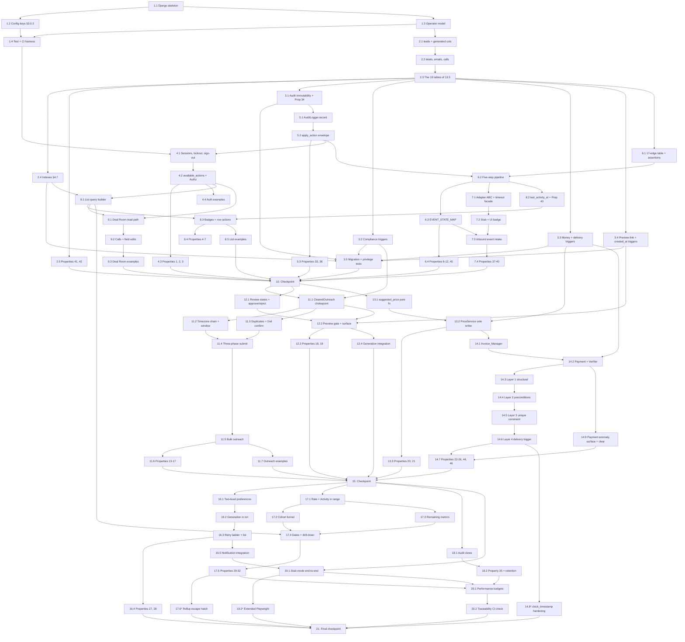

# Implementation Plan: Deal Room Dashboard

## Overview

Django 5 + PostgreSQL 16, server-rendered templates with HTMX and Alpine.js, Celery + Redis for notification delivery only (design §2.2, §2.3, §2.7). The repository is greenfield, so task 1 scaffolds the project.

The ordering follows the design's own layering:

- **Database enforcement precedes the services that rely on it** (tasks 2–3 before tasks 6, 11–14). The ten triggers of §4.6, the `UNIQUE (deal_id)` on `release_authorizations`, the generated normalization columns, the genesis partial unique index, and the §4.3 `CHECK` constraints all land before the service code they back — otherwise a service's property test can pass for the wrong reason.
- **The `Pipeline_Adapter` stub lands early** (task 7). Requirement 12.3 and §3.14.2 make stub mode the thing that lets the dashboard run end to end with no bot, so everything that invokes the adapter comes after it.
- **The state machine (task 6) and the audit logger with its transaction discipline (task 5) are foundations**, because nearly every service requests a transition or writes an audit entry inside the §3.13 one-action-one-transaction envelope.
- **Release safety is built as four separately verifiable layers** (tasks 14.3–14.6), one per §3.7.2–§3.7.5, never collapsed.
- **Every property test is implemented in the same task as the code it constrains**, referenced by property number.
- **Vertical slices after the foundations** (tasks 8, 9, 12) so the dashboard is demonstrable early.

## Tasks

- [ ] 1. Scaffold the Django project, settings, and test/CI harness
  - [ ] 1.1 Create the Django 5 project skeleton and package manifest
    - `pyproject.toml` pinning Django 5.x, `psycopg[binary]`, `celery`, `redis`, `django-htmx`
    - `config/` project package with `asgi.py`, `wsgi.py`, `urls.py`; `dashboard/` app package with the `models/`, `services/`, `adapter/`, `views/`, `templates/` subpackages that §3.0.1's layering rules refer to
    - PostgreSQL 16 as the only configured database backend; enable the `pg_trgm` extension in the initial migration (needed by §4.7)
    - _Requirements: 13.11_
  - [ ] 1.2 Add the five configuration keys of design §3.0.3
    - `config/settings/base.py` defining `PIPELINE_ADAPTER_MODE`, `REPORTING_TIMEZONE` (default `America/New_York`), `ADAPTER_OPERATION_TIMEOUT_SECONDS` (30), `SESSION_ABSOLUTE_LIFETIME_SECONDS` (43200), `SESSION_IDLE_TIMEOUT_SECONDS` (1800)
    - `USE_TZ = True`, `TIME_ZONE = "UTC"` so every stored timestamp is UTC
    - `SESSION_COOKIE_AGE` set to the idle timeout with `SESSION_SAVE_EVERY_REQUEST = True` as the cookie-level backstop described in §3.1
    - Celery app wired to Redis with one worker queue and a beat schedule placeholder
    - _Requirements: 10.13, 12.3, 12.8, 13.11, 1.4, 1.12_
  - [ ] 1.3 Create the `operators` model as the custom user model
    - `dashboard/models/operator.py` with `role` as a single field over `Viewer | Agent | Admin`, defaulting to `Viewer`, plus the registered email address and the optional Slack webhook target the notification channels read
    - Set `AUTH_USER_MODEL` before the first migration is generated
    - _Requirements: 1.5, 9.5, 9.6_
  - [ ] 1.4 Wire the test and CI harness
    - `pytest`, `pytest-django`, `hypothesis[django]`, `factory_boy`, `time-machine`, `playwright`, `respx`, `import-linter` as dev dependencies; `pytest.ini` with `DJANGO_SETTINGS_MODULE` and a `--hypothesis-seed` default
    - `.importlinter` with the §3.0.1 contracts declared but empty-sourced for now: views may not import models directly, only `outreach_controller` may reach the adapter send operations, only `release_gate` may reach `release_authorizations`
    - CI workflow running, as separate failing-capable steps: `pytest`, `lint-imports`, the import-time assertion check, and the migration test of task 3.5
    - _Requirements: 13.10_

- [ ] 2. Build the full schema with its declared constraints
  - [ ] 2.1 Create the `leads` table with every declared field and constraint
    - All columns of Requirement 13.1 including `state_version`, `website_condition`, `urgency`, `estimated_page_count`, `timezone`, `region`, `unsubscribed_at`, `do_not_call_at`, `manual_review_flag`, `last_activity_at`
    - The two `GENERATED ALWAYS AS … STORED` normalization columns of §3.6.5: `email_normalized` as `lower(btrim(contact_email))` and `phone_digits` as digits-only `contact_phone`
    - Every §4.3 `CHECK`: `researched_score` 1–5, `preferred_price` null or 550–1000, `status` in the eleven Pipeline_State values, `website_condition`/`urgency` null or 1–5, `estimated_page_count` null or 0–200, `state_version` non-negative default 0, `manual_review_flag` not-null default false, `timezone` ≤ 64 chars, `region` ≤ 200 chars, the 1–200 / 2048 / 320 / 32 length bounds
    - `last_activity_at` declared **`NOT NULL`**, not merely maintained: the genesis `pipeline_state_history` row is written in the same transaction as the Lead, so the source set of Requirement 13.14 is non-empty from the instant the Lead exists and there is no unset state for the column to hold. Task 8.2 supplies the initialization from that genesis row
    - _Requirements: 13.1, 13.6, 13.7, 13.11_
  - [ ] 2.2 Create `deals`, `emails`, and `calls` with their constraints
    - `deals` with `lead_id NOT NULL UNIQUE` (Requirement 13.12), `agreed_price` null or 550–1000, `payment_verified_at TIMESTAMPTZ(3)`, `verified_by_operator_id` referencing `operators`, `delivery_sent`, `delivered_date`
    - `deals` additionally carrying `payment_anomaly_flag BOOLEAN NOT NULL DEFAULT false` and `payment_anomaly_reason` holding 1–500 characters while the flag is true and null while it is false, expressed as a **two-way `CHECK`** so neither a flagged Deal with no reason nor an unflagged Deal carrying one is storable
    - `emails` with `lead_id`/`sent_at` not-null, `subject` 1–200, `body` 1–50000, `unsubscribed` not-null default false, `outreach_request_id UNIQUE`, nullable `site_project_id`, plus a **required `clearance_timestamp TIMESTAMPTZ(3)`** copied from the `outreach_requests` reservation and `late_opt_out_marker BOOLEAN NOT NULL DEFAULT false`
    - `calls` with `attempt_number` 1–20, `outcome` in `answered|busy|no-answer`, `notes` ≤ 5000, `outreach_request_id UNIQUE` — the storage ceilings deliberately wider than the Deal_Room_View input rules — plus `late_opt_out_marker BOOLEAN NOT NULL DEFAULT false` and a nullable `clearance_timestamp TIMESTAMPTZ(3)` constrained by `CHECK (outreach_request_id IS NULL OR clearance_timestamp IS NOT NULL)`, so the only call row permitted to carry no clearance is one an Operator logged directly under Requirement 3.5
    - _Requirements: 13.2, 13.3, 13.4, 13.6, 13.12, 5.12, 5.18, 5.21, 5.22, 8.21_
  - [ ] 2.3 Create the remaining nineteen tables enumerated in Requirement 13.5
    - `site_projects` (review_state CHECK defaulting to `Generating`, `page_count` 0–200, `rejection_reason` 10–1000 when rejected, a **required `created_at`** set at record creation and never changed thereafter, and a `generated_at` left unset until generation finishes), `site_pages` (required `site_project_id`), `contacts` (required `lead_id`), `invoices` (`deal_id` UNIQUE, `invoice_number` UNIQUE, `amount` 550–1000), `payments` (`amount_usd` 1–1000), `release_authorizations` (`deal_id` **UNIQUE** — the release safety constraint, `operator_id` not-null, `authorized_at TIMESTAMPTZ(3)`), `audit_entries` (closed `action_type` enum, `before_value`/`after_value` JSONB, monotonic `id` as the append sequence), `pipeline_state_history`, `processed_events` (`event_id` PK 1–128 chars), `outreach_requests` (UUID PK, channel, status, and a **required `clearance_timestamp TIMESTAMPTZ(3)`** — the Clearance_Timestamp recorded at reservation and the source both row-level copies in task 2.2 are taken from), `rejected_events`, `adapter_invocations`, `email_bounces`, `notifications` (`UNIQUE (event_id, operator_id)`), `notification_deliveries` (`UNIQUE (notification_id, channel)`, `attempt_count` 1–4, `outcome` in `delivered|failed`), `notification_preferences`, `login_attempts` (`(identifier_hash, occurred_at, outcome)`, append-only, never updated), `variants` (dimension+value key), `email_variant_assignments` (`UNIQUE (email_id, dimension)`)
    - `site_projects.created_at` is the Requirement 6.11 ordering key by which a Lead's most recent Site_Project is resolved, chosen over `generated_at` because `generated_at` is null for exactly the row that is still `Generating` — the row the indicator and the price resolution have to see
    - Every `lead_id`/`deal_id` reference as a real `REFERENCES` foreign key so an unresolvable reference is rejected by the database
    - On `pipeline_state_history`: `CHECK (from_state IS NOT NULL OR to_state = 'New_Lead')` plus the §4.4 partial unique index `one_genesis_row_per_lead ON (lead_id) WHERE from_state IS NULL`
    - _Requirements: 13.5, 13.9, 13.13, 13.15, 5.18, 6.5, 6.8, 6.9, 6.11, 8.1, 8.2, 8.3, 8.13, 9.8, 9.10, 11.3, 12.2, 12.5_
  - [ ] 2.4 Create the indexes of design §4.7
    - Lead list: `idx_leads_status_activity`, `idx_leads_activity`, `idx_leads_company`, `idx_leads_score`, `idx_leads_email_norm`, `idx_leads_phone_digits`, and the `gin_trgm_ops` GIN index over the four searchable columns
    - Analytics: `idx_history_state_time`, `idx_history_lead_time`, `idx_emails_sent`, `idx_emails_lead_sent`, `idx_calls_time_outcome`, `idx_invoices_issued`, `idx_payments_paid`, the partial `idx_deals_verified`, `idx_eva_variant`
    - Most-recent Site_Project: `idx_site_projects_lead_created ON site_projects (lead_id, created_at DESC, id DESC)`, whose column order matches the Requirement 6.11 ordering including the id tiebreak, so the latest-Site_Project lookup is one index-scan step per Lead and answers correctly for a Lead whose newest cycle is still `Generating`
    - Audit: `idx_audit_time`, `idx_audit_actor_time`, `idx_audit_action_time`, `idx_audit_target`
    - _Requirements: 2.6, 2.7, 6.11, 10.14, 11.6_
  - [ ] 2.5 Write property tests for the schema constraint layer
    - Implement **Property 41 (field constraints reject every out-of-bound write)** from the declarative `(model, field, bound)` table covering every constrained column of §4.3, generating values just inside and just outside each bound
    - Implement **Property 42 (referential integrity and at most one Deal per Lead)**, including concurrent Deal creation attempts on separate connections
    - _Requirements: 13.1, 13.2, 13.3, 13.4, 13.5, 13.6, 13.7, 13.8, 13.9, 13.11, 13.12, 13.15_
    - _Properties: 41, 42_

- [ ] 3. Install the database enforcement layer — the ten triggers of §4.6
  - [ ] 3.1 Install `trg_audit_immutable` and the two supporting immutability layers
    - `BEFORE UPDATE OR DELETE ON audit_entries` raising unconditionally
    - Grant the application database role only `INSERT` and `SELECT` on `audit_entries`
    - Override the model's `save()` to reject a call with a primary key already set and `delete()` to raise
    - Implement **Property 34 (committed Audit_Entries are immutable)** across ORM `save`/`update`/`delete`/`bulk_update` and raw `UPDATE`/`DELETE`
    - _Requirements: 11.4_
    - _Properties: 34_
  - [ ] 3.2 Install the four compliance triggers, every predicate a function of pre-submission values only
    - `trg_no_email_after_unsubscribe` on `emails` BEFORE INSERT rejecting when `NEW.clearance_timestamp >= leads.unsubscribed_at`, returning early when `unsubscribed_at` is null — **not** `sent_at`, which is assigned in Phase 3 after the adapter has already sent the message
    - `trg_no_call_after_dnc` on `calls` BEFORE INSERT rejecting when `NEW.clearance_timestamp >= leads.do_not_call_at`, **returning early on a null `NEW.clearance_timestamp`** so an Operator-logged call with no reservation behind it is exempt rather than rejected
    - `trg_no_email_after_bounce` on `emails` BEFORE INSERT carried the identical defect and is fixed the same way: scope the `EXISTS` to bounces for the Lead's current `contact_email` whose `occurred_at` **precedes `NEW.clearance_timestamp`**, which is also what Requirement 5.6 states — a recorded bounce blocks every *subsequent* email action, and an action cleared before the bounce was recorded is not subsequent to it
    - `trg_outreach_channel_match` on `emails` and `calls` BEFORE INSERT rejecting a row whose channel disagrees with its `outreach_requests` reservation — the cross-table half of the at-most-one rule; both operands are fixed in Phase 1
    - A test asserting the whole-table claim rather than the three predicates one at a time: no `BEFORE INSERT` trigger on `emails` or `calls` can reject a row whose adapter submission already succeeded. Drive every trigger with a reservation cleared at `T`, an opt-out or bounce recorded at `T + δ`, and the insert attempted afterwards, and assert the insert commits in every case
    - _Requirements: 5.6, 5.12, 5.19, 5.20_
  - [ ] 3.3 Install the three money and delivery triggers
    - `trg_delivery_guard` on `deals` BEFORE UPDATE asserting, whenever `delivery_sent` becomes true, that `payment_verified_at` is non-null, that exactly one `release_authorizations` row exists, and that `payment_verified_at <= authorized_at <= delivered_date`
    - `trg_agreed_price_frozen` on `deals` BEFORE UPDATE rejecting an `agreed_price` change once an invoice exists
    - `trg_deal_state_consistency` on `deals` BEFORE UPDATE requiring `payment_verified_at` non-null whenever the Lead is at or past `Payment_Verified`, so the flag and the state cannot diverge
    - _Requirements: 7.11, 8.11, 8.12, 8.17, 8.18, 8.19, 8.20_
  - [ ] 3.4 Install `trg_preview_link_approved` and `trg_site_created_at_immutable`
    - `trg_preview_link_approved` on `emails` BEFORE INSERT asserting that when `site_project_id` is set, that Site_Project's `approved_at` is non-null and `<= NEW.clearance_timestamp`, closing the approve-then-reject-then-send window. The operand is the clearance rather than `sent_at` for the same reason task 3.2 gives: a predicate over `sent_at` can newly fail after the adapter has sent. It is strictly stronger, since `clearance_timestamp <= sent_at` always and `Approved` is absorbing
    - `trg_site_created_at_immutable` on `site_projects` BEFORE UPDATE rejecting any change to `created_at`, so the Requirement 6.11 ordering key cannot be rewritten under a Lead whose generation history has already been resolved against it
    - _Requirements: 6.7, 6.11, 13.5_
  - [ ] 3.5 Write the migration and privilege tests that prove the enforcement layer is deployed
    - A test running a fresh `migrate` against an empty database and asserting that every trigger of §4.6, every `CHECK` and `UNIQUE` of §4.3, the two generated columns, the genesis partial unique index, and every index of §4.7 exists by querying `pg_trigger`, `pg_constraint`, `pg_attribute`, and `pg_indexes`
    - A privilege test asserting the application role holds no `UPDATE` or `DELETE` grant on `audit_entries`
    - Wire both into the CI workflow from task 1.4
    - _Requirements: 11.4, 13.5, 13.8_

- [ ] 4. Implement authentication and authorization
  - [ ] 4.1 Implement session establishment, expiry, lockout, and sign-out
    - `SessionExpiryMiddleware` enforcing both the 12-hour absolute cap from a never-refreshed `session_started_at` and the 30-minute idle cap from a per-request `last_seen_at`; either one ends the session
    - `AuthService.sign_in` returning `SignInOutcome`, honoring a retained requested screen only when the role permits it and falling back to the Lead_List_View, and emitting a single constant failure message that never distinguishes unknown identifier from wrong password
    - Windowed lockout over the `login_attempts` table keyed by hashed identifier, computed as **failures since that identifier's most recent success**: count the `outcome = 'failure'` rows whose `occurred_at` falls in the trailing 15 minutes *and* is later than that identifier's greatest successful `occurred_at`, coalescing to `-infinity` when the identifier has no success on record. At five or more, refuse without evaluating the password, display the remaining duration measured from the fifth such failure, and write a rejected-attempt audit entry
    - Reset on success implemented by **appending a success row**, never by updating or marking anything: the appended `occurred_at` becomes the window's new lower bound, so every earlier failure drops out of the count from that instant without a row being touched. The table is genuinely append-only — no `UPDATE` and no `DELETE` statement against `login_attempts` exists anywhere in the codebase, and the count is a derived windowed query over immutable rows rather than a mutable counter
    - Unauthenticated-request redirect in middleware before any view executes, so no Lead or Deal query is issued; `AuthService.sign_out` ending the session
    - _Requirements: 1.1, 1.2, 1.3, 1.4, 1.11, 1.12, 1.13_
  - [ ] 4.2 Implement the `available_actions()` single source of truth and in-service role checks
    - `Action` StrEnum and the `MIN_ROLE` table over `Viewer < Agent < Admin`; Admin-only role changes
    - `available_actions(lead, operator) -> dict[Action, Availability]` where `Availability` carries `permitted`, `enabled`, and `unmet` drawn from exactly the closed reason set of Requirement 3.4
    - `Authz.check(operator, action)` as the **first statement inside every service entry point**, not only as a view decorator, so a hand-crafted POST to an unrendered control is rejected at the point of application; the decorator stays as defense in depth
    - A rejected authorization writes a rejected-attempt audit entry naming the required role and leaves every record untouched
    - _Requirements: 1.5, 1.6, 1.7, 1.8, 1.9, 1.10, 11.7_
  - [ ] 4.3 Write property tests for auth and authorization
    - Implement **Property 1 (role enforcement is independent of what the UI rendered)** over the `Role × Action` cross product, submitting directly to each endpoint without rendering its page
    - Implement **Property 2 (sign-in refusal depends only on the windowed failure count)** over random sequences of failures, successes, and clock advances under `time-machine`, with the invariant recomputed as the **failures-since-last-success** count — the failures in the trailing 15 minutes later than the identifier's most recent success row — so a reset implemented by mutating rows rather than by appending a success would falsify it
    - Implement **Property 3 (authentication failure is indistinguishable across credential fields)**, comparing response bodies byte-for-byte after stripping CSRF tokens
    - _Requirements: 1.3, 1.6, 1.7, 1.8, 1.9, 1.10, 1.11, 11.7_
    - _Properties: 1, 2, 3_
  - [ ] 4.4 Write example tests for the auth cases that do not vary with input
    - Unauthenticated request to each screen redirecting to sign-in with the requested screen retained, asserting no Lead or Deal query is issued
    - Successful sign-in in two cases: a retained screen the role permits, and one it does not, which lands on the Lead_List_View
    - The Viewer default role at account creation; session boundaries at 11:59:59 / 12:00:00 and 29:59 / 30:00 under a frozen clock; sign-out timing
    - _Requirements: 1.1, 1.2, 1.4, 1.5, 1.12, 1.13_

- [ ] 5. Implement the Audit_Logger and the shared transaction discipline
  - [ ] 5.1 Implement `AuditLogger.record` over the closed action-type set
    - `AuditLogger.record(actor, action_type, target, before, after)` writing `actor_id`, `action_type`, `target_type`, `target_id`, `before_value` JSONB, `after_value` JSONB, and `occurred_at` at millisecond precision, called **inside** the acting transaction
    - `before_value` null for a creation and `after_value` null for a rejected attempt, both rendered as not-applicable
    - The **eleven** action types of Requirement 11.3 as a closed enum matching the database `CHECK`: outreach send, Pipeline_State change, agreed_price change, site approval, site rejection, invoice creation, payment verification, **payment anomaly clearing**, release authorization, Lead field edit, and rejected action attempt
    - _Requirements: 11.1, 11.2, 11.3_
  - [ ] 5.2 Implement the `apply_action` transaction envelope with its autonomous rejection transaction
    - One `transaction.atomic()` per Operator action and per inbound event containing every record write **and** the audit write, so a failed audit insert rolls the action back and reports that it was neither recorded nor applied
    - The autonomous rejection path: on `ActionRejected`, after the action's transaction has rolled back, open a **new** transaction that records the rejected attempt with `occurred_at` captured at raise time, then re-raise
    - `transaction.on_commit` for every background enqueue, and the rule that no network call happens inside a transaction
    - The §5.1 error taxonomy as eight exception classes with one handling policy each, including validation errors re-rendering the bound form rather than redirecting
    - _Requirements: 11.9, 11.10, 13.10_
  - [ ] 5.3 Write property tests for audit completeness and transactional atomicity
    - Implement **Property 33 (exactly one Audit_Entry per applied action and per rejected attempt)** over random valid, invalid, unauthorized, and duplicate-replay actions across all **eleven** action types — the generator now including the payment-anomaly-clearing action of Requirement 8.22 both as an applied Agent/Admin action carrying the recorded anomaly reason as `before_value` and as a rejected attempt by a Viewer
    - Implement **Property 36 (a failed write anywhere in an action rolls the whole action back)** over the cross product of every action and event type × the write index at which the failure is injected, always including the audit write as one position
    - _Requirements: 11.1, 11.2, 11.3, 11.9, 11.10, 13.10_
    - _Properties: 33, 36_

- [ ] 6. Implement the Pipeline_State_Machine
  - [ ] 6.1 Declare the transition table as data with its three import-time assertions
    - `PipelineState` StrEnum over the eleven values, `TERMINAL_STATES`, and `LEGAL_TRANSITIONS` as the 17-pair frozenset that is the only definition of legality in the codebase
    - The three module-level assertions: exactly 17 members, no pair with identical values, no pair whose source is terminal
    - `TRANSITION_PRECONDITIONS` as a separate table keyed by target state so legality and action preconditions do not tangle
    - _Requirements: 4.1, 4.11_
  - [ ] 6.2 Implement `request()` as the five-step ordered pipeline
    - Step 0a parse the target value, step 0b resolve the `lead_id` under `SELECT … FOR UPDATE`, step 1 the Terminal_State pre-check, step 2 `LEGAL_TRANSITIONS` membership with a message listing the legal successors, step 3 the action preconditions listing each unsatisfied one, step 4 the concurrency guard — stopping at the first step that rejects
    - The conditional `UPDATE` guarded on both `status = expected_from` and `state_version = expected_version`, incrementing `state_version` in the same transaction as the status write; rowcount 0 rejects with the state-changed message. Adapter-sourced requests pass `expected_from_state` read inside the transaction and skip the version check
    - Per accepted transition, in one transaction: the `leads.status` update, exactly one `pipeline_state_history` row carrying `from_state`, `to_state`, `occurred_at`, the acting actor and `actor_kind`, and `audit_entry_id`, and exactly one audit entry
    - Lead creation writing `status = New_Lead` plus the genesis history row with `from_state` null, rejecting any creation request specifying another initial state
    - Render `state_version` as a hidden field in every transition form
    - _Requirements: 4.2, 4.3, 4.4, 4.5, 4.7, 4.10, 4.11, 4.12, 4.13, 13.13_
  - [ ] 6.3 Implement the adapter event state mapping
    - `EVENT_STATE_MAP` exhaustive over the seven event types with `prospect_replied → Replied`, `payment_received → Paid_Pending_Verification`, and the other five mapping to no change
    - The two import-time assertions that nothing maps to `Released` and nothing maps to `Payment_Verified` — the machine-checked form of the §3.7.2 claim that no webhook can release a website or verify a payment
    - Mapped events evaluated through the same pipeline, with an illegal mapping recording the reported event type and current state and changing nothing else
    - _Requirements: 4.8, 4.9_
  - [ ] 6.4 Write property tests for the state machine
    - Implement **Property 8 (transition legality is exactly the 17-edge table)** over all 121 ordered pairs, asserting the rejection message class matches the pipeline order so the terminal-first evaluation is observable
    - Implement **Property 9 (recorded state history is always a legal path from New_Lead)** as the `PipelineHistoryMachine` stateful test
    - Implement **Property 10 (accepted-and-applied or rejected-and-unchanged, never both, never partial)**, with the concurrency half firing `N ∈ [2, 8]` requests from separate database connections
    - Implement **Property 11 (adapter events map exactly as tabulated)** over the 7 × 11 cross product
    - Implement **Property 12 (invalid inputs rejected before legality is consulted)** over non-member target strings and absent `lead_id`s
    - Implement **Property 45 (`state_version` increments once per accepted transition and stale versions are always rejected)** as the `StateVersionMachine`, including concurrent submissions of the same version
    - Add the import-time assertion check to CI as its own step
    - _Requirements: 4.1, 4.2, 4.3, 4.4, 4.5, 4.6, 4.7, 4.8, 4.9, 4.10, 4.11, 4.12, 4.13, 13.13_
    - _Properties: 8, 9, 10, 11, 12, 45_

- [ ] 7. Implement the Pipeline_Adapter boundary and its stub
  - [ ] 7.1 Define the adapter interface and the timeout-enforcing facade
    - `PipelineAdapter` ABC with exactly the five outbound operations, each **requiring** an `idempotency_key` and returning `AdapterResult` with `status` in `success | failure` and a 1–500 character `failure_reason` on failure
    - The `Idempotency_Key` is a requirement of **all five** operations, not only the two outreach ones: generated once per Operator-confirmed action, stable across every retry of that same confirmed action, and typed as non-optional so an invocation without one does not compile past the facade. For `send_prospect_email` and `log_outbound_call` that key *is* the action's `outreach_request_id`; `generate_site_preview`, `send_delivery_email`, and `create_invoice` each mint their own per-confirmation key
    - `TimeoutEnforcingAdapter` converting exceptions, connection errors, and hangs past `ADAPTER_OPERATION_TIMEOUT_SECONDS` into a failure result so no exception ever reaches a caller, recording every invocation with its elapsed time and its `Idempotency_Key`
    - The failure-handling contract: state retained, all records unchanged, the returned reason displayed, and a retry control that resubmits the same operation with the same `Idempotency_Key`
    - _Requirements: 12.1, 12.4, 12.8_
  - [ ] 7.2 Implement `StubPipelineAdapter` and the stub-mode UI indicator
    - A stub holding no network client, no SMTP config, and no HTTP session, returning success in under a second and writing every invocation with all arguments to `adapter_invocations`
    - Stub-mode synthesis of the corresponding inbound events for `create_invoice` and `generate_site_preview`, routed through the **real** intake endpoint with a real event identifier so the stub gets no privileged path
    - `PIPELINE_ADAPTER_MODE` selecting the implementation and driving the `adapter_stub_mode` template flag, rendered by one shared `action_button` partial that every action control uses
    - A CI template test asserting every template containing a form posting to an action endpoint includes that partial
    - _Requirements: 12.3_
  - [ ] 7.3 Implement the inbound event intake
    - The seven `EventType` values with a per-type schema requiring `event_id` (1–128 chars), `event_type`, `lead_id`, and `event_timestamp`, plus `deal_id` and amount on `payment_received`, and accepting on `unsubscribed` an **optional** email identifier — optional in the schema's own terms, so an `unsubscribed` event that omits it is a valid event rather than a rejected one
    - De-duplication as the first statement of the handling transaction: `INSERT INTO processed_events … ON CONFLICT (event_id) DO NOTHING`, rowcount 0 discarding the event; a 180-day purge cutoff comfortably above the 90-day floor
    - Rejection of an unknown event type, a missing or invalid field, an invalid timestamp, or an unresolvable `lead_id`, recording the payload and reason in `rejected_events` and changing nothing
    - The §3.14.3 event handling table, with every effect written as a set rather than an increment: `email_opened`/`email_clicked`/`prospect_replied` setting the email timestamps, `email_bounced` inserting `email_bounces` with address and reason and setting `manual_review_flag`, `site_generation_finished` setting the Site_Project review fields
    - `unsubscribed` setting `leads.unsubscribed_at` **and** setting `emails.unsubscribed` under the attribution rule: on the row named by the event's optional email identifier when the event carries one, otherwise on that Lead's email row with the greatest `sent_at`, otherwise on no row at all when the Lead has no email rows. This handler is the only writer of `emails.unsubscribed`, and therefore the only thing that makes the Requirement 10.3 unsubscribe-rate numerator reachable
    - `payment_received` in the **two-level transaction shape** the unconditional-recording rule forces, never one flat transaction:
      - in the enclosing event transaction, unconditionally insert the `payments` row and set `deals.paid_date` and `deals.payment_received` — irrespective of the Lead's current Pipeline_State and irrespective of whether an invoice record exists
      - request `Paid_Pending_Verification` inside a **nested savepoint**, so a rejection rolls back the transition alone and leaves the payment insert committed in the enclosing transaction; the savepoint rollback is the complete non-occurrence of the transition, leaving no `leads.status` change, no `pipeline_state_history` row, and no `state_version` increment
      - on that rejection, or when the Deal holds no invoice, write `payment_anomaly_flag` and `payment_anomaly_reason` naming which of the two conditions applied **in the enclosing transaction**, along with the Requirement 4.9 rejected-event record and the anomaly notification — not in an autonomous transaction, because only the savepoint rolled back and the enclosing transaction is still alive
      - the `processed_events` claim is written in the enclosing transaction and therefore **commits regardless**, so a rejected transition never releases the claim and a redelivery still finds it, discards, and leaves the single payment record and the anomaly flag as they stand
    - Intake returning 2xx for a malformed or duplicate event and 5xx only for a genuine server-side failure
    - _Requirements: 12.2, 12.5, 12.6, 12.7, 12.9, 4.8, 4.9, 5.6, 5.8, 5.23, 8.3, 8.21_
  - [ ] 7.4 Write property tests for the adapter boundary
    - Implement **Property 37 (delivering an event N times is indistinguishable from delivering it once)** for N in 1–10 across all seven types, including concurrent duplicate delivery on separate connections
    - Implement **Property 38 (inbound events accepted if and only if well formed)** over per-field omissions, invalid timestamps, absent `lead_id`s, and `event_id` lengths 0, 1, 128, 129, with the `unsubscribed` generator covering the optional email identifier in all four states — present and naming one of that Lead's own rows, present and naming a row belonging to a different Lead, present but naming no existing row, and omitted entirely, the last of which must be **accepted**, so a validator that promotes the optional field to a required one fails here
    - Implement **Property 39 (operations always return exactly one well-formed result and never record on failure)** over the five operations × `{success, raise, hang past timeout}`, each driven from an Operator confirmation with retry counts 1–10 so the invariant can assert that every invocation of every one of the five operations carries an `Idempotency_Key` and that every retry of one confirmed action carries **the same `Idempotency_Key`** as its first attempt — the generalized form, not the `outreach_request_id`-only form
    - Implement **Property 40 (stub mode records everything and transmits nothing)**, asserting zero sockets opened and an empty mail outbox
    - _Requirements: 12.1, 12.2, 12.3, 12.4, 12.5, 12.6, 12.7, 12.8, 12.9_
    - _Properties: 37, 38, 39, 40_

- [ ] 8. Build the Lead_List_View slice
  - [ ] 8.1 Implement the single list query builder
    - Conjunctive Pipeline_State filter, trimmed 1–100 character case-insensitive substring search over `company_name`/`contact_name`/`contact_email`/`contact_phone` served by the trigram GIN index, and sort over the six sortable columns
    - `ORDER BY <column> <dir> NULLS LAST, leads.id ASC` with `NULLS LAST` explicit for both directions
    - Pagination at 50 with total match count, page number and page count; a page beyond the last clamping to the last page; the zero-match state with a count of 0 and a clear-all control; the retrieval-failure state with a retry control — all with filter state carried in the URL rather than session
    - _Requirements: 2.2, 2.3, 2.4, 2.5, 2.11, 2.12, 2.13, 2.14, 2.15_
  - [ ] 8.2 Implement `last_activity_at` maintenance and its consistency job
    - The source set is exactly: that Lead's email `sent_at`, `opened_at`, `clicked_at`, and `reply_at`, its call record timestamps, its Pipeline_State change timestamps, and its **applied** Operator action timestamps — the timestamps of **rejected action attempts are excluded**, which matters because a rejected attempt commits an audit entry through the autonomous transaction of §3.13.3 outside any advancing path
    - Initialize the column at Lead creation from the `occurred_at` of that Lead's genesis `pipeline_state_history` row, written in the same transaction as the Lead, so the `NOT NULL` declaration of task 2.1 holds from the instant the Lead exists and the column has no unset branch
    - Advance the value in the same transaction as each of the five advancing writes: email row insert, adapter event applying an email timestamp, call insert, accepted state transition, audited Lead edit — never moving the value backwards. A rejected attempt must **not** advance the column, so the advance belongs to the applying path and not to the audit write
    - A nightly Celery beat consistency job recomputing the value from the source tables for every Lead, with rejected-attempt audit rows filtered out, and logging any drift
    - Implement **Property 43 (`last_activity_at` always equals the latest source timestamp)** as the `LastActivityMachine`, with rules writing exactly one source timestamp each, including out-of-order, equal, and duplicate values, plus an **`attempt_rejected_action`** rule issuing an illegal transition, an unauthorized Viewer action, and an out-of-range field edit; after that rule the column must be byte-identical to its prior value even though `audit_entries` grew by one. The `is None` branch is gone from the invariant — it is unreachable by construction and a null column is a constraint violation rather than a valid state
    - _Requirements: 2.1, 13.1, 13.14_
    - _Properties: 43_
  - [ ] 8.3 Implement the compliance badges and row actions
    - Four distinct badges — unsubscribed, do-not-call, bounced, duplicate-contact — each naming its condition; duplicate-contact computed for the whole page in one aggregate CTE over `email_normalized` and `phone_digits` rather than per row
    - The Site Ready for Review indicator joined from the most recent Site_Project's `review_state`, where "most recent" is resolved by the single Requirement 6.11 definition — a `LATERAL … ORDER BY created_at DESC, id DESC LIMIT 1` served by `idx_site_projects_lead_created`, **never** ordered by `generated_at`, which is null for exactly the still-`Generating` row this join has to see in order to omit the indicator for it
    - Row actions offered from `available_actions()` only where both the precondition and the role permit, omitted otherwise
    - _Requirements: 2.8, 2.10, 6.2, 6.11_
  - [ ] 8.4 Write property tests for the list view
    - Implement **Property 4 (result set equals the reference conjunctive predicate)** model-based against a naive in-Python filter
    - Implement **Property 5 (ordering is total, deterministic, and null-last in both directions)** over all six columns × both directions with high null density and many duplicate sort values
    - Implement **Property 6 (pagination covers the result set exactly once)** with N drawn around page boundaries and out-of-range page requests
    - Implement **Property 7 (rendered controls and badges equal the computed availability)** over random `(state, role, precondition, compliance)` tuples
    - _Requirements: 2.2, 2.3, 2.4, 2.5, 2.8, 2.10, 2.11, 2.12, 2.14, 3.4, 5.8, 8.7_
    - _Properties: 4, 5, 6, 7_
  - [ ] 8.5 Write example tests for the list states that do not vary with input
    - The row's enumerated field set including the most-recent-activity timestamp, asserting only that the row renders the stored value
    - The zero-match state and the retrieval-failure state with filters, search term, and sort retained
    - _Requirements: 2.1, 2.13, 2.15_

- [ ] 9. Build the Deal_Room_View slice
  - [ ] 9.1 Implement the Deal Room read path and activity history
    - One query per related collection with `select_related`/`prefetch_related` and no N+1, rendering every field of Requirement 3.1 including the Suggested_Price, the Payment_Verified_Flag value, and the release status
    - Release status derived from the existence of a `release_authorizations` row — `Locked` while none exists, `Released` with the `delivered_date` once one does — never from a separately stored status string
    - The activity history as a database-level `UNION ALL` over emails, calls, `pipeline_state_history`, and `audit_entries` into `(occurred_at, kind, summary, detail_json)`, ordered most-recent-first and paginated at 50 in the database
    - Every action control for the current state rendered from `available_actions()`, each disabled control displaying its unmet reasons from the closed reason set
    - The not-found path rendering a not-found message with a return path and creating nothing
    - _Requirements: 3.1, 3.2, 3.3, 3.4, 3.7, 3.10_
  - [ ] 9.2 Implement call record entry and the validated, audited field-edit path
    - `attempt_number` assigned server-side as 1 or `max + 1` under a row lock on the Lead so two concurrent submissions cannot take the same number; `outcome` constrained to the three values; notes ≤ 2,000 characters at the view boundary
    - Rejection of an invalid outcome or over-long notes creating no call row, retaining the Operator-entered values in the input controls, and naming the rejected field and accepted values
    - One validated field-edit path serving `contact_name` (≤ 100), `contact_email` (valid, ≤ 254), `contact_phone` (7–20) and the three pricing inputs `website_condition`, `urgency` (1–5), `estimated_page_count` (0–200), each acceptance writing an audit entry with before and after, each rejection retaining the stored value and naming the field and range, and an accepted pricing-input edit displaying the recomputed Suggested_Price
    - Rejected submissions re-rendering the bound form rather than redirecting, so typed input survives
    - _Requirements: 3.5, 3.6, 3.8, 3.9, 3.11, 3.12_
  - [ ] 9.3 Write example tests for the Deal Room
    - Release status rendering as Locked with no authorization and as Released with the `delivered_date` once one exists
    - Activity history with entries from all four sources and more than 50 total, asserting the union, ordering, and pagination
    - A stored call record appearing in the history with its assigned `attempt_number`; a rejected call record retaining the typed values; the not-found Deal Room
    - An accepted and a rejected value for each contact field and each pricing input, plus the recomputed Suggested_Price after an accepted pricing-input edit
    - One concurrency example on separate connections: two simultaneous call submissions for the same Lead must not receive the same `attempt_number`
    - _Requirements: 3.2, 3.3, 3.5, 3.6, 3.7, 3.8, 3.9, 3.10, 3.11, 3.12_

- [ ] 10. Checkpoint — foundations and the two read slices
  - Ensure all tests pass, ask the user if questions arise.

- [ ] 11. Implement the Compliance_Guard and Outreach_Controller
  - [ ] 11.1 Implement the `ClearedOutreach` token chokepoint
    - `ClearedOutreach` constructible only by `ComplianceGuard` via a sentinel argument, refusing construction when blocks are present; `OutreachController.submit(cleared, message)` as the only method reaching `send_prospect_email` and `log_outbound_call`
    - The token **carries** its clearance instant: `ClearedOutreach.clearance_timestamp` exposes the `ComplianceDecision.evaluated_at` of the clean evaluation, so "no submission without a Clearance_Timestamp" is a consequence of `submit()` accepting nothing else rather than a check to remember. It is never recomputed — a retry of the same confirmed action reuses the same reservation and therefore the same value
    - `ComplianceDecision` carrying blocks, warnings, `requires_extra_confirmation`, `evaluated_at`, `lead_local_time`, and `timezone_source`; the per-channel blocking table of §3.6.2 with bounces scoped to the `contact_email` they were recorded against and `manual_review_flag` set on bounce
    - Activate the import-linter contract restricting the adapter send symbols to `outreach_controller`
    - _Requirements: 5.3, 5.4, 5.6, 5.8, 5.18_
  - [ ] 11.2 Implement the timezone resolution chain and the calling window
    - `resolve_timezone` in exactly the Requirement 5.17 order — explicit `leads.timezone`, then the bundled static NANP table over `phone_digits`, then `leads.region`, then absent — with no network lookup and **no server default** substituted
    - The window check permitting a call when `08:00 <= local < 20:00`, displaying the Lead's local time and the window bounds on a block; an unresolvable timezone blocking every call with the unknown-local-time message and recording no call row
    - Ambiguous area codes resolved to the dominant zone with `timezone_source = AREA_CODE` surfaced on the Deal_Room_View as inferred and overridable
    - _Requirements: 5.5, 5.15, 5.17_
  - [ ] 11.3 Implement duplicate-contact detection and the second confirmation
    - Detection as an index lookup over the `email_normalized` and `phone_digits` generated columns, warning with the other Lead's `company_name`
    - The standard confirmation step displaying recipient `contact_email`, `company_name`, and subject, submitting nothing until confirmed and nothing at all on cancel
    - A server-side second confirmation token distinct from the standard one: the `ClearedOutreach` mint refuses when `requires_extra_confirmation` is true and the token is absent, so a client-side dialog alone cannot satisfy it
    - _Requirements: 5.2, 5.7_
  - [ ] 11.4 Implement the three-phase submit protocol and the reconciliation job
    - Phase 1 reserving one `outreach_requests` row per confirmed action with the `outreach_request_id` generated before the first attempt and reused unchanged on every retry, **and writing `clearance_timestamp = decision.evaluated_at` onto that reservation** — so the moment the reservation commits, the fact "this action was cleared at instant T" is durable and immutable, before any network act occurs; a replayed identifier discarded without invoking the adapter, displaying the existing record and its timestamp
    - Phase 2 invoking the adapter **outside any transaction** under the 30-second timeout with the `outreach_request_id` as the `Idempotency_Key`
    - Phase 3 recording, on success, the email row with `lead_id`, subject, body, `outreach_request_id`, `sent_at`, and the `clearance_timestamp` **copied verbatim from the reservation** — never re-derived and never read from the clock — plus the audit entry plus the `New_Lead → Contacted` transition request, all in one transaction; on failure, marking the reservation failed with the reason, recording no email row, and offering a retry that reuses the same identifier and the same clearance
    - The late-opt-out path: Phase 3 compares the reserved `clearance_timestamp` against the Lead's current `unsubscribed_at` (or `do_not_call_at`) under the row read it already takes, and when the opt-out is later, **still records the row** — the adapter has already reported success and the message has already left — additionally setting `late_opt_out_marker = true` and generating a notification so Operators learn of it within 60 seconds of the row being recorded. The reservation moves to `succeeded`, never `indeterminate`, because the outcome is fully known
    - A Celery beat reconciliation job marking reservations pending beyond 5 minutes as `indeterminate` and surfacing them on the Deal_Room_View with an explicit unknown-outcome message and a manual resolution control — never auto-retrying; the late opt-out is deliberately *not* routed here, since it is a known outcome rather than an unknown one
    - _Requirements: 5.1, 5.9, 5.10, 5.12, 5.18, 5.21, 5.22, 12.4_
  - [ ] 11.5 Implement bulk outreach
    - Selection over 100 rejected outright with the maximum displayed before any evaluation; for a valid selection, an independent `ComplianceDecision` per Lead, submission only for cleared Leads each with its own `outreach_request_id`, and a per-Lead result table naming the condition that blocked each blocked Lead
    - _Requirements: 5.13, 5.14_
  - [ ] 11.6 Write property tests for compliance and outreach
    - Implement **Property 13 (no outreach submitted after an opt-out, every recorded row cleared before one, and a late opt-out marks the row rather than losing it)** as the `ComplianceMachine`, asserting all three families after every rule: the **submission** invariant (no `send_prospect_email` or `log_outbound_call` invocation whose reservation's `clearance_timestamp` is at or after the Lead's opt-out timestamp), the **stored clearance** invariant (every `emails` row's `clearance_timestamp` strictly earlier than its Lead's `unsubscribed_at`, every `calls` row carrying a non-null one strictly earlier than `do_not_call_at`, a null-clearance call row exempt and never failing the check), and the **late-opt-out marker** behavior (exactly one row for that `outreach_request_id`, `late_opt_out_marker` true, one compliance notification, reservation status `succeeded` — never zero rows). Two rules beyond the existing set are required: `log_operator_call_without_reservation`, a Requirement 3.5 call row with a null `clearance_timestamp` that the call trigger must skip, and `opt_out_between_adapter_success_and_row_write`, which suspends a submission after the adapter has returned success in Phase 2, delivers the opt-out event, and only then lets Phase 3 commit — the rule that falsifies the old `sent_at`-based design
    - Implement **Property 14 (calls permitted exactly within the local calling window)** with generators covering half-hour and 45-minute offset zones, DST transition dates, boundary instants, stripped signals, and Leads carrying conflicting signals so the Requirement 5.17 precedence is observable
    - Implement **Property 15 (one outreach action produces at most one recorded row, retries reuse its identifier)** as the `OutreachIdempotencyMachine`
    - Implement **Property 16 (duplicate contacts detected under the specified normalization)** over case, whitespace, and phone punctuation variants
    - Implement **Property 17 (bulk outreach submits exactly the cleared subset)** over selections of size 1–100 with random per-Lead blocking conditions
    - _Requirements: 5.3, 5.4, 5.5, 5.7, 5.8, 5.9, 5.10, 5.11, 5.12, 5.13, 5.15, 5.16, 5.17, 5.18, 5.19, 5.20, 5.21, 5.22_
    - _Properties: 13, 14, 15, 16, 17_
  - [ ] 11.7 Write example tests for the outreach cases that do not vary with input
    - A confirmed send against a `New_Lead` requesting the Contacted state; the confirmation step in two cases, confirm and cancel, the cancel asserting zero adapter invocations and no email row
    - A bounce against the current `contact_email` blocking every subsequent email action, setting `manual_review_flag`, and displaying the recorded reason and timestamp, plus a second example where correcting `contact_email` clears the block
    - An unsubscribe event delivered for a Lead that has **no email rows at all**: the Lead-level opt-out is recorded by setting `unsubscribed_at`, the `unsubscribed` flag is set on no email row, and nothing raises. One behavior, so an example rather than a property
    - The 100/101 bulk selection boundary
    - _Requirements: 5.1, 5.2, 5.6, 5.14, 5.23_

- [ ] 12. Implement the Site_Review_Gate slice
  - [ ] 12.1 Implement the review state model and the approve/reject actions
    - `review_state` over the four values defaulting to `Generating`, with exactly one `site_projects` row per generation cycle and a Lead's **most recent** Site_Project resolved by the single Requirement 6.11 definition — greatest `created_at`, tie-broken by greatest id — applied everywhere the latest site is read, so every generation's review history is preserved, an old rejected generation can never be retroactively approved, and a cycle still `Generating` with a null `generated_at` is nonetheless ordered
    - `on_generation_finished` serving both initial generation and regeneration, setting `Ready_For_Review` and recording `generated_at`, `preview_url`, and `page_count`
    - Approve and reject legal only from `Ready_For_Review`, each recording the acting operator and timestamp and writing an audit entry with previous and new review_state; reject requiring a 10–1000 character reason and submitting exactly one regeneration request; any other current state rejected with the state retained and a rejected-attempt audit entry
    - An out-of-range rejection reason rejecting the action while retaining `Ready_For_Review` and the Operator's typed text and displaying the accepted range
    - _Requirements: 6.1, 6.4, 6.5, 6.8, 6.9, 6.10, 6.11_
  - [ ] 12.2 Implement the preview-link gate and the review surface
    - `assert_preview_link_permitted` called from `ComplianceGuard.evaluate()` so a blocked preview link surfaces as an ordinary block in the same decision object every send path already respects; detection scanning the composed body for any Site_Project `preview_url` of that Lead and for the configured preview-host domain pattern; a block retaining the composed message and displaying the current review_state alongside the required Approved
    - `emails.site_project_id` set whenever the body contains that site's URL, so the task 3.4 trigger applies
    - The review surface rendering `preview_url`, `page_count`, `generated_at`, and the stored `site_pages` text for up to 20 pages from local storage rather than the preview host
    - _Requirements: 6.3, 6.6, 6.7_
  - [ ] 12.3 Write property tests for the site review gate
    - Implement **Property 18 (no email carrying a preview link precedes that site's approval)** as the `SiteGateMachine`
    - Implement **Property 19 (review transitions legal only from Ready_For_Review)** over 4 review states × `{approve, reject}` × reason lengths `{0, 1, 9, 10, 500, 1000, 1001, 5000}`, plus arbitrary strings written directly to `review_state`
    - _Requirements: 6.4, 6.5, 6.6, 6.7, 6.8, 6.9, 6.10_
    - _Properties: 18, 19_
  - [ ] 12.4 Write the site-generation integration and indicator examples
    - Reported generation completion for both an initial generation and a regeneration, asserting `Ready_For_Review`, the recorded `generated_at`, `preview_url`, and `page_count`, and the site-ready notification inside the 60-second bound under a controlled clock
    - The Site Ready for Review indicator across all four review states, present only for `Ready_For_Review`
    - _Requirements: 6.1, 6.2_

- [ ] 13. Implement the Pricing_Advisor and the agreed_price write path
  - [ ] 13.1 Implement the pure suggested-price function and input resolution
    - `suggested_price(page_count, website_condition, urgency)` as the Requirement 7.1 formula verbatim, with `PRICE_FLOOR`, `PRICE_ANCHOR`, `PRICE_CAP` constants
    - `resolve_inputs(lead)` following the Requirement 7.12 order for `page_count` — the most recent Site_Project's `page_count`, otherwise `estimated_page_count`, otherwise absent — where "most recent" is the Requirement 6.11 ordering by `created_at DESC, id DESC` and **not** by `generated_at`; the row this resolution reads is frequently the still-`Generating` one whose `generated_at` is null, which a `generated_at` ordering cannot rank at all. `website_condition` and `urgency` are read directly with an unset column resolving to absent
    - All-or-nothing fallback: if any of the three is absent, return `SuggestedPrice(850, is_fallback=True, missing=(...))` without evaluating the formula, and have the Deal_Room_View name each absent attribute
    - Display of the Suggested_Price labelled as a recommendation alongside the floor, anchor, and cap and the `agreed_price` input; `preferred_price` displayed read-only as a research hint and excluded from every computation
    - _Requirements: 6.11, 7.1, 7.2, 7.10, 7.12, 7.13_
  - [ ] 13.2 Implement `PriceService.set_agreed_price` as the sole writer
    - `agreed_price` left empty until an Operator submits, with a quote or create-invoice action rejected while it is unset; values below 550, above 1000, blank, non-numeric, or non-whole rejected with the accepted range displayed, the previously persisted value retained or the field left unset, and Pipeline_State untouched
    - An accepted value persisted and displayed, with an audit entry recording the submitting operator, the Suggested_Price at submission time, and the previous and submitted values
    - `Pricing_Advisor` holding no reference to any Deal writer, so no computation can write the field; the input rendered disabled with its reason once an invoice exists, and any change request rejected — backed by `trg_agreed_price_frozen`
    - _Requirements: 7.3, 7.4, 7.5, 7.6, 7.8, 7.9, 7.11_
  - [ ] 13.3 Write property tests for pricing
    - Implement **Property 20 (Suggested_Price equals the formula and lands within the band)** over the full integer domain of the three inputs plus all seven non-empty absent-attribute subsets. The `page_count` half of the generator builds the whole resolution chain rather than passing a bare integer, and must include the case Requirement 6.11 exists for: a Lead whose most recent Site_Project has `review_state = Generating` and a **null `generated_at`**, sitting behind older completed cycles with different `page_count` values — in the variant where that in-flight row carries a `page_count` and the variant where it does not and resolution falls through to `estimated_page_count` — plus two Site_Projects sharing a `created_at` so the **id tiebreak** is exercised. The invariant asserts the resolved `page_count` equals that of the Site_Project with the greatest `(created_at, id)`, null `generated_at` included
    - Implement **Property 21 (a persisted agreed_price is always operator-submitted and always in band)** as the `PriceProvenanceMachine` invariant mixin, asserting that computing a suggestion never changes any `agreed_price`, that changing `preferred_price` changes neither the suggestion nor any `agreed_price`, and that no post-invoice value differs from the value at issue time
    - _Requirements: 6.11, 7.1, 7.2, 7.3, 7.4, 7.5, 7.6, 7.7, 7.8, 7.9, 7.10, 7.11, 7.12, 7.13_
    - _Properties: 20, 21_

- [ ] 14. Implement invoicing, payment verification, and the four-layer gated release
  - [ ] 14.1 Implement the Invoice_Manager
    - Preconditions state `Won`, `agreed_price` set and in `[550, 1000]`, and no existing invoice; creation writing exactly one invoice with a unique identifier, `amount` copied from `agreed_price` at issue time, and `issued_at`, then requesting the Invoiced state
    - A duplicate create surfacing the `UNIQUE (deal_id)` violation as "invoice already exists" with the existing identifier, amount, and `issued_at` unchanged; a missing `agreed_price` rejected with the unmet condition named
    - _Requirements: 8.1, 8.2_
  - [ ] 14.2 Implement payment recording and the Payment_Verifier
    - Payment recording from the `payment_received` event for **any** Deal the event's `deal_id` resolves to — no invoice precondition and no Pipeline_State precondition: amount validated as a whole dollar value in `[1, 1000]` — deliberately wider than `agreed_price` so a shortfall is recordable — `paid_date` stored and `payment_received` set unconditionally, with the Paid_Pending_Verification state requested as a **separate outcome** that does not condition the recording, in the nested-savepoint shape task 7.3 implements
    - The anomaly path: when that transition request is rejected because the Lead's current state forms no Legal_Transition to Paid_Pending_Verification, or when the Deal holds no invoice record, the amount, `paid_date`, and `payment_received` are retained, the Pipeline_State is left unchanged, `payment_anomaly_flag` is set with `payment_anomaly_reason` naming which of the two conditions applied, and Operators are notified within 60 seconds of the event being accepted
    - The verification surface displaying the recorded amount, the invoice amount, and the difference, with an enabled Verify Payment control only for Agent or Admin while the state is Paid_Pending_Verification
    - Verification requiring state Paid_Pending_Verification and an unset flag, writing `payment_verified_at` at millisecond precision and `verified_by_operator_id` and requesting the Payment_Verified state **in one transaction** so neither value persists without the other; a wrong state or already-set flag rejected with a message distinguishing the two
    - An amount mismatch displaying the absolute difference labelled shortfall when lower and overpayment when higher and requiring a **second** confirmation token, leaving the flag unset when that token is absent
    - _Requirements: 8.3, 8.4, 8.5, 8.6, 8.14, 8.17, 8.18, 8.19, 8.21_
  - [ ] 14.3 Build release safety layer 1 — structural absence, machine-checked
    - Activate the `release-gate-isolation` import-linter contract forbidding `dashboard.views`, `dashboard.adapter.events`, `payment_verifier`, `outreach_controller`, and `notification_service` from importing `dashboard.models.release_authorization`, so the Requirement 8.10 exclusions are a build step rather than a code review
    - `Release_Gate` as the sole insert site for `release_authorizations` and the sole caller of `adapter.send_delivery_email`; `TRANSITION_PRECONDITIONS[RELEASED]` requiring both `PaymentVerifiedFlagSet` and `HasReleaseAuthorization`
    - A test asserting the three structural facts hold: the `EVENT_STATE_MAP` assertions from task 6.3 fire, `Payment_Verified → Released` is the only inbound edge to `Released`, and `lint-imports` passes on the contract
    - _Requirements: 8.10, 8.12_
  - [ ] 14.4 Build release safety layer 2 — application preconditions with the flag checked before the state
    - `authorize_release` calling `Authz.check` first, then opening a transaction, then `SELECT … FOR UPDATE` on the Deal
    - `payment_verified_at is None` evaluated **before** the state check, so a Deal in any state whatsoever with an unset flag is rejected with the payment-verification reason regardless of its Pipeline_State, creating no authorization, submitting no delivery request, leaving `delivery_sent` and `delivered_date` unset, and writing one rejected-attempt audit entry with the `deal_id` and requesting actor
    - The gate reading the flag rather than the state for the Requirements 8.7/8.8/8.9 precondition; the Approve Release control rendered disabled with "payment verification outstanding" whenever the flag is unset, without consulting state
    - A server-minted, single-use confirmation token scoped to `(action, deal_id)` consumed inside the transaction, so a POST that bypassed the dialog is rejected
    - _Requirements: 8.7, 8.8, 8.9, 8.20_
  - [ ] 14.5 Build release safety layer 3 — the unique constraint collapsing concurrent confirmations
    - The `release_authorizations` insert wrapped so an `IntegrityError` on `one_authorization_per_deal` returns `already_authorized` with the **existing** authorization and does **not** call `_deliver()`, leaving `authorized_at`, `delivery_sent`, and `delivered_date` unchanged and submitting no additional delivery request
    - Exactly one authorization written per accepted confirmation, carrying `deal_id`, `operator_id`, and `authorized_at` at millisecond precision, with the audit entry inside the same transaction
    - _Requirements: 8.8, 8.13_
  - [ ] 14.6 Build release safety layer 4 — the delivery write behind its trigger
    - `_deliver()` invoking `send_delivery_email` **after** the authorization transaction has committed and outside any transaction, under the 30-second timeout
    - On success, a second transaction setting `delivery_sent` and `delivered_date` — passing `trg_delivery_guard` from task 3.3 — and requesting the Released state
    - On failure, the authorization retained, `delivery_sent` and `delivered_date` left unset, the Payment_Verified state retained, the failure reason displayed, and a retry control consuming a fresh single-use token so one activation submits at most one delivery request; no automatic retry is ever scheduled
    - _Requirements: 8.15, 8.16_
  - [ ] 14.7 Write property tests for the money path
    - Implement **Property 22 (everything delivered was verified, authorized, and correctly ordered)** as the `ReleaseSafetyMachine`
    - Implement **Property 23 (nothing is delivered without an accepted Approve Release)** as the `NoReleaseMachine`, whose rule set deliberately excludes `confirm_release`, plus a direct-POST generator issuing release requests across all eleven states with the flag unset and asserting the payment-verification reason every time
    - Implement **Property 24 (concurrent confirmations collapse to one authorization and one delivery)** with `N ∈ [2, 8]` confirmations on separate connections with randomized jitter
    - Implement **Property 25 (the invoice and verification gates admit exactly one valid combination each)**
    - Implement **Property 26 (delivery outcomes recorded faithfully, retries never over-send)**
    - Implement **Property 44 (the verification timestamp and the Payment_Verified state never diverge)** as the `VerificationConsistencyMachine`, whose extra `write_state_only` and `write_verification_timestamp_only` rules are issued through both the ORM and raw SQL so `trg_deal_state_consistency` is exercised as well as the service layer
    - Implement **Property 46 (an accepted payment event always leaves exactly one payment record)** as the `PaymentRecordMachine` — the `ReleaseSafetyMachine` rule set reused as an invariant mixin, the way Properties 21 and 33 already reuse theirs — extended with two rules the ordinary money path never produces: `deliver_payment_event_at_arbitrary_state`, forcing the Lead into each of the eleven Pipeline_States including the eight from which Paid_Pending_Verification is not a Legal_Transition, and `deliver_payment_event_without_invoice`, delivering it for a Deal with no invoice. Both crossed with repeat delivery counts `N ∈ [1, 10]` of the same `event_id`, random amounts in `[1, 1000]`, and a following `clear_payment_anomaly` rule issued as Agent, as Admin, as Viewer, and as a subsequent legal transition or adapter event. The invariant asserts `count(payments where event_id = E) == 1` — never zero, never more — plus, on every anomaly execution, a byte-identical `status`, no new `pipeline_state_history` row, the flag set with a reason naming the applicable condition, one anomaly notification, and clearing only by the Agent/Admin action
    - _Requirements: 8.1, 8.2, 8.3, 8.4, 8.5, 8.6, 8.9, 8.10, 8.11, 8.12, 8.13, 8.14, 8.15, 8.16, 8.17, 8.18, 8.19, 8.20, 8.21, 8.22, 8.23_
    - _Properties: 22, 23, 24, 25, 26, 44, 46_
  - [ ]* 14.8 Harden the timestamp chain to a single database clock
    - Source `payment_verified_at`, `authorized_at`, and `delivered_date` from `clock_timestamp()` in the database rather than the application clock, so multi-app-server skew cannot reach `trg_delivery_guard` at all
    - Recorded in §3.7.5 as a designed-but-not-implemented follow-up; the trigger already fails safe on skew, so this is a hardening step rather than a gap
    - _Requirements: 8.11_
  - [ ] 14.9 Surface the payment anomaly in both views and implement the audited clearing action
    - Depends on 14.2, which writes the flag, and not on the release-safety layers; sequenced alongside 14.3 rather than behind 14.6
    - While `payment_anomaly_flag` is set, the Deal_Room_View displays a payment anomaly indicator together with the recorded `payment_anomaly_reason`, and the Lead_List_View displays a payment anomaly badge on that Deal's Lead row — the same page-level aggregate the other four badges are computed in, so the badge costs no per-row query
    - `clear_payment_anomaly` as the sole clearing path: an explicit confirmed action restricted to Agent or Admin through `Authz.check` as the first statement of the service entry point, clearing the flag and the reason in one transaction with exactly one audit entry under the **`payment anomaly clearing`** action type carrying the recorded reason as `before_value`
    - No Pipeline_Adapter event and no Pipeline_State change clears the flag, enforced the way §3.7.2 enforces the release exclusions — one writer, and no call edge from the event intake or the state machine to it — so a later legal transition does not silently erase the record that a human still needs to look at this Deal
    - _Requirements: 8.22, 11.3_

- [ ] 15. Checkpoint — the full money path
  - Ensure all tests pass, ask the user if questions arise.

- [ ] 16. Implement the Notification_Service
  - [ ] 16.1 Implement the two-level preference model
    - One `Notification_Subscription` per `(operator, event_type)` over the four event types, and one `Channel_Delivery_Setting` per `(operator, event_type, channel)` over Slack and email, each settable independently
    - An Operator with no recorded preference treated as subscribed to all four types with both channels enabled
    - Enabling Slack without a recorded webhook target rejected, leaving the setting disabled and displaying that a webhook target is required
    - _Requirements: 9.7, 9.12_
  - [ ] 16.2 Implement notification generation inside the triggering transaction
    - `generate()` called inside the event or action transaction, conditioned on the subscription **alone** and restricted to Operators holding Agent or Admin, with `UNIQUE (event_id, operator_id)` giving the at-most-one guarantee structurally
    - Per-type payloads: reply excerpt truncated at the 500th character, payment amount with invoice amount, site-ready, and the single `compliance_event` type covering bounce and unsubscribe — each carrying the Lead `company_name` and a deep link to the Deal_Room_View
    - Delivery enqueued via `transaction.on_commit` so a rolled-back event delivers nothing
    - _Requirements: 9.1, 9.2, 9.3, 9.4, 9.11_
  - [ ] 16.3 Implement channel delivery, the retry ladder, and the in-dashboard list
    - A Celery task per `(notification, channel)` attempting delivery only where that channel's `Channel_Delivery_Setting` is enabled, retaining the generated record when it is disabled
    - `countdown=60, max_retries=3` giving the initial attempt plus up to three further attempts at 60-second intervals, recording `delivered` or `failed` with the attempt count as an **update** to `notification_deliveries` so a retry never inserts a notification
    - The in-dashboard list for the signed-in Operator over the trailing 30 days, most recent first, showing each per-channel outcome, present even when both channels are disabled because the list is not a channel
    - _Requirements: 9.5, 9.6, 9.8, 9.9, 9.10, 9.11_
  - [ ] 16.4 Write property tests for notifications
    - Implement **Property 27 (content and recipients match the event and the preference matrix)** over the four event types × random operator pools spanning all three roles × random 4×2 matrices including the all-disabled one, with reply texts of length 500 and 501
    - Implement **Property 28 (one notification per event per operator, retries never create more)** over repeat delivery counts 1–10 crossed with failure patterns
    - _Requirements: 9.1, 9.2, 9.3, 9.4, 9.7, 9.8, 9.10, 9.11_
    - _Properties: 27, 28_
  - [ ] 16.5 Write notification integration tests
    - Slack delivery to the recorded webhook target and email delivery to the registered address, with mocked transport asserting the destination
    - The 60-second bound under a controlled clock: one event per type, asserting generation and the first attempt on each enabled channel both land inside the bound and that a subsequent retry is permitted to land outside it
    - The payment-event path end to end: recorded amount and `paid_date`, `payment_received` set, Paid_Pending_Verification requested, and the payment notification inside the bound
    - The in-dashboard list under a frozen clock with notifications inside and outside the 30-day window; enabling Slack without a webhook
    - _Requirements: 8.3, 9.5, 9.6, 9.9, 9.12, 9.13_

- [ ] 17. Implement the Analytics_View
  - [ ] 17.1 Implement the shared `Rate` value object and the Activity-in-range block
    - `Rate(numerator, denominator)` returning `None` on a zero denominator so every rate renders not-applicable rather than zero, and formatting to one decimal place — implemented once so the `[0, 1]` bound and the zero-denominator rule are not restated per metric
    - The block labelled **Activity in range** carrying `Reached_Count` as `count(DISTINCT lead_id)` over `pipeline_state_history` and `Current_State_Count` over `leads.status` for each of the eleven states, labelled distinctly from the Cohort funnel block
    - _Requirements: 10.1, 10.10, 10.11_
  - [ ] 17.2 Implement the Cohort funnel block
    - The Cohort as the Leads whose `New_Lead` history entry falls inside the range; `Cohort_Stage_Count` counting cohort members whose history contains each ordered stage without further restricting those stages to the range
    - Drop-off count and percentage per consecutive stage pair, computed from cohort counts only and never from `Reached_Count`, with no clamping anywhere in the computation
    - _Requirements: 10.2, 10.8, 10.15_
  - [ ] 17.3 Implement the remaining metrics
    - Email open, click, reply, and unsubscribe rates over emails sent in range; the call connect rate; the close rate and the mean `agreed_price` over Deals in the post-Won states rounded to whole dollars
    - Per-Variant-dimension send count, reply rate, meeting rate, and close rate across the five dimensions, with an insufficient-sample indicator and the send count below 30 sends
    - Total revenue as the sum of payment amounts for Deals whose verification timestamp falls in range, invoice counts issued and paid, and the median whole days from `issued_at` to `paid_date` with the even-size median as the mean of the two central values and no paid invoices rendered not-applicable
    - _Requirements: 10.3, 10.4, 10.5, 10.6, 10.7, 10.12_
  - [ ] 17.4 Implement date-range handling and the drill-down
    - Default trailing 30 days; boundaries interpreted in `REPORTING_TIMEZONE` with the start inclusive from 00:00:00 and the end inclusive through 23:59:59, converted to UTC instants for querying; a range over 24 months rejected with the maximum span displayed; an empty range rendering every count as zero and every rate as not-applicable
    - Stage-count drill-down listing `company_name`, Pipeline_State, and most-recent-activity timestamp paginated at 50 with the total, **reusing the task 8.1 list query builder with a stage filter** rather than a parallel implementation
    - _Requirements: 10.9, 10.13, 10.14_
  - [ ] 17.5 Write property tests for analytics
    - Implement **Property 29 (every metric equals its independent reference computation)** model-based against an in-Python reference, with edge-case-biased datasets including empty sets, ties, even-sized payment sets, boundary timestamps, and Variant send counts spanning 0–60. The dataset must deliver `unsubscribed` events **through the real event intake** rather than seeding `emails.unsubscribed` directly, so the unsubscribe-rate numerator is populated by its actual writer: events carrying an explicit email identifier, events omitting it so the greatest-`sent_at` row is chosen, Leads with several email rows, with exactly one, and with none, and events whose attributed row falls outside the selected range while the event falls inside it. A regression that stops writing the flag then falsifies the property instead of passing trivially at zero
    - Implement **Property 30 (the eleven buckets partition the range and every rate is well formed)**, including datasets engineered so each rate's denominator is zero in turn
    - Implement **Property 31 (cohort funnel stage counts are monotonically non-increasing)**, deliberately including Leads whose `New_Lead` entry falls outside the range while later entries fall inside — the exact case that breaks a non-cohort funnel
    - Implement **Property 32 (out-of-range records never influence an in-range metric)**, plus the drill-down set equality
    - _Requirements: 10.1, 10.2, 10.3, 10.4, 10.5, 10.6, 10.7, 10.8, 10.9, 10.10, 10.11, 10.12, 10.13, 10.14, 10.15_
    - _Properties: 29, 30, 31, 32_
  - [ ]* 17.6 Add the analytics pre-aggregation rollup escape hatch
    - An `analytics_daily_rollup(day, metric_key, numerator, denominator)` table populated by a Celery beat job, with the view reading rollups for complete days and computing only the partial current day
    - Designed but not built in §3.11.4; build this only if the task 20 budget test for Requirement 10.14 fails
    - _Requirements: 10.14_

- [ ] 18. Implement the audit views
  - [ ] 18.1 Implement the per-Lead history and the Admin-only searchable log
    - Per-Lead history resolving entries whose target is the Lead or its Deal, ordered `occurred_at DESC, id DESC` so entries sharing a timestamp fall in append order, paginated at 50, with a no-recorded-activity message when empty
    - The searchable log restricted to Admin, filterable conjunctively by `actor_id`, `action_type`, and date range, ordered `occurred_at DESC`, paginated at 50 with the total match count; a non-Admin request rejected with an authorization-failure message
    - An application-level request to modify an entry rejected with the immutability message and every field left unchanged
    - No purge job scheduled, so entries accumulate and the 24-month retention floor cannot be violated by a misconfigured cutoff
    - _Requirements: 11.4, 11.5, 11.6, 11.7, 11.8_
  - [ ] 18.2 Write the audit query property test and the retention example
    - Implement **Property 35 (audit queries are correctly ordered, conjunctively filtered, and fully paginated)** model-based against a Python conjunctive filter, with many identical `occurred_at` values and Leads both with and without Deals
    - An example asserting 24-month retention under a frozen clock
    - _Requirements: 11.5, 11.6, 11.8_
    - _Properties: 35_

- [ ] 19. Wire the stub-mode end-to-end run
  - [ ] 19.1 Implement the stub-mode integration run from Lead creation through delivery
    - One test driving the full path: create Lead, send prospect email, record a reply event, set the pricing inputs and the agreed price, quote, create invoice, deliver a payment event, verify the payment, approve release, and deliver — asserting the terminal `Released` state and the complete audit trail
    - Assert the positive-path field values the invariant properties do not pin down: exactly one email row carrying `lead_id`, subject, body, `outreach_request_id`, and `sent_at` once the adapter returns success, and exactly one Release_Authorization carrying `deal_id`, `operator_id`, and millisecond-precision `authorized_at` together with exactly one delivery request
    - Assert the run completes with `PIPELINE_ADAPTER_MODE = stub` and no external transmission, which is the proof the dashboard is independently runnable without the bot
    - Add the inbound webhook endpoint behavior for each of the seven event types against a live database
    - A Playwright navigation assertion that selecting a Lead row opens the Deal_Room_View for that Lead
    - _Requirements: 2.9, 5.1, 8.8, 12.2, 12.3_
  - [ ]* 19.2 Extend the Playwright suite beyond the navigation assertions
    - Broader end-to-end UI coverage of the confirmation dialogs, the live Suggested_Price recompute, and the notification list poll
    - §7.1 deliberately scopes Playwright to a small set of confirmations, so this is additive coverage rather than required coverage
    - _Requirements: 3.4, 5.2, 8.6_

- [ ] 20. Implement the performance budget tests
  - [ ] 20.1 Seed the performance datasets and assert every stated budget
    - A seeding fixture producing 5,000 Leads with related rows, 50,000 emails with full state histories, 100,000 audit entries, a Lead with 500 activity entries, and a 20-page Site_Project
    - Assertions, each failing the build on regression: sign-in under 3s, list first page under 2s, filter/search/sort change under 1s, Deal Room render under 2s, site review surface under 3s, every analytics metric under 3s, audit search first page under 3s
    - Wire into CI as its own step so a missed budget is the signal for task 17.6 rather than a guess
    - _Requirements: 1.2, 2.6, 2.7, 3.1, 6.3, 10.14, 11.6_
  - [ ] 20.2 Implement the traceability CI check
    - Parse the `Validates: Requirements X.Y` bullets out of `design.md` and the `# Covers: Requirements X.Y` comments out of the example, integration, and performance suites, and assert their union equals the full acceptance-criteria set in `requirements.md`. The `# Covers:` comment is the declared mechanism for the non-property tiers and is load-bearing — without it the check sees only the property tier and reports every example-tier criterion as uncovered
    - Add the `# Covers:` annotation to every non-property test written in tasks 4.4, 8.5, 9.3, 11.7, 12.4, 16.5, 18.2, 19.1, and 20.1, and the `# Feature: deal-room-dashboard, Property N: …` comment to every one of the **46** property tests
    - Assert the check sees the criteria added in this revision: **5.18, 5.19, 5.20, 5.21, 5.22** through Property 13, **6.11** through Property 20, and **8.21, 8.22, 8.23** through Property 46, with 8.22's action type additionally reached by Property 33; and **5.23** through the example-tier test in task 11.7
    - Record the two tier moves so the check's expected partition matches: Requirement **8.3** has left the example tier for the property tier, because the unconditional-recording rule it now states varies with Pipeline_State and invoice presence, and Property 46 names it; Requirement **5.23** has joined the example tier, because a Lead with no email rows admits exactly one behavior
    - Fail the build when a criterion has no test
    - _Requirements: 13.5_

- [ ] 21. Final checkpoint
  - Ensure all tests pass, ask the user if questions arise.

## Notes

- Tasks marked with `*` are the three things the design itself names as designed-but-not-built: the analytics pre-aggregation rollup (§3.11.4), the `clock_timestamp()` timestamp hardening (§3.7.5), and the Playwright suite beyond the few navigation assertions (§7.1). Nothing load-bearing is optional — in particular every property test is required, because the properties are how the design's invariant claims are verified.
- All 46 correctness properties are assigned: 1–3 (4.3), 4–7 (8.4), 8–12 (6.4), 13–17 (11.6), 18–19 (12.3), 20–21 (13.3), 22–26 (14.7), 27–28 (16.4), 29–32 (17.5), 33 and 36 (5.3), 34 (3.1), 35 (18.2), 37–40 (7.4), 41–42 (2.5), 43 (8.2), 44 (14.7), 45 (6.4), 46 (14.7).
- Seven existing properties changed scope in this revision rather than being replaced, so their tasks changed and their numbers did not: **13** now carries the submission invariant, the stored-clearance invariant, and the late-opt-out marker across Requirements 5.18–5.22; **20** now covers the Requirement 6.11 `created_at` ordering including the in-flight `Generating` row and the id tiebreak; **29** now drives unsubscribe events through the real intake so the unsubscribe-rate numerator has a writer; **33** now spans eleven action types; **38** now exercises the optional email identifier in all four states; **39** now asserts a generalized `Idempotency_Key` across all five outbound operations; **43** now excludes rejected-attempt timestamps and has lost its unreachable `is None` branch. Property **46** is the only wholly new one.
- Each property test is implemented in the same task as the code it constrains, never batched at the end, so a defect is caught by the task that introduced it.
- Property tests run a minimum of 100 iterations; the pure pricing property runs 200–1000, the stateful machines run 100 with `stateful_step_count` between 10 and 50, and the concurrency properties draw `N` per example.

## Task Dependency Graph



```json
{
  "waves": [
    { "id": 0, "tasks": ["1.1"] },
    { "id": 1, "tasks": ["1.2", "1.3"] },
    { "id": 2, "tasks": ["1.4"] },
    { "id": 3, "tasks": ["2.1"] },
    { "id": 4, "tasks": ["2.2"] },
    { "id": 5, "tasks": ["2.3"] },
    { "id": 6, "tasks": ["2.4", "2.5", "3.1", "3.2", "3.3", "3.4"] },
    { "id": 7, "tasks": ["3.5", "5.1"] },
    { "id": 8, "tasks": ["5.2"] },
    { "id": 9, "tasks": ["4.1", "5.3", "6.1"] },
    { "id": 10, "tasks": ["4.2", "6.2"] },
    { "id": 11, "tasks": ["4.3", "4.4", "6.3", "7.1", "8.1", "8.2"] },
    { "id": 12, "tasks": ["6.4", "7.2", "8.3", "9.1"] },
    { "id": 13, "tasks": ["7.3", "8.4", "8.5", "9.2"] },
    { "id": 14, "tasks": ["7.4", "9.3"] },
    { "id": 15, "tasks": ["10"] },
    { "id": 16, "tasks": ["11.1", "12.1", "13.1"] },
    { "id": 17, "tasks": ["11.2", "11.3", "12.2", "13.2"] },
    { "id": 18, "tasks": ["11.4", "12.3", "12.4", "13.3", "14.1"] },
    { "id": 19, "tasks": ["11.5", "14.2"] },
    { "id": 20, "tasks": ["11.6", "11.7", "14.3", "14.9"] },
    { "id": 21, "tasks": ["14.4"] },
    { "id": 22, "tasks": ["14.5"] },
    { "id": 23, "tasks": ["14.6"] },
    { "id": 24, "tasks": ["14.7", "14.8"] },
    { "id": 25, "tasks": ["15"] },
    { "id": 26, "tasks": ["16.1", "17.1", "18.1"] },
    { "id": 27, "tasks": ["16.2", "17.2", "17.3", "18.2"] },
    { "id": 28, "tasks": ["16.3", "17.4"] },
    { "id": 29, "tasks": ["16.4", "16.5", "17.5"] },
    { "id": 30, "tasks": ["17.6", "19.1"] },
    { "id": 31, "tasks": ["19.2", "20.1"] },
    { "id": 32, "tasks": ["20.2"] },
    { "id": 33, "tasks": ["21"] }
  ]
}
```

### What can run in parallel

- **Wave A (after 1.4):** nothing else — the schema depends on the custom user model being registered before the first migration.
- **After 2.3:** tasks **3.1, 3.2, 3.3, 3.4** and **2.4** are fully independent of each other. Four separate trigger migrations and the index migration touch disjoint objects.
- **After 5.2:** tasks **4.1→4.2** (auth) and **6.1→6.2** (state machine) are independent tracks. Both need the transaction envelope; neither needs the other.
- **After 6.2 and 4.2:** the adapter track (**7.1→7.2→7.3**) and the list-view track (**8.1**, **8.2**) run in parallel. 8.2 depends only on the state machine, not on 8.1.
- **After 8.1:** **8.3** and **9.1** run in parallel — the Deal Room reuses the query builder but does not extend it.
- **After checkpoint 10:** three independent tracks — compliance/outreach (**11.x**), site review (**12.x**), and pricing (**13.x**). They converge only at 14.1, which needs 13.2, and at 12.2, which needs 11.1 for the block surfacing.
- **Within task 14:** the release chain is strictly sequential. 14.3→14.4→14.5→14.6 are the four release-safety layers and each must be verifiable on its own before the next is added; collapsing them defeats the point. **14.9** is the one exception: it depends on 14.2 alone, touches no release code, and therefore runs in parallel with 14.3 rather than behind 14.6. It is numbered after 14.8 so the optional sub-task ids already referenced elsewhere stay stable.
- **After checkpoint 15:** four independent tracks — notifications (**16.x**), analytics (**17.x**), audit views (**18.x**), and the end-to-end run (**19.1**, which needs 16.5 for the notification assertions inside the money path).
- **Final convergence:** **20.1** needs the analytics and audit views seeded and measurable; **20.2** runs last because it parses annotations from every earlier test.
